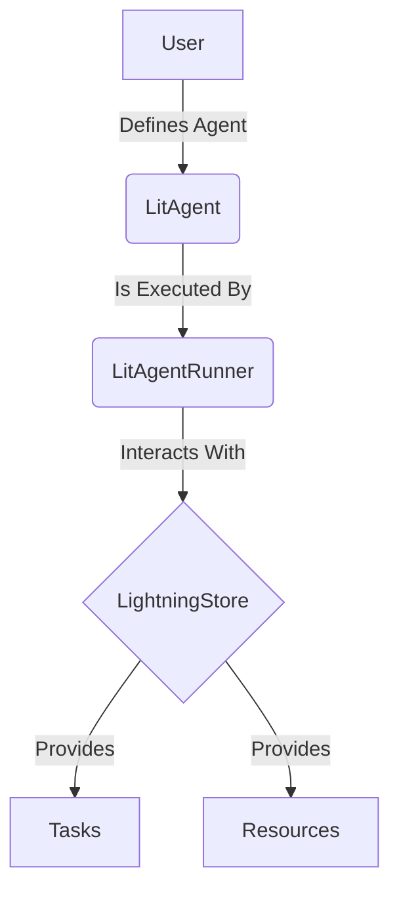

# Getting Started with AgentLightning

## 1. Synopsis

AgentLightning is a Python library for building and running autonomous agents. It provides a simple and flexible framework for defining agent logic, managing resources, and orchestrating agent execution. This tutorial will guide you through the process of installing the library, setting up a basic configuration, and running a simple example.

## 2. Prerequisites

- Python 3.9+
- `pip` for installing packages

## 3. Architecture



## 4. Installation

Install the `agentlightning` library using `pip`:

```bash
pip install agentlightning
```

## 5. Implementation Steps

### Step 1: Your First Agent

Create a Python file named `my_agent.py`. In this file, we will define a simple agent that takes a string as input and returns it in uppercase.

```python
from agentlightning.litagent import rollout

@rollout
def simple_agent(task: str):
    return task.upper()

```

*Verification*: You can test your agent function directly:

```python
print(simple_agent("hello world"))
```

This should output `HELLO WORLD`.

### Step 2: Running the Agent

Now, let's run this agent using the `LitAgentRunner`. We will use an `InMemoryLightningStore` to manage tasks and results without needing any external database.

```python
import asyncio
from agentlightning.store.memory import InMemoryLightningStore
from agentlightning.runner.agent import LitAgentRunner
from agentlightning.types import Task
from my_agent import simple_agent

async def main():
    # 1. Initialize the store
    store = InMemoryLightningStore()

    # 2. Create the runner
    runner = LitAgentRunner(agent=simple_agent, store=store)

    # 3. Define a task and add it to the store
    task = Task(input="hello from agentlightning")
    await store.add_rollouts([task])

    # 4. Run the agent for one step
    async with runner.run_context():
        completed_rollout = await runner.step(task.input)

    # 5. Print the result
    print(f"Agent output: {completed_rollout.output}")

if __name__ == "__main__":
    asyncio.run(main())
```

*Verification*: Running this script will output:

```
Agent output: HELLO FROM AGENTLIGHTNING
```

## 6. Common Pitfalls

- **Asynchronous Nature**: Most of `agentlightning` is asynchronous. Make sure to use `async` and `await` correctly.
- **Resource Not Found**: If your agent requires a resource (like an `llm`), ensure it's added to the `LightningStore` and that your agent correctly specifies it in its signature.

## 7. Challenge Yourself

Modify the `simple_agent` to accept an `llm` resource and use it to respond to a prompt. You will need to:

1.  Update the agent function to accept an `llm` argument.
2.  Create an `LLM` resource object.
3.  Add the `LLM` resource to the `InMemoryLightningStore`.
4.  Run the agent and verify it uses the LLM.
