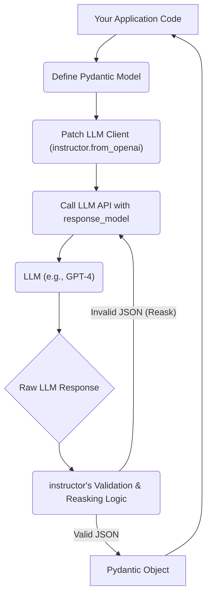

# Getting Started with `instructor`

## 1. Goal
In this tutorial, you will learn how to use the `instructor` library to extract structured and validated data from Large Language Model (LLM) responses. By the end, you will have a working understanding of how to patch an OpenAI client, define a Pydantic model for data extraction, and reliably obtain structured output from an LLM.

## 2. Prerequisites
- Python 3.9+
- Basic understanding of Large Language Models (LLMs) and their APIs (e.g., OpenAI)
- Familiarity with Pydantic for data validation
- An OpenAI API key

## 3. Architecture
The `instructor` library operates by intercepting and enhancing the standard LLM client's request-response cycle. It introduces a layer that takes your desired output structure (defined as a Pydantic model), guides the LLM to produce output matching that structure, and then validates the LLM's response. If validation fails, `instructor` can even "reask" the LLM to correct its output, ensuring robust data extraction.



## 4. Step 1: Setup and Installation
First, you need to install the necessary libraries: `instructor` and `openai`.

```bash
pip install instructor openai pydantic
```

Next, ensure your OpenAI API key is set as an environment variable or passed directly to the `OpenAI` client. For simplicity, we'll assume it's set as `OPENAI_API_KEY`.

## 5. Step 2: Define Your Desired Data Structure with Pydantic
`instructor` leverages Pydantic models to define the exact structure of the data you want to extract from the LLM's response. This is crucial for ensuring type safety and data integrity. Let's define a `UserDetail` model to extract a user's name and age.

```python
from pydantic import BaseModel

class UserDetail(BaseModel):
    name: str
    age: int

    def __str__(self):
        return f"User: {self.name}, Age: {self.age}"

print(UserDetail.model_json_schema(indent=2))
```

This Pydantic model will be used by `instructor` to instruct the LLM on the expected output format and to validate the response. The `__str__` method is added for cleaner printing later.

## 6. Step 3: Patch the OpenAI Client
To enable `instructor`'s capabilities, you need to "patch" your OpenAI client. This is a simple process that wraps the standard OpenAI client with `instructor`'s enhanced functionalities.

```python
import instructor
from openai import OpenAI
from pydantic import BaseModel # Already defined, but good for context

# Initialize the standard OpenAI client
client = OpenAI()

# Patch the client with instructor
# Now, 'client' has additional capabilities provided by instructor
patched_client = instructor.from_openai(client)

print("OpenAI client patched successfully!")
```

The `instructor.from_openai(client)` call returns a new client instance that automatically handles `response_model` parameters in `chat.completions.create` calls, transforming raw JSON responses into validated Pydantic objects.

## 7. Step 4: Extract Structured Data
Now that our client is patched and our `UserDetail` model is defined, we can make a call to the LLM. The key difference here is the `response_model` argument in the `create` method. This tells `instructor` to expect and validate the output against our `UserDetail` model.

```python
import instructor
from openai import OpenAI
from pydantic import BaseModel

# Define your desired data structure (as in Step 2)
class UserDetail(BaseModel):
    name: str
    age: int

    def __str__(self):
        return f"User: {self.name}, Age: {self.age}"

# Patch the OpenAI client (as in Step 3)
client = instructor.from_openai(OpenAI())

# Make an LLM call with the response_model parameter
# instructor will ensure the output conforms to UserDetail
completion = client.chat.completions.create(
    model="gpt-4o", # You can use any suitable model, e.g., "gpt-3.5-turbo"
    messages=[
        {
            "role": "user",
            "content": "Extract the name and age from the following text: My name is Alice and I am 30 years old."
        }
    ],
    response_model=UserDetail # This is where instructor shines!
)

# The result is a UserDetail object, not raw JSON or a string
print(f"Extracted User Detail: {completion}")
print(f"Name: {completion.name}, Type: {type(completion.name)}")
print(f"Age: {completion.age}, Type: {type(completion.age)}")

assert isinstance(completion, UserDetail)
assert completion.name == "Alice"
assert completion.age == 30

print("\nSuccessfully extracted and validated structured data!")
```

In this step, the LLM processes the message, and `instructor` intervenes to ensure that the response is a `UserDetail` object. If the LLM were to return malformed JSON or data that doesn't fit the `UserDetail` schema, `instructor` would attempt to reask the LLM to correct its output, greatly increasing the reliability of structured extraction.

## 8. Conclusion
Congratulations! You've successfully used the `instructor` library to extract structured, validated data from an OpenAI LLM. You've seen how to:

- Define a clear data schema using Pydantic models.
- Patch an existing LLM client to leverage `instructor`'s capabilities.
- Make LLM calls that reliably return Pydantic objects instead of raw text or JSON strings.

This approach provides significant benefits:

- **Type Safety:** You work directly with Python objects, eliminating the need for manual parsing and type conversions.
- **Data Validation:** Pydantic automatically validates the extracted data against your schema, catching errors early.
- **Reliability:** `instructor`'s reasking mechanism improves the chances of getting valid structured data, even if the LLM initially makes a mistake.
- **Readability:** Your code becomes cleaner and more focused on business logic, as data extraction concerns are handled by the library.

To further explore `instructor`, consider experimenting with more complex Pydantic models, handling lists of objects, or exploring its batch processing and fine-tuning features. The possibilities for building robust, AI-powered applications are vast!