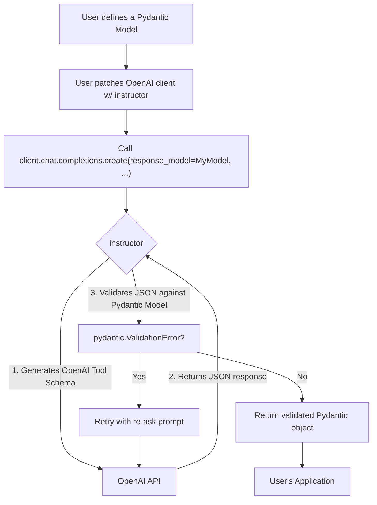

'''
# Getting Started with Instructor

## 1. Synopsis

Large Language Models (LLMs) are incredibly powerful, but their default output is often unstructured text. This creates a challenge for developers: how do you reliably get structured data, like JSON, from a model's response? You might write complex prompts, create custom parsing logic, and build brittle systems to handle malformed outputs. 

`instructor` solves this problem by seamlessly connecting LLM outputs to Pydantic models. Instead of getting a string of text, you get a validated, typed Pydantic object directly from the function call. This makes your code cleaner, more reliable, and easier to maintain.

In this tutorial, you will learn the basics of `instructor`: how to install it, patch an OpenAI client, and perform a structured data extraction with a single API call.

## 2. Prerequisites

- Python 3.9+
- An OpenAI API key

First, you need to install the necessary libraries. `instructor` works by "patching" an existing AI client, so we'll install both `openai` and `instructor`.

```bash
pip install openai instructor pydantic
```

## 3. Architecture

The magic of `instructor` lies in its `patch` function. It intercepts the standard API call (like `chat.completions.create`), injects the logic needed for structured data extraction, and then validates the model's response. 

Here's a visual overview of the process:



## 4. Implementation Steps

Let's build a simple example to extract a user's information from a piece of text.

### Step 1: Define your Pydantic Model

First, define the data structure you want to extract. A Pydantic model is perfect for this. We'll create a simple `User` model.

```python
from pydantic import BaseModel

class User(BaseModel):
    name: str
    age: int
```

*Why?*: This model serves as the schema for the data you want the LLM to return. `instructor` will use this to generate the necessary instructions for the model and to validate the final output.

### Step 2: Patch the OpenAI Client

Next, we set up the OpenAI client and apply the `instructor` patch. This is the key step that enables the `response_model` parameter.

```python
import openai
import instructor

# 1. Instantiate the OpenAI client
# Make sure your OPENAI_API_KEY environment variable is set.
client = openai.OpenAI()

# 2. Patch the client with instructor
client = instructor.patch(client)
```

*Why?*: The `patch` function wraps the client's `chat.completions.create` method. The new, patched method understands how to handle the `response_model` argument, manage retries, and parse the response.

### Step 3: Make the Structured API Call

Now, you can call `create` as you normally would, but with one crucial addition: the `response_model` argument.

```python
from pydantic import BaseModel
import openai
import instructor

# Define the model from Step 1
class User(BaseModel):
    name: str
    age: int

# Patch the client from Step 2
client = instructor.patch(openai.OpenAI())

# Make the call with the response_model parameter
user = client.chat.completions.create(
    model="gpt-3.5-turbo",
    response_model=User,
    messages=[
        {"role": "user", "content": "Extract user details from the following text: Jason is 25 years old."},
    ]
)

# Verification
print(f"Name: {user.name}, Age: {user.age}")
assert isinstance(user, User)
assert user.name == "Jason"
assert user.age == 25

print("Successfully extracted and validated user data.")
```

### *Verification*

When you run the script above, you will see the following output:

```
Name: Jason, Age: 25
Successfully extracted and validated user data.
```

Notice that the `user` variable is not a dictionary or a raw string; it is a true instance of your `User` Pydantic model. You can access its attributes with dot notation (`user.name`) and benefit from your IDE's type-ahead and static analysis features.

## 5. Common Pitfalls

- **Vague Prompts**: If your prompt is unclear, the LLM might struggle to generate a response that fits your `response_model`. Be specific. Instead of "Summarize the text," try "Extract the key person from the text and provide their name and age."
- **Model Limitations**: Simpler models might not follow instructions as well as more advanced ones. If you are not getting valid Pydantic objects, consider trying a more capable model (e.g., `gpt-4o` instead of `gpt-3.5-turbo`).
- **Forgetting to Patch**: If you forget to call `instructor.patch(client)`, the `response_model` parameter will be ignored (or raise an error), and you will get a standard, unstructured API response.

## 6. Challenge Yourself

To solidify your understanding, try extending this example. 

1.  Create a more complex Pydantic model. For example, a `Transaction` model that includes a `description` (str), an `amount` (float), a `currency` (str), and a `date` (datetime.date).
2.  Write a prompt to extract transaction information from a sentence like: "On June 5th, 2024, I spent $25.50 on a coffee and a croissant."
3.  Make the `instructor` call and print the resulting `Transaction` object. 

This will give you a better feel for how `instructor` can handle various data types and more complex extraction tasks.
'''