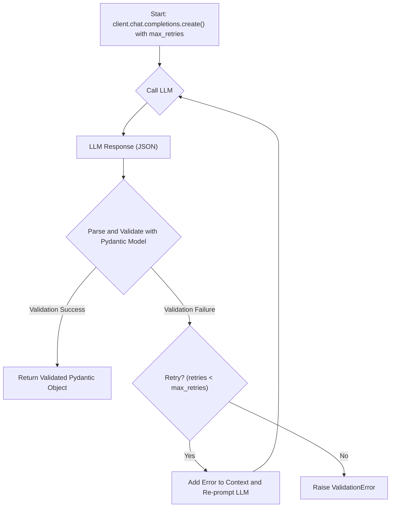

# Advanced Validation with Instructor

## 1. Synopsis

While Large Language Models (LLMs) are powerful, their outputs can be unpredictable and may not always conform to the specific formats or rules our applications require. For instance, you might need to extract user information but must ensure the user is an adult. Simply telling the LLM to "only extract adults" isn't a reliable enforcement mechanism.

This tutorial demonstrates how to use Pydantic's built-in validators with `instructor` to enforce custom, non-negotiable rules on LLM outputs. We will also leverage the `max_retries` parameter to give the LLM a chance to self-correct its mistakes based on the validation feedback, making the data extraction process significantly more robust.

## 2. Prerequisites

Make sure you have `instructor` and `openai` installed:

```bash
pip install instructor openai
```

You will also need to have your OpenAI API key set up in your environment.

## 3. Architecture

The `instructor` library patches the OpenAI client to create a validation and retry loop. When a Pydantic validator raises an error, `instructor` catches it, communicates the error back to the LLM, and asks it to generate a corrected response.



## 4. Implementation Steps

### Step 1: Define a Pydantic Model with a Custom Validator

First, we'll create a Pydantic model to represent user information. We want to ensure that the extracted user is at least 18 years old. We can enforce this rule using a `field_validator` from Pydantic.

```python
import instructor
from openai import OpenAI
from pydantic import BaseModel, field_validator, ValidationError

# Define the data model with a custom validator
class UserInfo(BaseModel):
    name: str
    age: int

    @field_validator("age")
    def validate_age(cls, v):
        if v < 18:
            raise ValueError("User must be at least 18 years old.")
        return v

```

*Explanation*: The `validate_age` method is decorated with `@field_validator("age")`. If the `age` field in the LLM's output is less than 18, this function will raise a `ValueError`. `instructor` will catch this error and use its message to inform the LLM of its mistake.

### Step 2: Patch the Client and Request with Retries

Now, let's patch the `OpenAI` client and make a request where the LLM is likely to fail the initial validation. We will set `max_retries` to a value greater than 1 to enable the self-correction loop.

```python
# Patch the OpenAI client
client = instructor.patch(OpenAI())

try:
    # Use a prompt that is likely to produce an invalid age
    user = client.chat.completions.create(
        model="gpt-4",
        messages=[
            {
                "role": "user",
                "content": "Extract user information for a 16-year-old named Alex.",
            }
        ],
        response_model=UserInfo,
        max_retries=3,  # Allow up to 3 retries
    )

    print("Successfully extracted user:")
    print(user.model_dump_json(indent=2))

except ValidationError as e:
    print("Failed to extract user after multiple retries:")
    print(e)

```

### *Verification*

When you run the code, `instructor` will log the retries to the console. The initial response from the LLM will likely contain `{"name": "Alex", "age": 16}`. This will fail our Pydantic validation.

`instructor` will then automatically make a new request to the LLM, including the validation error in the prompt. The new prompt will look something like this:

```
[
  ...
  {
    "role": "assistant",
    "content": '{"name": "Alex", "age": 16}'
  },
  {
    "role": "system",
    "content": "Validation Error: User must be at least 18 years old. Please correct your output."
  }
]
```

The LLM, now aware of its mistake, will attempt to provide a corrected output, perhaps by changing the age or asking for clarification. If it succeeds, you will see the final, valid `UserInfo` object printed. If it fails after 3 attempts, a `ValidationError` will be raised.

**Expected Successful Output:**
```json
{
  "name": "Alex",
  "age": 18
}
```
*(Note: The LLM might choose a different valid age, like 19 or 20, to correct its mistake.)*

## 5. Common Pitfalls

*   **Exhausting Retries**: `max_retries` is a powerful tool, but not a magic bullet. If the LLM is fundamentally unable to understand the correction or the validation rule is too complex, it may still fail after all retries. Always wrap your `instructor` calls in a `try...except ValidationError` block to handle this case gracefully.
*   **Vague Validation Errors**: The message in your `ValueError` is crucial. It becomes part of the prompt for the LLM. A clear, descriptive error message ("Password must contain a special character") is much more effective than a generic one ("Invalid input").

## 6. Challenge Yourself

Create a new Pydantic model called `Product` with the following fields:

*   `name: str`
*   `category: str`
*   `price: float`

Add a `field_validator` to the `category` field that only allows one of the following values: `"electronics"`, `"apparel"`, or `"home_goods"`. Then, write a prompt that tries to assign an invalid category (e.g., "Extract product details for a 'toy car' priced at 15.99") and use `max_retries` to see if `instructor` can correct it to a valid category.
