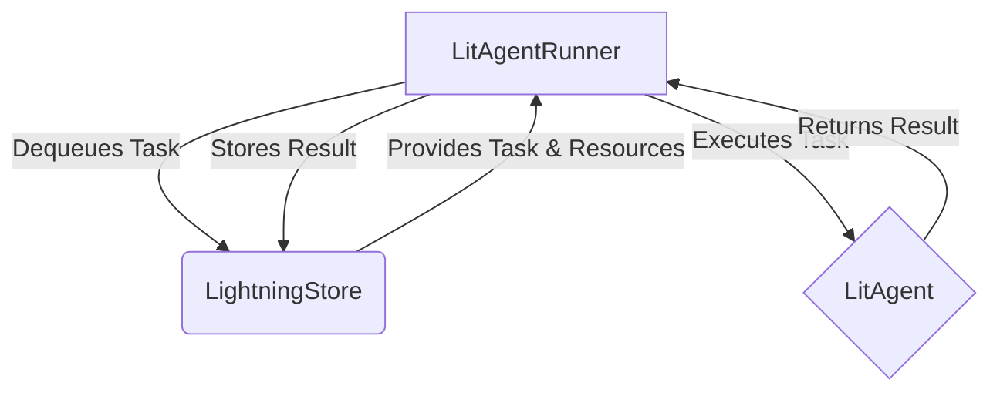

# Core Concepts of AgentLightning

## 1. Goal

In this tutorial, you will learn about the fundamental components of the AgentLightning framework. We will explore the core concepts of `LitAgent`, `LitAgentRunner`, and the `LightningStore`, and how they work together to create a powerful and flexible platform for building and running agents.

## 2. Prerequisites

- Python 3.9+
- A basic understanding of agent-based systems and asynchronous programming.

## 3. Architecture

The AgentLightning framework is designed to be modular and extensible. The three main components are:

- **`LitAgent`**: This is where you define the logic of your agent. It's the "brain" of your operation.
- **`LitAgentRunner`**: This is the "engine" that runs your agent. It handles the details of execution, such as fetching tasks, managing resources, and reporting results.
- **`LightningStore`**: This is the central "hub" where tasks, resources, and results are stored. It acts as a message broker between the different components of the system.

Here's a diagram illustrating how these components interact:



## 4. Implementation Steps

### Step 1: Define Your `LitAgent`

The first step is to create a class that inherits from `LitAgent` and implements the `rollout` method. This method contains the core logic of your agent.

```python
from agentlightning.litagent import LitAgent
from agentlightning.types import NamedResources, Rollout, RolloutRawResult, Task

class MyAgent(LitAgent[str]):
    def rollout(self, task: str, resources: NamedResources, rollout: Rollout) -> RolloutRawResult:
        print(f"Processing task: {task}")
        # Your agent logic goes here
        return f"Completed task: {task}"
```

### Step 2: Set Up the `LightningStore`

For this example, we'll use an in-memory `LightningStore` for simplicity.

```python
from agentlightning.store.memory import MemoryStore

store = MemoryStore()
```

### Step 3: Create a `LitAgentRunner`

Now, we'll create a `LitAgentRunner` to execute our agent. We need to provide it with the agent and the store.

```python
from agentlightning.runner.agent import LitAgentRunner

agent = MyAgent()
runner = LitAgentRunner(agent=agent, store=store)
```

### Step 4: Add a Task to the Store and Run the Agent

Finally, we'll add a task to the `LightningStore` and run the agent.

```python
import asyncio

async def main():
    # Add a task to the store
    await store.enqueue_rollout(Task(id="task-1", input="Hello, AgentLightning!"))

    # Run the agent to process the task
    await runner.step("task-1")

if __name__ == "__main__":
    asyncio.run(main())
```

## 5. Verification

When you run the above code, you should see the following output:

```
Processing task: Hello, AgentLightning!
```

This confirms that the `LitAgentRunner` successfully fetched the task from the `LightningStore` and executed the `rollout` method of your `MyAgent`.

## 6. Common Pitfalls

- **Forgetting to `await` asynchronous methods**: Many of the methods in AgentLightning are asynchronous, so make sure to use the `await` keyword where necessary.
- **Misconfiguring the `LightningStore`**: Ensure that your `LitAgentRunner` and any other components that need to access the store are configured with the same store instance.

## 7. Challenge Yourself

Modify the `MyAgent` class to use an external resource, such as an LLM. You'll need to:

1.  Add the resource to the `LightningStore`.
2.  Update the `rollout` method to access the resource from the `resources` dictionary.

This will give you a better understanding of how to manage resources in AgentLightning.
