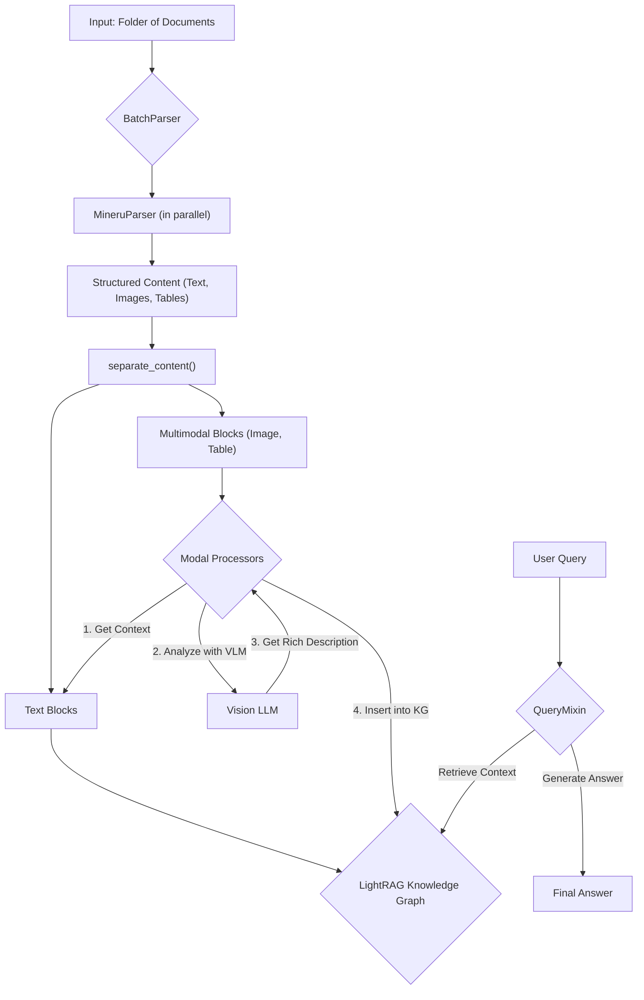

> # 02. RAG-Anything: Core Concepts and Architecture

## 1. Goal

In modern data environments, information isn't just plain text. It's locked away in complex documents as charts, tables, images, and equations. How do you build an AI that can understand *all* of it? 

This tutorial dives into the architecture of `RAG-Anything`, a framework designed to solve this exact problem. You will learn how it deconstructs, analyzes, and creates a queryable, multimodal knowledge base from sophisticated documents.

## 2. Prerequisites

- Python 3.9+.
- A conceptual understanding of Retrieval-Augmented Generation (RAG).
- Project dependencies installed (e.g., `pip install -r requirements.txt`).

## 3. Architecture: The Document Processing Pipeline

RAG-Anything operates as a multi-stage pipeline. It takes a folder of documents, processes them in parallel, analyzes multimodal content (like images and tables), builds a knowledge graph, and prepares to answer questions.



### Key Components

- **`RAGAnything`**: The central orchestrator you will interact with. It coordinates the entire workflow, from parsing to querying.
- **`BatchParser` & `MineruParser`**: These components work together to efficiently process large numbers of documents. `MineruParser` is the heavy lifter, using advanced tools to extract structured content (like text, tables, and images) from PDFs and other file types.
- **`ModalProcessors`**: This is where the magic happens for multimodal data. Specialized processors like `ImageModalProcessor` and `TableModalProcessor` take non-text content, use Vision-Language Models (VLMs) to generate rich text descriptions, and integrate this new knowledge into the system.
- **`QueryMixin`**: This provides the user-facing methods like `aquery()` to ask questions against the knowledge base.
- **`LightRAG`**: The underlying engine that powers everything. It builds and manages the knowledge graph, handles embeddings, and performs the core retrieval logic.

## 4. Implementation: A Quick Example

Let's see the architecture in action. The following example demonstrates initializing the system, processing a simple text file, and asking a question. We'll use dummy functions for the AI models to make it runnable and focus on the workflow.

```python
import asyncio
import os
from raganything import RAGAnything

# --- Step 1: Define Dummy AI Model Functions ---
# In a real application, these would be calls to actual LLM/VLM/Embedding APIs.
async def dummy_llm(prompt: str, **kwargs) -> str:
    """Simulates a Large Language Model."""
    print(f"\n--- LLM received prompt snippet: ---\n{prompt[:100]}...\n------------------------------------")
    return "Based on the context, the secret to multimodal RAG is handling diverse content."

async def dummy_vision_llm(prompt: str, images: list, **kwargs) -> str:
    """Simulates a Vision-Language Model."""
    print(f"\n--- VLM received prompt: {prompt} and {len(images)} image(s) ---
")
    return "This image appears to be a simple diagram."

def dummy_embedding_func(texts: list[str], **kwargs) -> list[list[float]]:
    """Simulates an embedding model."""
    print(f"\n--- Embedding function received {len(texts)} text chunk(s) ---
")
    # Return a list of dummy vectors, one for each text
    return [[0.1 * i] * 10 for i in range(len(texts))]

async def main():
    # --- Step 2: Create a Dummy Document ---
    doc_path = "my_report.txt"
    with open(doc_path, "w") as f:
        f.write("This document states that the secret to multimodal RAG is handling diverse content.")

    # --- Step 3: Initialize RAGAnything ---
    # This class orchestrates the entire pipeline.
    # We provide it with the necessary AI model functions.
    rag_system = RAGAnything(
        llm_model_func=dummy_llm, 
        vision_model_func=dummy_vision_llm, 
        embedding_func=dummy_embedding_func
    )

    # --- Step 4: Process the Document ---
    # This is an end-to-end function that handles parsing, content separation,
    # embedding, and insertion into the knowledge graph.
    print(f"Processing {doc_path}...")
    await rag_system.process_document_complete(doc_path)
    print("\nDocument processing complete.")

    # --- Step 5: Ask a Question ---
    # Use the aquery method to ask a question against the ingested knowledge.
    print("\nQuerying the system...")
    question = "What is the secret to multimodal RAG?"
    answer = await rag_system.aquery(question)
    
    print(f"\nQuestion: {question}")
    print(f"Answer: {answer.answer_text}")

    # --- Step 6: Cleanup ---
    # Finalize storages to ensure all data is saved correctly
    await rag_system.finalize_storages()
    os.remove(doc_path)

if __name__ == "__main__":
    asyncio.run(main())

```

### *Verification*

When you run this script, you will see output from the dummy functions, indicating that the system is calling them at the right stages. The final output should look like this:

```
Question: What is the secret to multimodal RAG?
Answer: Based on the context, the secret to multimodal RAG is handling diverse content.
```

## 5. Common Pitfalls

- **Parser Not Installed**: `RAGAnything` defaults to using `MineruParser`, which must be installed separately (`pip install mineru`). If the parser is missing, initialization will fail. You can check if it's installed with `rag_system.check_parser_installation()`.
- **Forgetting `await`**: Many methods in `RAG-Anything` are asynchronous (`async`). Forgetting to use the `await` keyword on calls like `process_document_complete()` and `aquery()` is a common mistake that will prevent the code from running correctly.

## 6. Challenge Yourself

Modify the example script to process a document with a table. 

1. Change the dummy document to a Markdown file (`my_report.md`).
2. Add a Markdown table to the file, for example:

   | Quarter | Revenue |
   |---|---|
   | Q1 | $1M |
   | Q2 | $1.5M |

3. Run the script again and observe the logs. Notice how the `TableModalProcessor` (if enabled in the config) would be invoked to describe the table. 
4. Ask a question about the data in the table, like: "What was the revenue in Q2?".
