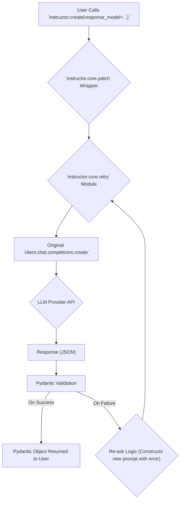

# Core Concepts of Instructor

## 1. Synopsis

Large Language Models (LLMs) are incredibly powerful, but their unstructured text output can be difficult to integrate into applications. If you need to extract specific information—like user details, product information, or structured logs—you often have to write brittle parsing code that breaks with the slightest change in the model's response.

`instructor` solves this problem by seamlessly binding Pydantic models to your LLM calls. This forces the model to return a structured, validated JSON object that conforms to your predefined schema, giving you reliable, type-hinted data you can use directly in your code.

This tutorial will guide you through the fundamental architecture of the `instructor` library. You will learn about the `patch` function, the `Instructor` class, and the data flow of a `create` call, which together form the library's core.

## 2. Prerequisites

- Python 3.9+
- An OpenAI API key
- Basic understanding of Pydantic models
- The following Python libraries installed:

```bash
pip install instructor openai pydantic
```

## 3. Architecture

The magic of `instructor` lies in how it intercepts and enhances the standard API call to an LLM provider. Here’s a high-level look at the data flow when you make a `create` call.



## 4. Implementation Steps

Let's dive into the code. We'll start by setting up a basic OpenAI client and then see how `instructor` transforms it.

### Step 1: The Power of `patch`

The `patch` function is the cornerstone of `instructor`. It takes a standard AI client instance (like `openai.OpenAI` or `openai.AsyncOpenAI`) and modifies its `chat.completions.create` method in place. This new method understands additional parameters, most importantly `response_model`.

Here’s how you apply it:

```python
import instructor
from openai import OpenAI
from pydantic import BaseModel

# Define your desired data structure
class UserDetail(BaseModel):
    name: str
    age: int

# 1. Create a standard OpenAI client
client = OpenAI()

# 2. Apply the patch
# This returns a modified client, ready to do structured extraction
patched_client = instructor.patch(client)

# 3. Use the patched client with the `response_model` parameter
extraction = patched_client.chat.completions.create(
    model="gpt-3.5-turbo",
    response_model=UserDetail,
    messages=[{"role": "user", "content": "Extract Jason is 25 years old."}],
)

# The result is a Pydantic object, not a dictionary or string
assert isinstance(extraction, UserDetail)
assert extraction.name == "Jason"
assert extraction.age == 25

print(extraction.model_dump_json(indent=2))
```

***Verification***

If you run this script, you will see the following output, confirming that the LLM's response was successfully parsed into a `UserDetail` instance:

```json
{
  "name": "Jason",
  "age": 25
}
```

### Step 2: The `Instructor` Class (Deprecated but good to know)

While `patch` is the modern, recommended approach, older versions of `instructor` used an `Instructor` class that wrapped the client. You might still see this pattern in older codebases. It serves the same purpose as `patch` but with a slightly different syntax.

### Step 3: Understanding the `create` Data Flow

Let's break down what happens when you call the patched `create` method:

1.  **Intercept and Process**: The `new_create_sync` or `new_create_async` wrapper inside `patch.py` intercepts your call. It takes the `response_model` (`UserDetail` in our example) and converts it into a JSON schema that the LLM provider's function-calling or tool-use API can understand. This schema is injected into the API call parameters.

2.  **Enter the Retry Loop**: The call is then handed over to the `retry_sync` or `retry_async` function in `retry.py`. This function, built on the robust `tenacity` library, wraps the actual API call in a retry loop.

3.  **Call the LLM**: The original `client.chat.completions.create` is called with the modified parameters, including the tool schema for `UserDetail`.

4.  **Validate the Response**: When the LLM responds, `instructor` attempts to parse the JSON output into an instance of your `UserDetail` model.

5.  **Success or Retry**: 
    *   **On Success**: If the response is valid, the `UserDetail` object is returned.
    *   **On Failure**: If the data is malformed (e.g., a field is missing, has the wrong type, or fails a validator), a `pydantic.ValidationError` is raised. The retry logic catches this, constructs a new prompt explaining the error to the LLM, and sends the request again. This "re-asking" process gives the model a chance to self-correct.

This automatic validation and retry mechanism is what makes `instructor` so reliable.

## 5. Common Pitfalls

**Watch Out: `ValidationError` in Retries**

If the LLM consistently fails to produce a valid object even after multiple retries, `instructor` will raise an `InstructorRetryException`. This error contains the history of the attempts and the last validation error, which is invaluable for debugging. You might need to:

*   **Simplify your model**: Complex or ambiguous Pydantic models are harder for the LLM to follow.
*   **Improve your prompt**: Make sure your prompt clearly asks for the information in the format you expect.
*   **Increase `max_retries`**: Give the model more chances to correct itself, especially for complex tasks.

```python
# Example of catching a retry exception
import instructor
from openai import OpenAI
from pydantic import BaseModel, Field

class UserDetail(BaseModel):
    name: str
    age: int = Field(..., gt=0) # Age must be positive

client = instructor.patch(OpenAI())

try:
    # This will likely fail as the model might return age 0 or negative
    user = client.chat.completions.create(
        model="gpt-3.5-turbo",
        response_model=UserDetail,
        messages=[{"role": "user", "content": "Extract a newborn baby named Sam."}],
        max_retries=3,
    )
except instructor.exceptions.InstructorRetryException as e:
    print(f"Validation failed after multiple retries: {e}")
```

## 6. Challenge Yourself

Now it's your turn! Create a Pydantic model to extract product information from a user review.

1.  Define a `Product` model with fields for `name` (str), `rating` (int, between 1 and 5), and `in_stock` (bool).
2.  Write a prompt describing a customer review (e.g., "The new X-Widget is amazing! I'd give it 5 stars, but it's currently sold out.").
3.  Use the patched `instructor` client to extract the `Product` information from your prompt.
4.  Print the resulting Pydantic object.

This exercise will solidify your understanding of how to define a schema and use `instructor` to get structured data from natural language.
