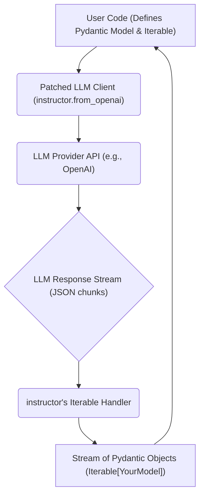

# Extracting Lists of Objects with `instructor`'s Iterable DSL

## 1. Goal
In this tutorial, you will learn how to efficiently extract and stream a list of structured objects from a single LLM call using the `instructor` library's `Iterable` DSL. By the end, you will have a working example that defines a Pydantic model and uses `response_model=Iterable[YourModel]` to parse multiple entities from an LLM's response.

## 2. Prerequisites
- Python 3.9+
- Basic understanding of Pydantic models.
- Familiarity with Large Language Models (LLMs) and their API calls.

## 3. Architecture
The `instructor` library intercepts the LLM client's `create` call and injects its logic to handle structured output. When using `Iterable[Model]`, it intelligently parses the LLM's streamed response, yielding Pydantic model instances as they are identified, allowing for efficient processing of lists of objects.



## 4. Step 1: Setup and Pydantic Model Definition
First, we need to import the necessary libraries and define the Pydantic model that represents the structure of each item in our list. For this example, let's imagine we want to extract a list of people with their names and ages.

We'll use `instructor` to patch an OpenAI client. Make sure you have `openai` and `pydantic` installed (`pip install openai pydantic instructor`).

```python
import instructor
from openai import OpenAI
from pydantic import BaseModel, Field
from typing import Iterable

# Define the Pydantic model for each person
class Person(BaseModel):
    name: str = Field(description="The name of the person")
    age: int = Field(description="The age of the person")

# Patch the OpenAI client
# This enables instructor's features, including the Iterable DSL
client = instructor.from_openai(OpenAI())

print("Setup complete and client patched.")
```

## 5. Step 2: Extracting the List of Objects using `Iterable`
Now, we'll use the patched client and specify `response_model=Iterable[Person]` in our `chat.completions.create` call. This tells `instructor` that we expect a stream of `Person` objects from the LLM's response.

We'll provide a prompt that clearly asks the LLM to provide information about multiple people.

```python
# Example prompt asking for multiple people
user_content = (
    "Extract a list of people from the following text: "
    "Alice is 30 years old, Bob is 24, and Charlie is 35. "
    "Also, David who is 29, and Eve at 22."
)

print(f"Requesting extraction for: \"{user_content}\"")

try:
    # Call the LLM with response_model set to Iterable[Person]
    # instructor will handle the streaming and parsing into Person objects
    people_stream = client.chat.completions.create(
        model="gpt-4o", # You can use any suitable model, e.g., "gpt-3.5-turbo"
        messages=[
            {"role": "user", "content": user_content}
        ],
        response_model=Iterable[Person] # This is the key part for list extraction
    )

    print("\nExtracted people:")
    # Iterate through the stream of Pydantic objects
    for person in people_stream:
        assert isinstance(person, Person)
        print(f"- Name: {person.name}, Age: {person.age}")

except Exception as e:
    print(f"An error occurred during extraction: {e}")

```

## 6. Conclusion
You've successfully used `instructor`'s `Iterable` DSL to extract a stream of structured `Person` objects from a single LLM call. This pattern is incredibly powerful for scenarios where you need to parse multiple entities from a text, allowing for efficient, streaming processing rather than waiting for a single, large JSON blob. You can extend this by using more complex Pydantic models or integrating it into a larger data processing pipeline. Happy extracting!