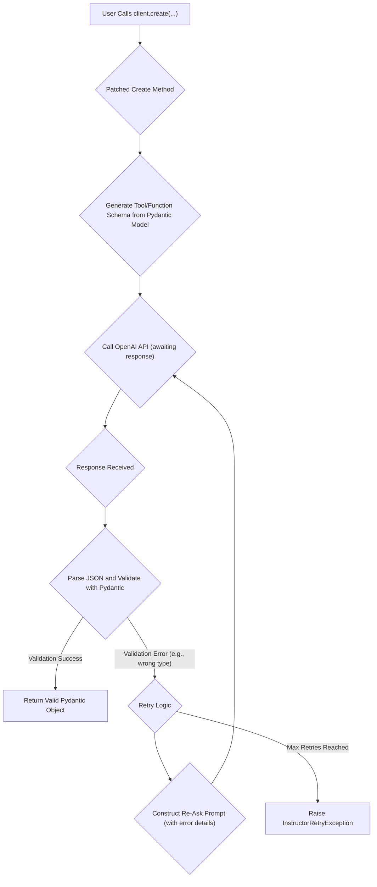

'''
# Advanced Features: Streaming, Validation, and Retries

Welcome to this advanced tutorial on the `instructor` library! While `instructor` makes it simple to get structured data from language models, its true power lies in its advanced features. In this guide, you'll learn how to build robust, real-time, and reliable data extraction pipelines using streaming, automatic validation, and the powerful retry mechanism.

## 1. Synopsis: The Real-World Problem

Imagine you're building a system to monitor social media for mentions of your product. You need to extract key information in real-time: the user, their sentiment, and the core message. The data needs to be accurate, and the system must be resilient to API errors or malformed outputs from the language model.

This is where `instructor`'s advanced features shine. We can stream data as it's generated for a real-time UI, automatically validate it against a Pydantic model, and retry with corrections if the model makes a mistake. This tutorial will walk you through exactly how to do that.

## 2. Prerequisites

- Python 3.9+
- An OpenAI API key
- `instructor` and `openai` libraries installed (`pip install instructor openai`)
- A basic understanding of Pydantic `BaseModel`.

## 3. Architecture: The `instructor` Power Loop

Under the hood, `instructor` wraps the OpenAI client's `create` method with a powerful processing loop. Here’s a conceptual look at what happens when you make a call.



This diagram shows the "happy path" of successful validation and the "unhappy path" where `instructor` catches a `ValidationError`, constructs a new prompt telling the model how to fix its mistake, and retries the API call.

## 4. Implementation Steps

### Step 1: Basic Setup

First, let's set up our OpenAI client and patch it with `instructor`. This is the foundation for all our advanced calls.

```python
import instructor
from openai import OpenAI
from pydantic import BaseModel, Field
from typing import Iterable, List

# Patch the OpenAI client
client = instructor.patch(OpenAI())

class User(BaseModel):
    name: str = Field(description="The user's name")
    age: int = Field(description="The user's age")

```

*Verification*: Running this code block should execute without any errors, indicating that your environment is set up correctly.

### Step 2: Streaming Lists of Objects with `create_iterable`

The `create_iterable` method is perfect for when you expect the LLM to return a list of objects (a JSON array) and you want to process each object as soon as it's fully formed, rather than waiting for the entire list.

Let's ask the model to extract user data from a block of text.

```python
# Continuing from the setup above

def stream_users() -> None:
    text_block = """
    John, 42, is a software engineer. Sarah, 28, is a doctor. 
    Michael, 35, is a teacher. Emily, a 23 year old, is a student.
    """

    # We define the response model as `Iterable[User]`
    # This tells instructor to stream each `User` object as it's parsed
    users = client.create_iterable(
        model="gpt-4o",
        messages=[{
            "role": "user",
            "content": f"Extract all user information from the following text: {text_block}",
        }],
        response_model=Iterable[User],
    )

    print("Streaming users:")
    for user in users:
        print(f"  - Name: {user.name}, Age: {user.age}")

stream_users()
```

*Verification*: When you run this, you will see the user data printed to the console one by one as they are extracted and validated.

```
Streaming users:
  - Name: John, Age: 42
  - Name: Sarah, Age: 28
  - Name: Michael, Age: 35
  - Name: Emily, Age: 23
```

### Step 3: Real-Time UI with `create_partial`

What if you want to build a UI that updates in real-time as the model "thinks"? The `create_partial` method streams back a *partial* Pydantic object as tokens arrive. This is incredibly powerful for creating a "generative UI" effect.

Let's ask for a single, more complex user profile.

```python
import time

class UserProfile(BaseModel):
    name: str
    bio: str
    location: str
    interests: List[str]

def stream_partial_profile() -> None:
    partials = client.create_partial(
        model="gpt-4o",
        messages=[{
            "role": "user", 
            "content": "Create a detailed user profile for a fictional character named 'Alex' who loves hiking and coding."
        }],
        response_model=UserProfile
    )

    print("Streaming a partial profile (updates in place):")
    # The \r and end='' move the cursor to the beginning of the line to simulate an updating UI
    for partial_profile in partials:
        print(f"\r{partial_profile.model_dump_json(indent=2)}", end='', flush=True)
        time.sleep(0.1)
    print("\n\nProfile complete!")

stream_partial_profile()
```

*Verification*: Running this code will print a JSON object to your console that appears to "build itself" in place. You'll see the `name` appear, then the `bio` will be typed out, followed by the other fields, demonstrating the real-time token stream being parsed into the model.

### Step 4: Automatic Validation and Retries

This is the magic of `instructor`. If the LLM returns data that doesn't match your Pydantic model, `instructor` will automatically catch the validation error, inform the model what it did wrong, and ask it to try again.

We can simulate this by asking for a user but providing text where the age is not a number. We'll set `max_retries=2` to see the process in action and enable logging to see the re-ask.

```python
import logging

logging.basicConfig(level=logging.INFO)

def test_validation_and_retry() -> None:
    try:
        user = client.create(
            model="gpt-4o",
            messages=[{
                "role": "user",
                "content": "Extract user data from: 'John is twenty-nine years old'"
            }],
            response_model=User,
            max_retries=2
        )
        print("\nSuccessfully extracted user:")
        print(user.model_dump_json(indent=2))

    except Exception as e:
        print(f"\nFailed after retries: {e}")

test_validation_and_retry()
```

*Verification*: When you run this, you will see INFO logs from `instructor`. The first log will show a `ValidationError` because the model will likely return `{"name": "John", "age": "twenty-nine"}`. The subsequent log will show `instructor` re-running the completion with a new message that includes the error. The model will then correct its mistake and return `{"name": "John", "age": 29}`, which will be successfully parsed.

```
INFO:instructor:Retrying, attempt: 1
INFO:instructor:Parse error: 1 validation error for User
age
  Input should be a valid integer, unable to parse string as an integer [type=int_parsing, input_value='twenty-nine', input_type=str]
    For further information visit https://errors.pydantic.dev/2.5/v/int_parsing
INFO:instructor:Retrying, attempt: 2

Successfully extracted user:
{
  "name": "John",
  "age": 29
}
```

## 5. Common Pitfalls

- **Streaming and Incomplete Data**: When using streaming (`create_iterable`, `create_partial`), network interruptions or complex model outputs can sometimes result in incomplete JSON. While `instructor` is robust, it's good practice to wrap your streaming logic in `try...except` blocks to handle potential `JSONDecodeError` or `InstructorRetryException`.

- **Exceeding `max_retries`**: If the model consistently fails to produce valid data even after several retries, `instructor` will raise an `InstructorRetryException`. This is a signal that your prompt may be unclear or your `response_model` is too restrictive for the given task. Log this exception and analyze the `last_completion` attribute to debug your prompt.

- **Prompt Clarity is Key**: The re-asking mechanism works best when the initial prompt is clear. The better the initial instructions, the more likely the model is to correct itself based on the validation feedback.

## 6. Challenge Yourself

Now it's your turn to combine these concepts. Here's a challenge:

1.  **Read the `instructor` documentation on the `CitationMixin` DSL.**
2.  **Create a new Pydantic model** called `Fact` that includes the `CitationMixin` and has a `fact_statement: str` field.
3.  **Use `create_iterable` with your `Fact` model** to stream a list of facts from a long article (e.g., a Wikipedia page summary).
4.  **For each `Fact` object you stream, verify that the `substring_quotes` field (added by the mixin) is not empty**, proving that the model has cited its source from the context you provided.

This will test your ability to combine streaming with another advanced DSL feature, building a powerful, verifiable, and real-time data extraction system.
'''