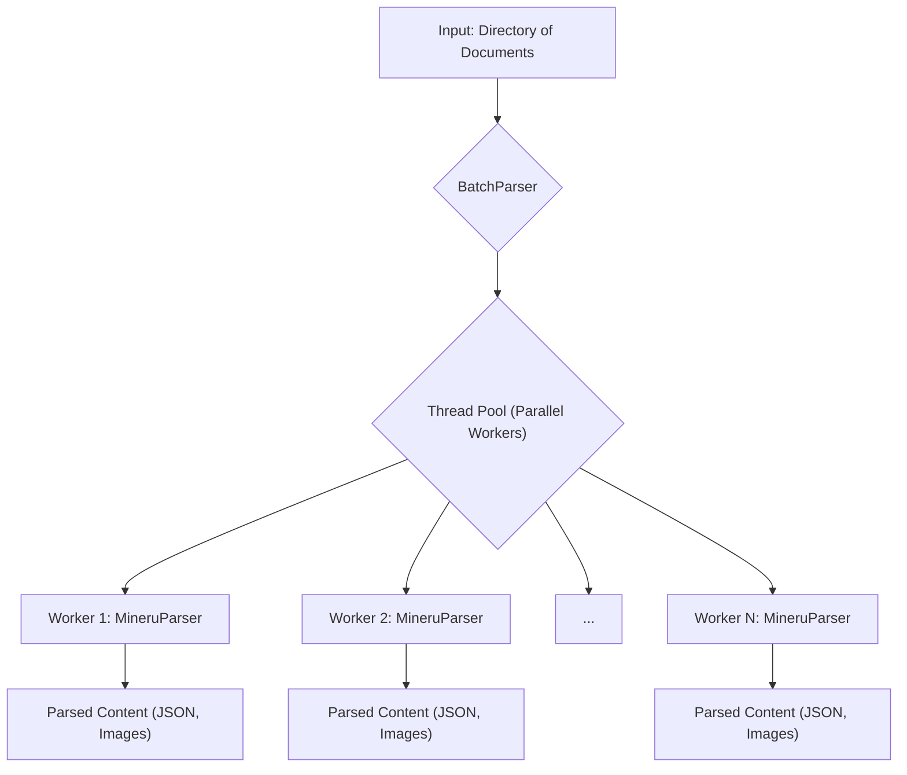

# Advanced Document Ingestion with `BatchParser`

## 1. Synopsis

In many real-world scenarios, you need to build a knowledge base from a large collection of documents, not just a single file. Processing these documents one by one is slow and inefficient. This tutorial teaches you how to use the `BatchParser` to ingest and parse an entire directory of documents in parallel, significantly speeding up your data pipeline.

We will cover how `BatchParser` orchestrates the `MineruParser` to extract structured content like text, tables, and images from a variety of file formats.

## 2. Prerequisites

- Python 3.9+ installed.
- The `raganything` library installed.
- A directory containing various documents to process (e.g., PDFs, images, text files).

## 3. Architecture

The batch ingestion process is a pipeline that takes a directory of raw documents and produces a structured, machine-readable output for each one.



## 4. Implementation Steps

### Step 1: Create a Batch Processing Script

Let's write a Python script that uses `BatchParser` to process a folder named `my_documents`. The results will be saved to a folder named `parsed_output`.

Create a file named `run_batch_ingestion.py`:

```python
import asyncio
import logging
from raganything.batch_parser import BatchParser

# Configure logging to see the progress
logging.basicConfig(
    level=logging.INFO,
    format="%(asctime)s - %(name)s - %(levelname)s - %(message)s",
)

async def main():
    """
    Initializes and runs the batch parser on a directory of documents.
    """
    # 1. Initialize the BatchParser
    #    - parser_type="mineru": Use the powerful Mineru parser.
    #    - max_workers=4: Process up to 4 files concurrently.
    #    - show_progress=True: Display a progress bar.
    batch_parser = BatchParser(
        parser_type="mineru", 
        max_workers=4, 
        show_progress=True
    )

    # 2. Define input and output paths
    #    Create a folder named `my_documents` and place your files there.
    input_paths = ["my_documents"]  
    output_dir = "parsed_output"

    print(f"Starting batch processing for: {input_paths}")

    # 3. Run the batch processing
    #    The `process_batch_async` method handles everything:
    #    - Finds all supported files in the input paths.
    #    - Distributes them to worker threads.
    #    - Collects the results.
    result = await batch_parser.process_batch_async(
        file_paths=input_paths,
        output_dir=output_dir,
        recursive=True  # Search subdirectories as well
    )

    # 4. Print the final summary
    print("\n--- Batch Processing Complete ---
")
    print(result.summary())

    if result.failed_files:
        print("\n--- Errors ---
")
        for file, error in result.errors.items():
            print(f"File: {file}\nError: {error}\n")

if __name__ == "__main__":
    # Create a dummy document to process
    from pathlib import Path
    doc_dir = Path("my_documents")
    doc_dir.mkdir(exist_ok=True)
    (doc_dir / "sample_report.txt").write_text("This is a test report about financial results.")

    asyncio.run(main())

```

*Why use `process_batch_async`?* This asynchronous method is ideal for I/O-bound tasks like file processing. It allows the program to remain responsive while waiting for files to be read and processed, making efficient use of the CPU.

### Step 2: Run the Ingestion

Execute the script from your terminal:

```bash
python run_batch_ingestion.py
```

### Step 3: Verify the Output

After the script finishes, you will see a new directory named `parsed_output`. Inside, you'll find a subdirectory for each document that was successfully processed. For our `sample_report.txt` example, the structure will be:

```
parsed_output/
└── sample_report/
    ├── page_0.json
    └── sample_report.md
```

- **`sample_report.md`**: A markdown representation of the document's content.
- **`page_0.json`**: A structured JSON file containing the detailed output from `MineruParser`, with coordinates and types for each content block (text, table, etc.).

## 5. Common Pitfalls

- **`MineruExecutionError`**: This error often means the `mineru` command-line tool is not installed or not in your system's PATH. The `raganything` library relies on this external tool for parsing.
- **Permission Denied**: Ensure your script has read permissions for the input directory and write permissions for the output directory.
- **Unsupported File Types**: `BatchParser` will automatically skip files with unsupported extensions. You can get a list of supported types by calling `batch_parser.get_supported_extensions()`.

## 6. Challenge Yourself

Modify the `run_batch_ingestion.py` script to handle errors more gracefully. Instead of just printing the errors at the end, try to move the failed files to a separate `failed_documents` directory for later inspection. This will require you to use the `result.failed_files` list and the `shutil` module in Python.
