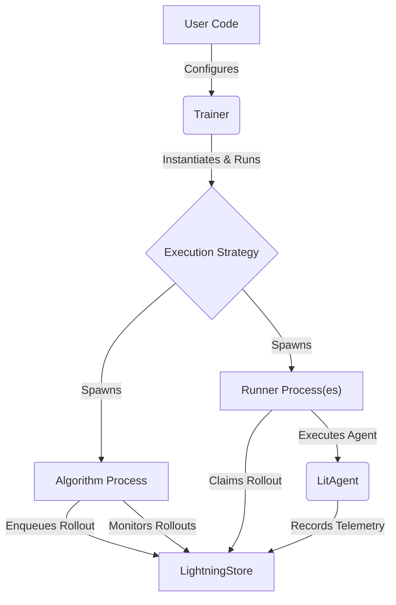

'''
# Understanding the Algorithm and Training

## 1. Synopsis

Training an AI agent is more than just writing its core logic; it involves systematically evaluating its performance, tuning its parameters (like prompts), and managing the entire process. The `AgentLightning` framework provides a powerful and flexible system to handle this training loop. 

At the heart of this system are three key components:

- **`Trainer`**: The main orchestrator that sets up and manages the training environment.
- **`Algorithm`**: The strategic component that defines *how* the agent is trained. This could be a simple loop, a sophisticated prompt optimization strategy, or anything in between.
- **`Runner`**: The execution engine that runs the agent with specific inputs.

In this tutorial, you will learn how to use these components to create and run a basic training process.

## 2. Prerequisites

- Python 3.9+
- A conceptual understanding of AI agents and the idea of training them through repeated trials (rollouts).

## 3. Architecture

The training process follows a clear, decoupled architecture. The `Trainer` acts as the central coordinator, the `Algorithm` provides the training logic, and `Runners` execute the agent. They all communicate via the `LightningStore`, which acts as a message bus and data store.



## 4. Implementation Steps

Let's walk through implementing a basic training loop using the built-in `Baseline` algorithm.

### Step 1: Defining the `Algorithm` Contract

Every training strategy in `AgentLightning` implements the `Algorithm` interface defined in `agentlightning/algorithm/base.py`. The most important method is `run`, which contains the core training logic.

```python
# From agentlightning/algorithm/base.py

class Algorithm:
    # ... other methods for setup ...

    def run(
        self,
        train_dataset: Optional[Dataset[Any]] = None,
        val_dataset: Optional[Dataset[Any]] = None,
    ) -> Union[None, Awaitable[None]]:
        """Subclasses should implement this method to implement the algorithm."""
        raise NotImplementedError("Subclasses must implement run().")
```

The `Trainer` calls this `run` method, passing in the training and validation datasets you provide.

### Step 2: Using the `Baseline` Algorithm

`AgentLightning` provides a simple, ready-to-use algorithm called `Baseline`. It's a `FastAlgorithm`, meaning it's designed for quick development and debugging cycles. It iterates through the provided datasets, enqueues a rollout for each data point, and waits for them to complete.

Let's instantiate it.

```python
# From agentlightning/algorithm/fast.py
from agentlightning.algorithm.fast import Baseline

# This algorithm will run for 1 epoch, polling for updates every 2 seconds.
baseline_algorithm = Baseline(n_epochs=1, polling_interval=2.0)
```

### Step 3: Configuring the `Trainer`

The `Trainer` is the main entry point. We configure it with our chosen algorithm, the number of parallel runners, and other settings.

```python
# From agentlightning/trainer/trainer.py
from agentlightning.trainer import Trainer

# We will run 2 agents in parallel.
trainer = Trainer(
    algorithm=baseline_algorithm,
    n_runners=2,
    max_rollouts=10 # Stop each runner after 10 rollouts
)
```

### Step 4: Running a Development Session

Now, let's put it all together. We need a `LitAgent` to run and some data to run it on. For this example, we'll create a simple agent and a dummy dataset.

```python
import asyncio
from agentlightning.litagent import litagent, LitAgent
from agentlightning.trainer import Trainer
from agentlightning.algorithm.fast import Baseline

# 1. Define a simple agent
@litagent
def my_simple_agent(user_prompt: str):
    print(f"Agent received prompt: {user_prompt}")
    return f"Response to: {user_prompt}"

# 2. Create an instance of the agent
agent_instance = my_simple_agent()

# 3. Create a dummy dataset
dummy_train_data = ["hello", "world", "tell me a joke"]
dummy_val_data = ["what is the capital of France?"]

# 4. Configure the training components
baseline_algorithm = Baseline(n_epochs=1, polling_interval=1.0, max_queue_length=2)
trainer = Trainer(
    algorithm=baseline_algorithm,
    n_runners=2,
)

# 5. Run the development training loop
print("Starting trainer.dev()...")
trainer.dev(
    agent=agent_instance, 
    train_dataset=dummy_train_data, 
    val_dataset=dummy_val_data
)
print("Trainer finished.")

```

We use `trainer.dev()` because it's specifically designed for development. It requires a `FastAlgorithm` (like `Baseline`) and provides a quick way to test your entire setup.

## 5. Verification

Run the Python script above. You will see log messages from the `Trainer` and the `Baseline` algorithm. Key things to look for in the output:

- Messages indicating the `Trainer` is starting.
- Logs from the `Baseline` algorithm showing it is enqueuing rollouts for each item in your datasets.
- Status updates for each rollout (e.g., `queuing`, `running`, `succeeded`).
- The "Agent received prompt..." print statements from your `my_simple_agent`.

```text
# Example Output Snippet
INFO:__main__:Starting trainer.dev()...
INFO:agentlightning.trainer.trainer:Starting execution with ClientServerExecutionStrategy...
INFO:agentlightning.algorithm.fast:Proceeding epoch 1/1.
INFO:agentlightning.algorithm.fast:Enqueued rollout ... in train mode with sample: hello
INFO:agentlightning.algorithm.fast:Enqueued rollout ... in train mode with sample: world
... # more logs
Agent received prompt: hello
Agent received prompt: world
...
INFO:agentlightning.algorithm.fast:Finished 4 rollouts.
```

## 6. Common Pitfalls

- **`TypeError` with `trainer.dev()`**: The `trainer.dev()` method is strict and only accepts algorithms that inherit from `FastAlgorithm`. If you pass a regular `Algorithm`, it will raise a `TypeError`. For full, long-running training jobs, you would use `trainer.fit()`.

- **Controlling Rollout Flow**: The `Baseline` algorithm's `max_queue_length` and `polling_interval` parameters are crucial for controlling the rate of rollouts. If your runners are slow, a long queue might build up. Tuning these can help manage resources.

- **No `run` Implementation**: If you create a custom algorithm and forget to implement the `run` method, you will get a `NotImplementedError` at runtime.

## 7. Challenge Yourself

Create your own simple `FastAlgorithm`. 

1. Subclass `agentlightning.algorithm.fast.FastAlgorithm`.
2. Implement the `async def run(...)` method.
3. Inside `run`, instead of processing both datasets, use `get_store()` to `enqueue_rollout` for **only the validation dataset** (`val_dataset`).
4. Instantiate your new algorithm and pass it to the `Trainer`. 

This will test your understanding of how an algorithm interacts with the store and datasets to control the training flow.
'''