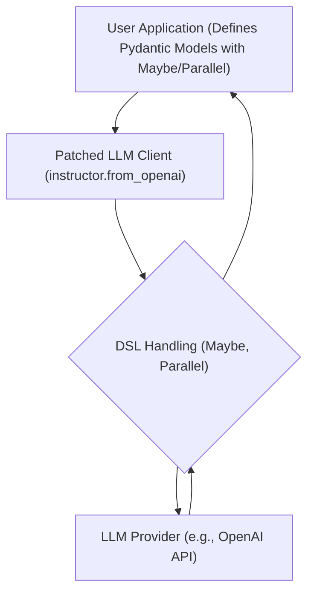

# Handling Optional and Parallel Extractions

## 1. Goal
In this tutorial, you will learn how to handle complex data extraction scenarios using `instructor`'s Domain Specific Language (DSL) features: `Maybe[Model]` for optional extractions and `Parallel[ModelA, ModelB]` for extracting multiple, different types of information from a single LLM response. By the end, you will have a working understanding of how to robustly extract structured data, even when some information might be missing or when you need to extract disparate pieces of information simultaneously.

## 2. Prerequisites
- Python 3.9+
- Basic understanding of `instructor` and Pydantic models.
- An OpenAI API key (or access to another supported LLM provider).

## 3. Architecture
`instructor` works by patching the LLM client, allowing it to intercept the request and response to enforce structured output. `Maybe` and `Parallel` are part of `instructor`'s DSL, which leverages Pydantic to define these complex extraction patterns. The patched client then guides the LLM to produce output that conforms to these patterns, handling validation and reasking as needed.



## 4. Step 1: Setting up `Maybe[Model]` for Optional Extraction
Sometimes, the information you're trying to extract might not always be present in the text. Instead of failing the extraction, `instructor` allows you to define optional models using `Maybe[Model]`. If the LLM cannot find the relevant information to construct the model, `Maybe` will return `None` for that particular extraction, allowing your application to handle the absence gracefully.

Let's define a `User` model and a `Product` model. We'll try to extract both from a text, but the `Product` might not always be mentioned.

First, install the necessary libraries:
```bash
pip install openai pydantic instructor
```

Now, let's write the code:

```python
import instructor
from openai import OpenAI
from pydantic import BaseModel, Field
from typing import Optional

# 1. Define your Pydantic Models
class User(BaseModel):
    name: str
    email: str
    age: Optional[int] = None

class Product(BaseModel):
    name: str
    price: float

# 2. Patch the OpenAI client
client = instructor.from_openai(OpenAI())

# 3. Define a model that might or might not be present using Optional (or Maybe)
class UserAndOptionalProduct(BaseModel):
    user: User
    product: Optional[Product] = None # Using Optional for clarity, Instructor's Maybe[Model] handles this more explicitly under the hood for some cases.

# Example 1: Both user and product information are present
response_both = client.chat.completions.create(
    model="gpt-4",
    messages=[
        {"role": "user", "content": "Extract the user details for John Doe, john@example.com, 30 years old, who bought a Now, let's look at an example using `instructor.Maybe`. While `Optional[PydanticModel]` works for simple cases, `instructor.Maybe` is specifically designed for scenarios where the LLM might *not* be able to construct a particular Pydantic model at all, rather than just having optional fields *within* a model. `instructor.Maybe` will return `None` if the model cannot be instantiated by the LLM.

```python
import instructor
from openai import OpenAI
from pydantic import BaseModel, Field
from typing import Optional

# 1. Define your Pydantic Models
class User(BaseModel):
    name: str
    email: str
    age: Optional[int] = None

class Product(BaseModel):
    name: str
    price: float

# 2. Patch the OpenAI client
client = instructor.from_openai(OpenAI())

# 3. Use instructor.Maybe for optional extraction of a *whole model*
class ExtractionResultMaybe(BaseModel):
    user: User
    product: instructor.Maybe[Product] # This tells instructor that Product might not be extractable

# Example 1: Both user and product information are present
response_maybe_both = client.chat.completions.create(
    model="gpt-4",
    messages=[
        {"role": "user", "content": "Extract the user details for John Doe, john@example.com, 30 years old, who bought a Widget for $19.99."}
    ],
    response_model=ExtractionResultMaybe,
)

print("--- With Product ---")
print(response_maybe_both.model_dump_json(indent=2))
assert isinstance(response_maybe_both.user, User)
assert isinstance(response_maybe_both.product, Product)

# Example 2: Only user information is present
response_maybe_user_only = client.chat.completions.create(
    model="gpt-4",
    messages=[
        {"role": "user", "content": "Extract the user details for Jane Smith, jane@example.com, 28 years old."}
    ],
    response_model=ExtractionResultMaybe,
)

print("\n--- User Only ---")
print(response_maybe_user_only.model_dump_json(indent=2))
assert isinstance(response_maybe_user_only.user, User)
assert response_maybe_user_only.product is None

```

## 5. Step 2: Parallel Extraction with `Parallel[ModelA, ModelB]`

Sometimes, from a single prompt, you might want to extract entirely different pieces of information that don't necessarily form a single, cohesive Pydantic model. `instructor.Parallel` allows you to extract multiple, distinct models concurrently. This is particularly useful when you need a diverse set of structured data from one LLM call, optimizing token usage and API calls.

Let's define a `Person` model and an `Address` model. We will extract both from a single text that describes a person and their location.

```python
import instructor
from openai import OpenAI
from pydantic import BaseModel, Field

# 1. Define your Pydantic Models
class Person(BaseModel):
    name: str
    age: int
    occupation: str

class Address(BaseModel):
    street: str
    city: str
    zip_code: str

# 2. Patch the OpenAI client
client = instructor.from_openai(OpenAI())

# 3. Use instructor.Parallel to extract both models
# The result will be a tuple of the extracted models
response_parallel = client.chat.completions.create(
    model="gpt-4",
    messages=[
        {
            "role": "user",
            "content": "Extract the person and address information: John Doe is a 45-year-old software engineer living at 123 Main St, Anytown, 98765."
        }
    ],
    response_model=instructor.Parallel(Person, Address),
)

print("--- Parallel Extraction ---")
# The response is a tuple containing instances of Person and Address
person_data, address_data = response_parallel

print("Person Data:")
print(person_data.model_dump_json(indent=2))
assert isinstance(person_data, Person)

print("\nAddress Data:")
print(address_data.model_dump_json(indent=2))
assert isinstance(address_data, Address)

```

## 6. Conclusion

You've successfully learned how to use `instructor.Maybe[Model]` for handling optional data extractions and `instructor.Parallel[ModelA, ModelB]` for performing concurrent extractions of different data types from a single prompt. These powerful DSL features provided by `instructor` allow for much more robust and efficient structured data extraction from Large Language Models, making your applications more resilient to missing information and more efficient in their API usage. Experiment with different prompts and model combinations to see how these patterns can be applied to your specific use cases.