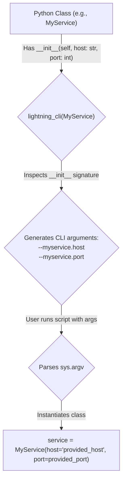

# Tutorial: CLI Configuration with `lightning_cli`

## 1. Goal

In this tutorial, you will learn how to use the `lightning_cli` utility to automatically generate a Command-Line Interface (CLI) for your Python classes. This powerful tool simplifies the process of configuring complex applications by exposing class `__init__` parameters as command-line arguments, saving you from writing boilerplate `argparse` code.

## 2. Prerequisites

- The `agentlightning` package must be installed.

## 3. Architecture

The `lightning_cli` utility works by inspecting the `__init__` method of one or more Python classes. It dynamically creates CLI arguments that correspond to the parameters of the `__init__` method. When the script is run, `lightning_cli` parses the command-line arguments, instantiates the classes with the provided values, and returns the configured objects.



## 4. Implementation Steps

### Step 1: Create a simple configurable class

Let's start with a basic example. Create a file named `my_app.py` and add the following code:

```python
import asyncio
from agentlightning.config import lightning_cli
from agentlightning.server import AgentLightningServer

class MyService:
    def __init__(self, greeting: str = "Hello", repeat: int = 1):
        """
        A simple service to demonstrate lightning_cli.

        Args:
            greeting: The message to print.
            repeat: The number of times to print the message.
        """
        self.greeting = greeting
        self.repeat = repeat

    def run(self):
        for i in range(self.repeat):
            print(f"{i + 1}: {self.greeting}")

if __name__ == "__main__":
    # Use lightning_cli to configure and instantiate MyService
    service = lightning_cli(MyService)
    service.run()
```

*Verification*:

Run the script from your terminal. It will use the default values from the `__init__` method:

```bash
python my_app.py
```

Output:
```
1: Hello
```

### Step 2: Configure the class from the command line

Now, let's override the default values using the auto-generated CLI arguments. The arguments are created using the pattern `--<class_name_lowercase>.<parameter_name>`.

*Verification*:

Run the following command:

```bash
python my_app.py --myservice.greeting "Welcome to agentlightning" --myservice.repeat 3
```

Output:
```
1: Welcome to agentlightning
2: Welcome to agentlightning
3: Welcome to agentlightning
```

### Step 3: Configure a real-world component

`lightning_cli` is most useful for configuring complex components. Let's use it to configure the `AgentLightningServer` from the `agentlightning` package. Create a new file called `launch_server.py`.

```python
import asyncio
from agentlightning.config import lightning_cli
from agentlightning.server import AgentLightningServer

async def main():
    # lightning_cli will parse --agentlightningserver.host, --agentlightningserver.port, etc.
    server = lightning_cli(AgentLightningServer)
    print(f"Server configured for endpoint: {server.endpoint}")

    # To actually run the server:
    # await server.start()
    # print("Server started. Press Ctrl+C to stop.")
    # await server.run_forever()

if __name__ == "__main__":
    asyncio.run(main())
```

*Verification*:

You can now configure the server's host and port from the command line. Run the help command to see all available options:

```bash
python launch_server.py --help
```

Now, run the script with custom arguments:

```bash
python launch_server.py --agentlightningserver.host 127.0.0.1 --agentlightningserver.port 9999
```

Output:
```
Server configured for endpoint: http://127.0.0.1:9999
```

## 5. Common Pitfalls

- **Missing Type Hints**: `lightning_cli` relies on type hints (`str`, `int`, `bool`, etc.) in the `__init__` signature to correctly parse values. If a parameter has no type hint, it will default to being treated as a `str`.
- **Complex Types**: While `lightning_cli` supports basic types, `List`, and `Optional`, it may not correctly handle more complex custom objects passed directly via the command line. For those scenarios, other configuration methods might be more suitable.
- **Argument Naming**: Remember that argument names are automatically generated by lowercasing the class name and replacing underscores (`_`) with hyphens (`-`) in parameter names. Forgetting this convention can lead to "unrecognized arguments" errors.

## 6. Challenge Yourself

Your task is to create a single script that uses `lightning_cli` to configure and instantiate both the `AgentLightningServer` and the `AgentLightningClient` from the `agentlightning.client` module. The script should print the configured server endpoint and the client endpoint to verify that the configuration was successful.

Hint: You can pass multiple classes to `lightning_cli`, and it will return a tuple of instances in the same order.

```python
# Example of using lightning_cli with multiple classes
server, client = lightning_cli(AgentLightningServer, AgentLightningClient)
```

This exercise will demonstrate how to manage the configuration of a multi-component system from a single, unified command-line interface.
