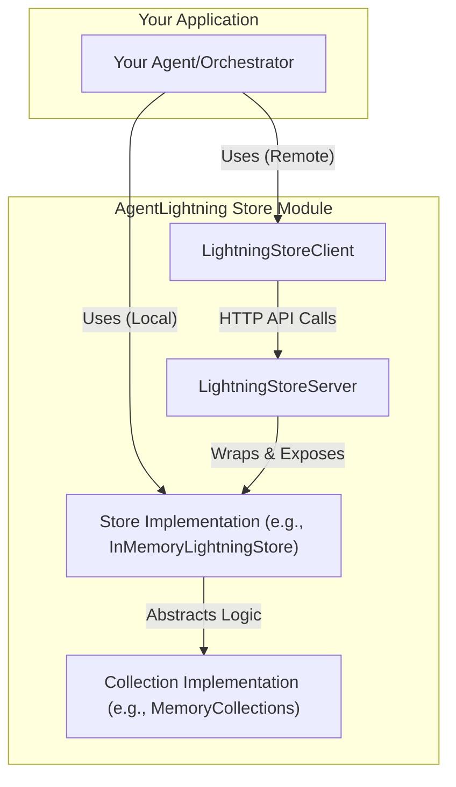

'''
# Data Storage and Management in AgentLightning

## 1. Synopsis

In complex AI systems, especially those involving multiple agents or distributed machine learning rollouts, managing state, tasks, and results is a critical challenge. How do you coordinate work between different processes? How do you track the progress of thousands of experiments? How do you ensure that your system can recover from failures?

AgentLightning solves this with a robust and flexible data storage layer, `agentlightning.store`. It provides a centralized control plane for managing the entire lifecycle of ML rollouts, from queuing tasks to storing telemetry data. This tutorial will guide you through the architecture of the storage system and show you how to configure and use it for both simple and distributed scenarios.

## 2. Prerequisites

- Python 3.9+
- A basic understanding of asynchronous programming (`async`/`await`).
- Familiarity with client-server architectures.

## 3. Architecture

The `agentlightning.store` module is built on a layered architecture that separates high-level APIs from low-level database interactions. This allows you to switch between different storage backends (like in-memory for testing or MongoDB for production) without changing your application logic.

Here’s a simplified view of the architecture:



- **Your Application**: Interacts with the store via a `LightningStore` interface.
- **Client/Server (Optional)**: For distributed setups, the `LightningStoreClient` communicates with a `LightningStoreServer` over HTTP, which wraps a concrete store implementation.
- **Store Implementation**: Contains the business logic for managing rollouts, attempts, and spans (e.g., `InMemoryLightningStore`).
- **Collection Implementation**: The lowest level, responsible for the actual data storage in memory, MongoDB, etc.

## 4. Implementation Steps

Let's walk through how to use the store, starting with a simple in-memory setup and progressing to a client-server model.

### Step 1: Local In-Memory Storage

For local development or single-process applications, the `InMemoryLightningStore` is the easiest way to get started. It's thread-safe and requires no external dependencies.

First, we instantiate the store and use it to create and manage a rollout.

```python
import asyncio
from agentlightning.store.memory import InMemoryLightningStore
from agentlightning.types import TaskInput, RolloutConfig

async def main():
    # 1. Initialize the in-memory store
    # thread_safe=True is important for multi-threaded apps, but not required for this asyncio example.
    store = InMemoryLightningStore(thread_safe=False)

    print("Step 1: Starting a new rollout...")
    # 2. Use start_rollout to create and immediately begin an attempt
    # This is useful when the orchestrator is also the worker.
    attempted_rollout = await store.start_rollout(
        input=TaskInput(data={"prompt": "Write a story"}),
        config=RolloutConfig(max_retries=2),
        metadata={"author": "tutorial"}
    )

    rollout_id = attempted_rollout.rollout_id
    print(f"-> Rollout started with ID: {rollout_id}")
    print(f"-> Initial status: {attempted_rollout.status}")

    # 3. Verify by querying the rollout
    print("\nStep 2: Querying the rollout...")
    results = await store.query_rollouts(rollout_id_in=[rollout_id])
    retrieved_rollout = results[0]

    print(f"-> Successfully retrieved rollout: {retrieved_rollout.rollout_id}")
    print(f"-> Metadata: {retrieved_rollout.metadata}")

if __name__ == "__main__":
    asyncio.run(main())

```

***Verification***:

Running this script will produce output showing that a rollout was created with a unique ID and then successfully retrieved, confirming the store is working correctly.

```
Step 1: Starting a new rollout...
-> Rollout started with ID: ...
-> Initial status: preparing

Step 2: Querying the rollout...
-> Successfully retrieved rollout: ...
-> Metadata: {'author': 'tutorial'}
```

### Step 2: Serving the Store

To enable multi-process or distributed coordination, you need to expose your store over the network. The `LightningStoreServer` wraps any `LightningStore` implementation and serves it via a FastAPI application.

Let's adapt our previous example to run a server.

```python
import asyncio
from agentlightning.store.memory import InMemoryLightningStore
from agentlightning.store.client_server import LightningStoreServer

async def run_server():
    # 1. Initialize the store you want to serve
    # For a server, it's critical to use a thread-safe or zero-copy store.
    # InMemoryLightningStore with thread_safe=True is a good start.
    local_store = InMemoryLightningStore(thread_safe=True)

    # 2. Wrap the store in a server
    # It will listen on http://127.0.0.1:8000 by default
    server = LightningStoreServer(local_store, port=8000)

    # 3. Start the server
    # It runs in the background, allowing the rest of your app to proceed.
    await server.start()
    print("LightningStoreServer running at http://127.0.0.1:8000")

    # Keep the server running indefinitely for the client to connect
    try:
        await asyncio.Event().wait()
    finally:
        await server.stop()

if __name__ == "__main__":
    # It's often best to run the server in its own script.
    # This example runs it and waits.
    asyncio.run(run_server())
```

***Verification***:

When you run this script, your terminal will show that the server is running. You can open a browser to `http://127.0.0.1:8000/v1/agl/health` and you should see `{"status": "ok"}`.

### Step 3: Connecting with a Client

Now that the server is running, other processes (workers, algorithms) can connect to it using `LightningStoreClient`. The client implements the same `LightningStore` interface, so your application logic doesn't need to change.

This script acts as a worker that enqueues and dequeues tasks from the remote store.

```python
import asyncio
from agentlightning.store.client_server import LightningStoreClient
from agentlightning.types import TaskInput

async def run_client():
    # 1. Initialize the client, pointing to the server's address
    client = LightningStoreClient("http://127.0.0.1:8000")

    print("Waiting for the server to be healthy...")
    await client.wait_for_health()
    print("Server is healthy!")

    # 2. Enqueue a task for a worker to pick up later
    print("\nStep 1: Enqueuing a rollout...")
    enqueued_rollout = await client.enqueue_rollout(
        input=TaskInput(data={"task": "process_data"})
    )
    print(f"-> Rollout enqueued with ID: {enqueued_rollout.rollout_id}")
    print(f"-> Status: {enqueued_rollout.status}")

    # 3. Dequeue the task, simulating a worker claiming a job
    print("\nStep 2: Dequeuing a rollout...")
    attempted_rollout = await client.dequeue_rollout(worker_id="worker-123")

    if attempted_rollout:
        print(f"-> Worker-123 dequeued rollout: {attempted_rollout.rollout_id}")
        print(f"-> New status: {attempted_rollout.status}")
    else:
        print("-> No rollouts in the queue.")

if __name__ == "__main__":
    # Run this script while the server script is running in another terminal.
    asyncio.run(run_client())
```

***Verification***:

Run this client script while the server from Step 2 is active. The output will show the client successfully enqueuing a task and then dequeuing it, demonstrating full client-server communication.

## 5. Common Pitfalls

- **Safety Mismatches**: When using `LightningStoreServer`, the underlying store **must** be async-safe and thread-safe. Using a non-thread-safe store like the default `InMemoryLightningStore(thread_safe=False)` will lead to race conditions and unpredictable behavior. Always enable safety features for server-based stores.
- **Blocking Operations**: All `LightningStore` methods are `async`. Ensure you `await` them correctly. Blocking the event loop in a client or server can hang the entire system.
- **Stateful Clients**: `LightningStoreClient` is lightweight and designed to be stateless. Create a new client instance wherever needed; don't try to share it across processes that can't share memory.

## 6. Challenge Yourself

Now that you understand the basics, try extending what you've learned:

1.  **Explore the MongoDB Backend**: The architecture is designed for different backends. Look at the `agentlightning/store/collection/mongo.py` file. Can you figure out how to instantiate and use a `MongoCollections`-based store for persistent, production-grade storage?
2.  **Implement a Custom Health Check**: The `LightningStore` has a `statistics()` method. Modify the `LightningStoreServer` to expose these statistics on a new `/stats` endpoint. This is a common pattern for adding observability to services.
3.  **Build a Multi-Worker System**: Write a script that simulates multiple workers in parallel, all connecting to the same `LightningStoreServer` and calling `dequeue_rollout`. Observe how the store safely distributes the work among them.
'''