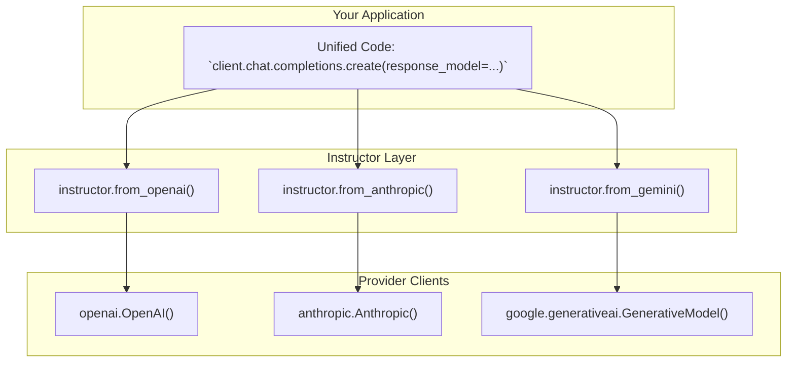

# Using Instructor with Multiple Providers

## 1. Synopsis

In the real world, you might need to use different language models for different tasks. One model might be faster, another might be more creative, and a third might have a specific knowledge domain. `instructor` provides a unified interface that allows you to switch between providers like OpenAI, Anthropic, and Google Gemini without changing your core application logic.

This tutorial will teach you how to use `instructor`'s provider-specific factory functions (`from_openai`, `from_anthropic`, `from_gemini`) to create patched clients that all share the same structured output capabilities.

## 2. Prerequisites

To follow this tutorial, you'll need to install the necessary libraries:

```bash
pip install instructor openai anthropic google-generativeai
```

You will also need API keys for OpenAI, Anthropic, and Google.

## 3. Architecture

`instructor` acts as a consistent layer on top of various LLM provider APIs. The `from_...` factory functions take a provider-native client and return a patched `instructor` client that standardizes how you request structured data.



## 4. Implementation Steps

Let's build a simple example that extracts user data from a piece of text using three different providers.

### Step 1: Define a Shared Pydantic Model

First, we define the `UserModel` that we want to extract. This model will be used across all provider calls, ensuring the output format is always consistent.

```python
import instructor
from pydantic import BaseModel

# Define the shared data structure
class UserModel(BaseModel):
    name: str
    age: int
```

### Step 2: Create Provider-Specific Clients

Now, we'll initialize the native client for each provider and then wrap it with the corresponding `instructor` factory function.

#### OpenAI

For OpenAI, we use the standard `instructor.patch` which is equivalent to `from_openai`.

```python
import openai

# Create a standard OpenAI client
openai_client = openai.OpenAI()
# Patch it with instructor
openai_instructor = instructor.patch(openai_client)
```

#### Anthropic

For Anthropic, we use the `from_anthropic` function.

```python
import anthropic

# Create an Anthropic client
anthropic_client = anthropic.Anthropic()
# Create a patched instructor client from it
anthropic_instructor = instructor.from_anthropic(anthropic_client)
```

#### Google Gemini

For Gemini, we use the `from_gemini` function. Note the deprecation warning; `from_genai` is the newer approach, but `from_gemini` demonstrates the provider-specific pattern.

```python
import google.generativeai as genai

# Configure the Gemini client
genai.configure(api_key="YOUR_GEMINI_API_KEY")

# Create a Gemini client
gemini_client = genai.GenerativeModel('gemini-1.5-flash')
# Create a patched instructor client from it
gemini_instructor = instructor.from_gemini(gemini_client)
```

### Step 3: Execute the Unified Extraction Logic

With our patched clients, we can now call `chat.completions.create` (or `generate_content` for Gemini's patched method) with the exact same `response_model` and input text. `instructor` handles the translation to each provider's specific API format.

```python
# The input text is the same for all calls
text = "Jason is 25 years old."

# --- OpenAI Call ---
def call_openai():
    user = openai_instructor.chat.completions.create(
        model="gpt-4o",
        response_model=UserModel,
        messages=[{"role": "user", "content": text}],
    )
    print(f"OpenAI Extraction: {user.name}, {user.age}")
    assert isinstance(user, UserModel)

# --- Anthropic Call ---
def call_anthropic():
    # Note: Anthropic uses `messages.create` which is what instructor patches
    user = anthropic_instructor.messages.create(
        model="claude-3-haiku-20240307",
        max_tokens=1024,
        response_model=UserModel,
        messages=[{"role": "user", "content": text}],
    )
    print(f"Anthropic Extraction: {user.name}, {user.age}")
    assert isinstance(user, UserModel)

# --- Gemini Call ---
def call_gemini():
    # Note: The patched method for Gemini is `generate_content`
    user = gemini_instructor.generate_content(
        response_model=UserModel,
        prompt=text,
    )
    print(f"Gemini Extraction: {user.name}, {user.age}")
    assert isinstance(user, UserModel)

# Run all calls
call_openai()
call_anthropic()
call_gemini()
```

### Verification

When you run the code above (after setting your API keys), you should see the following output, demonstrating that each provider successfully extracted the structured data:

```
OpenAI Extraction: Jason, 25
Anthropic Extraction: Jason, 25
Gemini Extraction: Jason, 25
```

## 5. Common Pitfalls

*   **API Key Management**: Ensure you have configured API keys correctly for each service. Missing keys are a common source of errors.
*   **Model Names**: Model names (`gpt-4o`, `claude-3-haiku-20240307`, `gemini-1.5-flash`) are specific to each provider. Using the wrong name will result in an error.
*   **Slight API Differences**: While `instructor` unifies the core logic, some underlying client methods might differ (e.g., `chat.completions.create` vs. `messages.create`). The `from_...` functions patch the correct method, so your interaction is mostly with the patched `create` method.
*   **Deprecation Warnings**: As seen with `from_gemini`, `instructor` is constantly evolving. Pay attention to deprecation warnings and update your code to use the recommended newer functions for long-term stability.

## 6. Challenge Yourself

Now that you understand the multi-provider pattern, try extending the example. 

1.  Look at the `instructor/providers/` directory in the `instructor` library.
2.  Pick a new provider, such as `groq` or `mistral`.
3.  Install the required client library (e.g., `pip install groq`).
4.  Add a new function `call_groq()` that uses `instructor.from_groq()` to perform the same `UserModel` extraction.

This exercise will solidify your understanding of how `instructor` makes it easy to leverage the best model for the job, anywhere in your stack.
