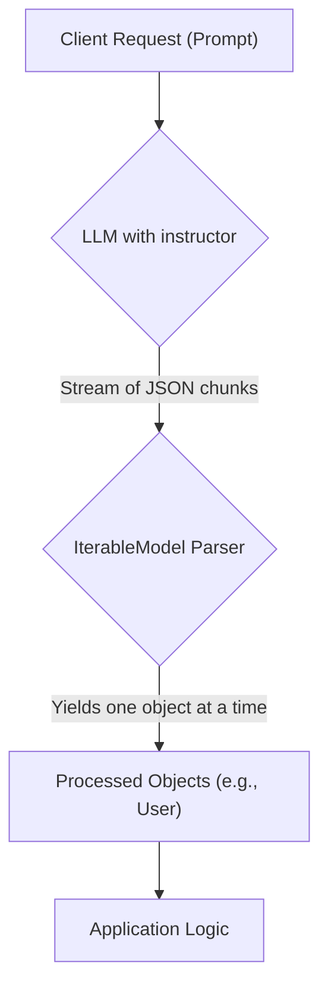

# Streaming Lists of Objects with IterableModel

## 1. Goal

In many applications, you need to extract a list of structured objects from a text. For example, you might want to extract all the user profiles from a document or list all the action items from a meeting transcript. While you could ask the language model to return a single JSON object with a list of items, this approach has a drawback: you have to wait for the entire list to be generated before you can start processing it.

This tutorial will teach you how to stream a list of objects from a single LLM call. We will use the `instructor.dsl.IterableModel` to define a model that can be iterated over, allowing you to process each object as it becomes available from the stream. This is ideal for improving the user experience in real-time applications.

## 2. Prerequisites

- The `instructor` package installed. You can install it with pip:

```bash
pip install instructor
```

## 3. Architecture

Here's a diagram illustrating the streaming process. The client sends a single request to the LLM, and the LLM streams back a sequence of objects that are parsed and yielded one by one.



## 4. Implementation Steps

Let's build an example that extracts user information from a block of text and streams the results.

### Step 1: Define Your Data Model and Use IterableModel

First, we define the Pydantic model for a single user. Then, we use `IterableModel` to create a new model that can handle a stream of `User` objects.

```python
import openai
import instructor
from pydantic import BaseModel, Field
from instructor.dsl.iterable import IterableModel

# 1. Define the data model for a single user
class User(BaseModel):
    name: str = Field(description="The name of the person")
    age: int = Field(description="The age of the person")
    role: str = Field(description="The role of the person")

# 2. Create a model for a list of users
MultiUser = IterableModel(User)

# 3. Patch the OpenAI client
client = instructor.patch(openai.OpenAI())

# 4. Make the streaming call
def extract_users():
    return client.chat.completions.create(
        model="gpt-4-turbo",
        response_model=MultiUser,
        stream=True,
        messages=[
            {
                "role": "user",
                "content": "Generate 5 users with different names, ages, and roles.",
            },
        ],
    )

# 5. Iterate over the streaming response
for user in extract_users():
    print("New user received:")
    print(user.model_dump_json(indent=2))

```

### *Verification*

When you run this code, you will see the user objects printed to the console one by one as they are generated and parsed from the LLM's streaming response. The output will look something like this, with a noticeable delay between each user object:

```
New user received:
{
  "name": "Alice",
  "age": 30,
  "role": "Software Engineer"
}
New user received:
{
  "name": "Bob",
  "age": 25,
  "role": "Data Scientist"
}
New user received:
{
  "name": "Charlie",
  "age": 35,
  "role": "Product Manager"
}
...
```

## 5. Common Pitfalls

- **Model Not Returning a List**: If the model doesn't return a JSON array, the `IterableModel` will not be able to parse any objects. Ensure your prompt is clear about expecting multiple items.
- **Invalid JSON in the Stream**: The underlying parser is robust, but severe malformations in the JSON stream from the LLM can cause parsing errors.
- **Using the Wrong `response_model`**: Always use the `IterableModel`-wrapped class (e.g., `MultiUser`) in the `response_model` argument, not the base class (e.g., `User`).

## 6. Challenge Yourself

Modify the example to extract a list of `Product` objects from a description. Each `Product` should have a `name`, `price`, and a list of `features`. This will test your ability to work with nested structures within a streaming context.
