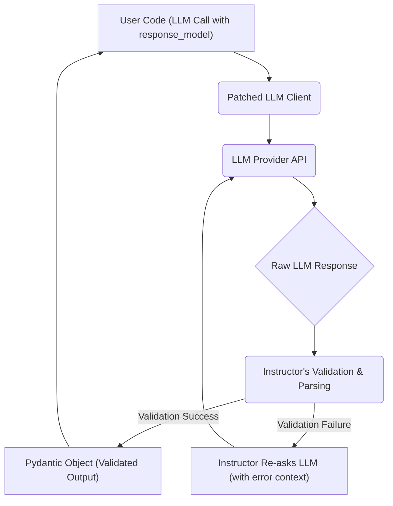

# Response Validation and Retries with Instructor

## 1. Goal
In this tutorial, you will learn how the `instructor` library provides robust response validation and automatic retries with Large Language Models (LLMs). We will demonstrate how to define a Pydantic model with custom validation logic and observe how `instructor` intelligently re-prompts the LLM when initial responses fail validation, ensuring reliable structured output.

## 2. Prerequisites
- Python 3.9+
- Basic understanding of Pydantic models.
- Familiarity with LLM APIs (e.g., OpenAI's chat completions).

## 3. Architecture
`instructor` patches your LLM client, intercepting calls to inject its validation and re-asking logic. When a Pydantic model is provided as `response_model`, `instructor` attempts to parse the LLM's response into this model. If validation fails (e.g., due to a Pydantic `ValidationError` or a custom `@validator` failure), `instructor` automatically re-sends the request to the LLM, often with an appended message detailing the validation error, prompting the LLM to correct its output. This retry mechanism continues until a valid response is received or a retry limit is hit.



## 4. Step 1: Setup
First, let's install the necessary libraries and set up our environment. We'll need `instructor` and `openai`.

```bash
pip install instructor openai pydantic
```

Next, ensure your OpenAI API key is set as an environment variable.

```python
import os
import instructor
from openai import OpenAI
from pydantic import BaseModel, Field, validator

# Ensure your OpenAI API key is set
# os.environ["OPENAI_API_KEY"] = "YOUR_API_KEY"

# Patch the OpenAI client
client = instructor.from_openai(OpenAI())
```

## 5. Step 2: Define a Pydantic Model with Custom Validation
We'll create a `UserDetail` model. To demonstrate `instructor`'s retry mechanism, we'll add a custom Pydantic `@validator` that enforces a specific constraint – for instance, that the user's age must be a positive number and not exceeding 100. If the LLM generates an age outside this range, our validator will raise an error, triggering `instructor` to re-ask.

```python
class UserDetail(BaseModel):
    name: str = Field(description="The name of the user")
    age: int = Field(description="The age of the user")
    occupation: str = Field(description="The occupation of the user")

    @validator('age')
    def validate_age(cls, v):
        if not 0 < v <= 100:
            raise ValueError("Age must be a positive number and not exceed 100.")
        return v

    @validator('name')
    def validate_name_capitalization(cls, v):
        if not v[0].isupper():
            raise ValueError("Name must start with a capital letter.")
        return v
```

## 6. Step 3: Triggering Validation and Retries
Now, let's use our patched client with `UserDetail` as the `response_model`. We will craft a prompt that initially provides an invalid age (e.g., a very high number or a negative age) or an uncapitalized name. `instructor` will catch the `ValueError` from our custom validator and retry the LLM call, providing feedback to the LLM so it can correct its mistake.

```python
try:
    # This prompt will likely cause a validation error for age or name initially
    # leading to instructor retrying.
    user_info = client.chat.completions.create(
        model="gpt-4",
        messages=[
            {
                "role": "user",
                "content": "Extract details for a person named john, who is 150 years old and works as a retired philosopher."
            }
        ],
        response_model=UserDetail,
        max_retries=2 # Instructor will retry up to 2 times upon validation failure
    )

    print("\nSuccessfully extracted and validated user details:")
    print(user_info.model_dump_json(indent=2))

except Exception as e:
    print(f"An error occurred after retries: {e}")

print("\n--- Another Example with valid input ---")

# Example with a valid input that should pass on the first attempt
valid_user_info = client.chat.completions.create(
    model="gpt-4",
    messages=[
        {
            "role": "user",
            "content": "Extract details for a person named Alice, who is 30 years old and works as a software engineer."
        }
    ],
    response_model=UserDetail,
)

print("\nSuccessfully extracted and validated user details with valid input:")
print(valid_user_info.model_dump_json(indent=2))
```

When you run the code, observe how `instructor` handles the initial invalid input. It will internally retry the LLM call, passing the validation error back to the model, which then attempts to generate a corrected response that satisfies the `UserDetail` model's constraints.

## 7. Conclusion

You've seen how `instructor` dramatically improves the reliability of LLM-generated structured data. By combining Pydantic's powerful validation capabilities with `instructor`'s automatic retry mechanism, you can ensure that your applications receive high-quality, validated data, even when the LLM initially makes mistakes. This "Response Guarantee" (as highlighted in the `executive_summary.md`) is a critical feature for building robust and dependable LLM-powered applications. Experiment with different validation rules and prompts to fully appreciate the power of `instructor`'s error correction capabilities.