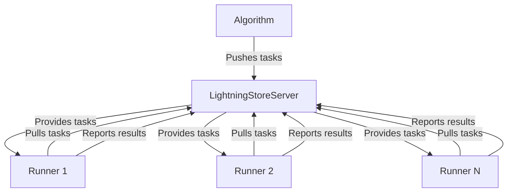

'''
# Distributed Training with `ClientServerExecutionStrategy`

## 1. Goal

This tutorial will guide you through setting up and running a distributed training job for your AI agents using `agentlightning`. We will focus on the `ClientServerExecutionStrategy`, which allows you to distribute the training process across multiple machines for improved scalability and performance.

## 2. Prerequisites

Before you begin, ensure you have the following:

- Python 3.10 or higher.
- The `agentlightning` package installed. You can install it using pip:

```bash
pip install agentlightning
```

## 3. Architecture

The `ClientServerExecutionStrategy` implements a distributed architecture where the core components of the training process can run on separate machines. The main components are:

- **Algorithm**: The main process that orchestrates the training, including managing the agent's learning process and sending tasks to the runners.
- **LightningStoreServer**: A central server that stores and distributes tasks, model weights, and other resources.
- **Runners**: Worker processes that execute the agent's rollouts (e.g., playing a game, interacting with an environment) and report the results back to the store.

The following diagram illustrates this architecture:



## 4. Implementation Steps

We will now demonstrate how to use `ClientServerExecutionStrategy` in different roles. We'll use a simple agent and training setup for this example.

### Step 1: The Training Script

First, let's create a single Python script that can act as the algorithm, a runner, or both. This is a common pattern that simplifies deployment.

```python
# training_script.py
import asyncio
import logging
from typing import Literal

from agentlightning.execution.client_server import ClientServerExecutionStrategy
from agentlightning.store.in_memory import InMemoryStore
from agentlightning.structs import Task

# Dummy components for demonstration
async def dummy_algorithm(store, stop_event):
    for i in range(10):
        if stop_event.is_set():
            break
        task = Task(data=f"task_{i}")
        await store.add_task(task)
        await asyncio.sleep(1)
    print("Algorithm finished adding tasks.")

async def dummy_runner(store, worker_id, stop_event):
    while not stop_event.is_set():
        task = await store.get_task()
        if task:
            print(f"Runner {worker_id} processing {task.data}")
            await asyncio.sleep(2)
        else:
            await asyncio.sleep(1)
    print(f"Runner {worker_id} stopping.")


def main(role: Literal["algorithm", "runner", "both"]):
    strategy = ClientServerExecutionStrategy(
        role=role,
        server_host="localhost",
        server_port=8000,
        n_runners=2
    )
    store = InMemoryStore()
    strategy.execute(dummy_algorithm, dummy_runner, store)

if __name__ == "__main__":
    import sys
    # In a real application, you would use a proper CLI library like argparse
    role = sys.argv[1] if len(sys.argv) > 1 else "both"
    logging.basicConfig(level=logging.INFO)
    main(role)

```

### Step 2: Running the Distributed System

Now, you can run this script in different modes to create your distributed system.

#### Option A: All-in-One (for testing)

Run everything in one command. This will start the algorithm and two runner processes on your local machine.

*Verification*:

```bash
python training_script.py both
```

You should see output from both the algorithm and the runners, similar to this:

```
INFO:agentlightning.execution.client_server:Starting client-server execution with 2 runner(s) [role=both, main_process=algorithm]
INFO:agentlightning.execution.client_server:Spawning runner processes...
INFO:agentlightning.execution.client_server:Running algorithm...
INFO:agentlightning.execution.client_server:Starting LightningStore server on localhost:8000
Runner 0 processing task_0
Runner 1 processing task_1
...
Algorithm finished adding tasks.
```

#### Option B: Separate Algorithm and Runners

This is a more realistic distributed setup.

1.  **Start the Algorithm Server**:
    In one terminal, start the algorithm process. This will also start the `LightningStoreServer`.

    *Verification*:

    ```bash
    python training_script.py algorithm
    ```

    The output will show the server starting:

    ```
    INFO:agentlightning.execution.client_server:Starting client-server execution with 2 runner(s) [role=algorithm, main_process=algorithm]
    INFO:agentlightning.execution.client_server:Running algorithm solely...
    INFO:agentlightning.execution.client_server:Starting LightningStore server on localhost:8000
    ```

2.  **Start the Runners**:
    In another terminal (or on a different machine that can reach the algorithm server), start the runner processes.

    *Verification*:

    ```bash
    python training_script.py runner
    ```

    The runners will connect to the server and start processing tasks:

    ```
    INFO:agentlightning.execution.client_server:Starting client-server execution with 2 runner(s) [role=runner, main_process=algorithm]
    INFO:agentlightning.execution.client_server:Spawning runner processes...
    Runner 0 processing task_0
    Runner 1 processing task_1
    ...
    ```

## 5. Common Pitfalls

- **Firewall and Network Issues**: If your runners are on a different machine than your algorithm server, ensure that the server's host and port are accessible. Firewalls might block the connection.
- **Shared Storage**: In a real-world scenario, you would use a persistent, shared `LightningStore` implementation (like one based on Redis or a database) instead of `InMemoryStore` so that all components can access the same data.
- **Resource Management**: Be mindful of the resources (CPU, memory, GPU) each runner requires. The `n_runners` parameter should be set according to the capacity of your runner machines.

## 6. Challenge Yourself

Modify the `training_script.py` to use a file-based log instead of printing to the console. Run the distributed setup with the algorithm on your local machine and a runner on a different machine in your network. Check the log files on both machines to verify that the system is working correctly.
'''