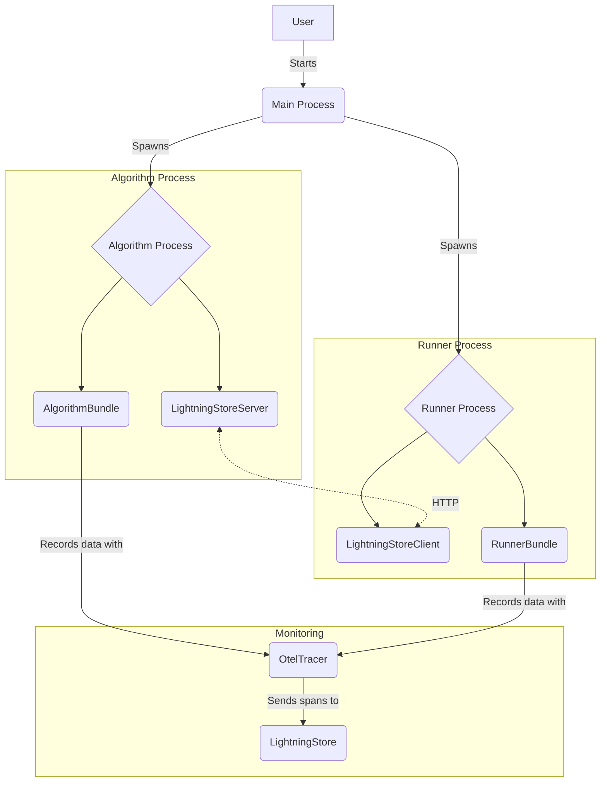

'''
# Execution and Instrumentation in AgentLightning

## 1. Synopsis

Modern agent-based applications often involve multiple components running in parallel, communicating with each other, and interacting with external services. This complexity makes it challenging to execute, monitor, and debug these applications. In this tutorial, you will learn how to use AgentLightning's execution and instrumentation features to address these challenges.

We will explore the client-server execution model, which allows you to run different parts of your application in separate processes. We will also dive into the OpenTelemetry-based tracing system, which provides deep insights into your application's behavior.

## 2. Prerequisites

Before you begin, make sure you have the following installed:

- Python 3.9+
- `agentlightning`
- `opentelemetry-sdk`

## 3. Architecture

The following diagram illustrates the client-server execution model and the role of the `OtelTracer`:



## 4. Implementation Steps

### Step 1: Define a Simple Algorithm and Runner

First, let's define a simple algorithm and runner. The algorithm will send a message to the runner, and the runner will print the message.

```python
import asyncio
from agentlightning.execution.base import AlgorithmBundle, RunnerBundle
from agentlightning.store.base import LightningStore
from agentlightning.execution.events import ExecutionEvent

class MyAlgorithm(AlgorithmBundle):
    async def __call__(self, store: LightningStore, event: ExecutionEvent) -> None:
        print("Algorithm started")
        await store.put("message", "Hello from the algorithm!")
        await asyncio.sleep(1)
        print("Algorithm finished")

class MyRunner(RunnerBundle):
    async def __call__(self, store: LightningStore, worker_id: int, event: ExecutionEvent) -> None:
        print(f"Runner {worker_id} started")
        message = await store.get("message")
        print(f"Runner {worker_id} received: {message}")
        print(f"Runner {worker_id} finished")
```

### Step 2: Client-Server Execution

Now, let's use the `ClientServerExecutionStrategy` to run the algorithm and runner in separate processes.

```python
from agentlightning.execution.client_server import ClientServerExecutionStrategy
from agentlightning.store.memory import InMemoryStore

if __name__ == "__main__":
    # In one terminal, run the algorithm
    # python your_script.py --role algorithm

    # In another terminal, run the runner
    # python your_script.py --role runner

    import argparse

    parser = argparse.ArgumentParser()
    parser.add_argument("--role", type=str, choices=["algorithm", "runner", "both"], default="both")
    args = parser.parse_args()

    strategy = ClientServerExecutionStrategy(role=args.role)
    store = InMemoryStore()
    algorithm = MyAlgorithm()
    runner = MyRunner()

    strategy.execute(algorithm, runner, store)
```

*Verification*: You will see the "Algorithm started" and "Runner started" messages in the respective terminals, followed by the runner printing the message from the algorithm.

### Step 3: Instrumentation with OtelTracer

Now, let's add tracing to our application using the `OtelTracer`.

```python
import asyncio
from agentlightning.execution.base import AlgorithmBundle, RunnerBundle
from agentlightning.store.base import LightningStore
from agentlightning.execution.events import ExecutionEvent
from agentlightning.tracer.otel import OtelTracer

async def run_with_tracing():
    tracer = OtelTracer()
    async with tracer.trace_context("my-trace") as trace:
        with trace.start_as_current_span("algorithm") as span:
            print("Algorithm started")
            await asyncio.sleep(0.5)
            span.set_attribute("message", "Hello from the algorithm!")
            print("Algorithm finished")

        with trace.start_as_current_span("runner") as span:
            print("Runner started")
            await asyncio.sleep(0.5)
            span.set_attribute("message", "Hello from the runner!")
            print("Runner finished")

if __name__ == "__main__":
    asyncio.run(run_with_tracing())
```

*Verification*: When you run this script, the tracer will output the spans to the console. You will see the "algorithm" and "runner" spans with their respective attributes.

## 5. Common Pitfalls

- **Pickling Errors**: When using `multiprocessing`, all objects passed between processes must be picklable. This can be a common source of errors, especially with complex objects.
- **Network Configuration**: When running the client and server on different machines, ensure that the firewall rules and network configuration allow communication on the specified port.

## 6. Challenge Yourself

- Modify the `ClientServerExecutionStrategy` example to run multiple runners.
- Extend the `OtelTracer` example to send traces to a remote OpenTelemetry collector.
- Explore the `SharedMemoryExecutionStrategy` and compare its performance to the `ClientServerExecutionStrategy`.
'''