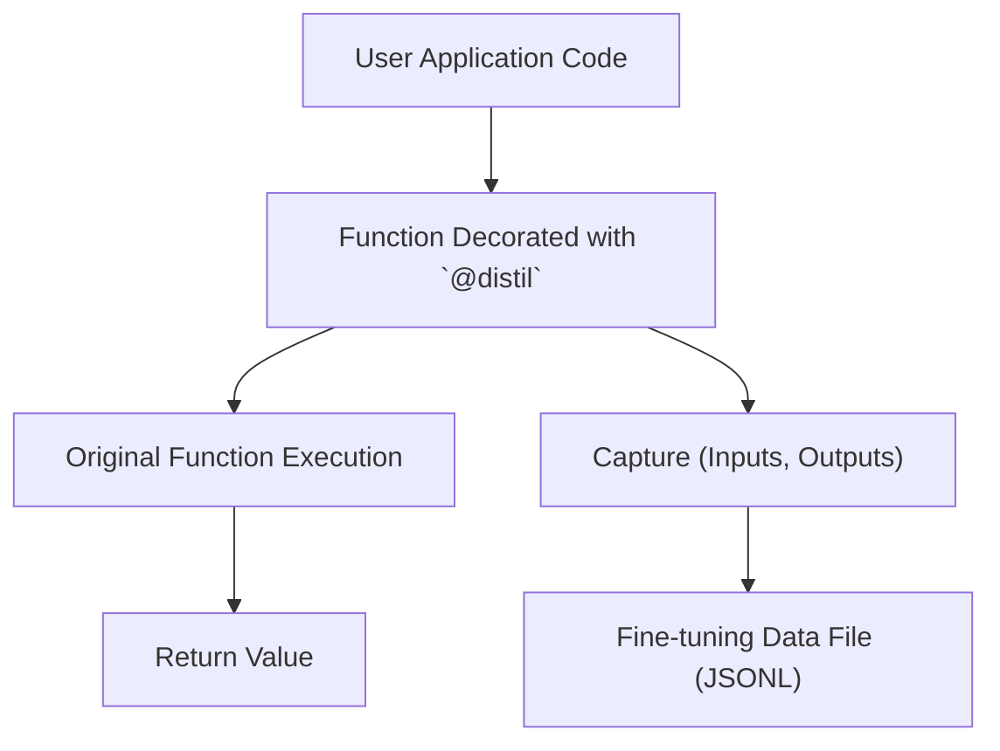

# Generating Fine-Tuning Data with `@distil`

## 1. Goal
In this tutorial, you will learn how to leverage the `instructor` library's `@distil` decorator to automatically capture function calls and their outputs. This process allows for the systematic generation of high-quality data suitable for fine-tuning large language models (LLMs), effectively creating a dataset that mirrors how your applications interact with these models. By the end, you will understand how to instrument your code to produce structured fine-tuning examples.

## 2. Prerequisites
- Python 3.9+
- Basic understanding of LLMs and fine-tuning concepts.
- Familiarity with `instructor` library basics, particularly patching LLM clients.
- `openai` library installed (`pip install openai instructor pydantic`)

## 3. Architecture
The `@distil` decorator intercepts calls to functions, logs their inputs (arguments) and outputs (return values), and saves this information to a specified file. This captured data forms the basis for fine-tuning datasets, allowing you to train smaller, more specialized models based on the behavior of larger, more capable ones.



## 4. Step 1: Setting up Your Environment
First, ensure you have the necessary libraries installed. We will be using `instructor` and `openai`.

```bash
pip install openai instructor pydantic
```

Next, let's define a simple Pydantic model and an OpenAI client, patched with `instructor`.

```python
import instructor
from openai import OpenAI
from pydantic import BaseModel
from typing import Literal

# Define a Pydantic model for structured output
class UserInformation(BaseModel):
    name: str
    age: int
    occupation: Literal['engineer', 'doctor', 'artist', 'other']

# Patch the OpenAI client
client = instructor.from_openai(OpenAI())
```

## 5. Step 2: Decorating a Function with `@distil`
Now, let's create a function that uses our patched OpenAI client to extract structured information. We will then decorate this function with `@distil`. The `@distil` decorator will automatically capture the function's arguments and its return value, saving them as a fine-tuning example.

We need to specify a `name` for our distillation pipeline and an `output_path` where the data will be saved. The `output_path` should end with `.jsonl`.

```python
@instructor.distil(
    name="user_info_extraction",
    output_path="user_info_finetuning_data.jsonl",
)
def extract_user_info(text: str) -> UserInformation:
    """
    Extracts user information from a given text using an LLM.
    """
    return client.chat.completions.create(
        model="gpt-4",
        messages=[{"role": "user", "content": f"Extract user information from: {text}"}],
        response_model=UserInformation,
    )


# Example usage:
print("Extracting user info for John Doe...")
john_data = extract_user_info("John Doe is 30 years old and works as an engineer.")
print(f"Extracted: {john_data.model_dump_json(indent=2)}")

print("\nExtracting user info for Jane Smith...")
jane_data = extract_user_info("Jane Smith is 45, a doctor.")
print(f"Extracted: {jane_data.model_dump_json(indent=2)}")
```

## 6. Step 3: Examining the Generated Fine-Tuning Data
After running the code above, a file named `user_info_finetuning_data.jsonl` will be created in your working directory. Each line in this file will be a JSON object representing a single fine-tuning example.

Here's what the `user_info_finetuning_data.jsonl` file will look like:

```json
{"name": "user_info_extraction", "input": {"text": "John Doe is 30 years old and works as an engineer."}, "output": {"name": "John Doe", "age": 30, "occupation": "engineer"}}
{"name": "user_info_extraction", "input": {"text": "Jane Smith is 45, a doctor."}, "output": {"name": "Jane Smith", "age": 45, "occupation": "doctor"}}
```

Each entry includes:
- `"name"`: The name of the distillation pipeline, which is useful for organizing different types of fine-tuning data.
- `"input"`: A dictionary of the arguments passed to the decorated function (`extract_user_info` in this case).
- `"output"`: The return value of the decorated function, which is the structured `UserInformation` object in this example.

This `.jsonl` format is commonly used for fine-tuning LLMs, allowing you to feed these examples directly into training pipelines to teach smaller models to perform similar structured extractions.

## 7. Conclusion
Congratulations! You've successfully used the `@distil` decorator to automatically generate fine-tuning data from your application's interactions with LLMs. This powerful feature of `instructor` simplifies the creation of high-quality datasets, enabling you to train more efficient and specialized models. You can extend this by decorating more functions and generating diverse datasets for various tasks, further enhancing your LLM-powered applications. Remember, the key is to run your application with the decorated functions, and `instructor` will handle the data capture for you.