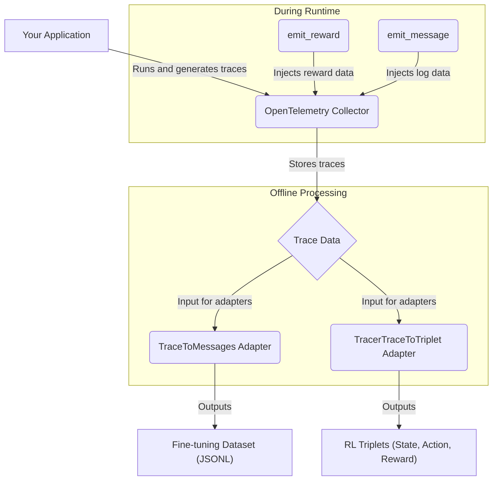

'''
# Adapters and Emitters: Transforming Telemetry for AI

Welcome to this tutorial on **Adapters and Emitters** in the AgentLightning framework. These powerful components are the bridge between raw application telemetry and the structured data required for training machine learning models. By the end, you'll know how to customize your data pipeline to create training data for fine-tuning and reinforcement learning.

## 1. Goal

In this tutorial, you will learn how to:

-   Inject custom data (rewards and messages) into your trace data using **Emitters**.
-   Transform raw trace data into structured formats (like OpenAI messages or RL triplets) using **Adapters**.

This will enable you to create custom training data from your application's runtime behavior.

## 2. Prerequisites

-   Python 3.9+
-   An understanding of OpenTelemetry tracing concepts (spans, traces).
-   The `agentlightning` library installed.

## 3. Architecture

The relationship between your application, emitters, and adapters is straightforward. Emitters inject data during runtime, and adapters process that data offline.



## 4. Step 1: Using Emitters to Add Context

Emitters are functions that let you add specific, structured data to your traces. This is invaluable for annotating your application's behavior with information that can be used for model training.

### Emitting Rewards

The `emit_reward` function allows you to record a scalar reward value. This is essential for reinforcement learning, where you need to provide feedback to the agent.

Let's say you have a function that evaluates the quality of an LLM's response. You can use `emit_reward` to record the score.

```python
from agentlightning.emitter import emit_reward

def evaluate_response(response: str) -> float:
    # Dummy evaluation: reward based on length
    reward = 1.0 if len(response) > 50 else 0.0
    # Emit the reward into the current trace
    emit_reward(reward)
    return reward

# In your application logic:
llm_response = "This is a sufficiently long and detailed response from the LLM."
evaluate_response(llm_response)
```

**Verification**: After running your application, you can inspect the generated traces. You will find a span named `AGL_ANNOTATION` with an attribute `lightning.span.reward` containing the value you emitted.

### Emitting Messages

The `emit_message` function is perfect for adding descriptive logs or comments to your traces. This can help with debugging or providing context for data analysis.

```python
from agentlightning.emitter import emit_message

def process_data(data: dict):
    if not data.get("user_id"):
        emit_message("Missing user_id in data", attributes={"data.keys": str(data.keys())})
        return

    # ... continue processing

# In your application
process_data({"product_id": "123"})
```

**Verification**: You will find a span named `AGL_MESSAGE` in your trace data. The message "Missing user_id in data" will be in the `lightning.span.message.body` attribute.

## 5. Step 2: Using Adapters to Transform Data

Adapters take a full trace (a sequence of spans) and transform it into a more useful format. AgentLightning provides adapters for common machine learning tasks.

### Creating Fine-Tuning Data with `TraceToMessages`

The `TraceToMessages` adapter converts a trace into a conversation history compatible with OpenAI's fine-tuning format. It intelligently reconstructs the back-and-forth between the user, the assistant, and any tools that were called.

```python
from agentlightning.adapter.messages import TraceToMessages
from agentlightning.types import Span

# Assume `trace_spans` is a list of Span objects from your trace data
# For example, loaded from a JSON file or retrieved from a collector
trace_spans: list[Span] = [] # You would load your actual spans here

# Initialize the adapter
messages_adapter = TraceToMessages()

# Adapt the spans
openai_messages = messages_adapter.adapt(trace_spans)

# The output is a list of objects ready for JSONL serialization
for message_group in openai_messages:
    print(message_group)
```

**Verification**: The output `openai_messages` will be a list of `OpenAIMessages` TypedDicts. Each dictionary contains a `messages` key with a list of conversation turns, and an optional `tools` key if any functions were defined.

### Creating Reinforcement Learning Data with `TracerTraceToTriplet`

The `TracerTraceToTriplet` adapter is designed for reinforcement learning. It processes a trace to identify **(State, Action, Reward)** triplets. In the context of LLMs:

-   **State**: The prompt given to the LLM.
-   **Action**: The response generated by the LLM.
-   **Reward**: The reward captured by `emit_reward`.

This adapter uses a `TraceTree` to reconstruct the sequence of events and correctly associate rewards with the actions that caused them.

```python
from agentlightning.adapter.triplet import TracerTraceToTriplet
from agentlightning.types import Span

# Assume `trace_spans` is a list of Span objects
trace_spans: list[Span] = [] # Load your spans here

# Initialize the adapter
# `llm_call_match` is a regex to identify LLM call spans
triplet_adapter = TracerTraceToTriplet(llm_call_match=".*llm.*")

# Adapt the spans
triplets = triplet_adapter.adapt(trace_spans)

for triplet in triplets:
    print(f"Prompt: {triplet.prompt}")
    print(f"Response: {triplet.response}")
    print(f"Reward: {triplet.reward}")
```

**Verification**: The output `triplets` will be a list of `Triplet` objects. Each object will have `prompt`, `response`, and `reward` attributes, which you can then use to train your RL agent.

## 6. Common Pitfalls

-   **Broken Traces**: Adapters like `TracerTraceToTriplet` rely on parent-child relationships between spans. If your tracing instrumentation is not set up correctly, you might have "orphan" spans. The `repair_hierarchy=True` option in `TracerTraceToTriplet` (which is on by default) can often fix this by analyzing span timings.
-   **Incorrect `llm_call_match`**: If the `TracerTraceToTriplet` adapter isn't finding any LLM calls, double-check the regex provided to `llm_call_match`. It must match the name of the spans corresponding to your LLM invocations.
-   **No Reward Span**: For a triplet to be generated, there must be a reward span that occurs *after* the LLM call. Ensure your `emit_reward` calls are correctly placed in your application logic.

## 7. Challenge Yourself

Now that you understand the basics, here's a challenge:

1.  Create a simple application that uses an LLM to answer a question.
2.  Instrument the application with OpenTelemetry.
3.  Use `emit_reward` to give a reward of `1.0` if the answer contains the word "Python", and `0.0` otherwise.
4.  Use `emit_message` to log the length of the LLM's response.
5.  Run the application to generate a trace.
6.  Write a script that uses `TracerTraceToTriplet` to extract the (Prompt, Response, Reward) triplet from the trace and prints it to the console.

This exercise will solidify your understanding of how to create a complete data pipeline from application telemetry to structured training data.
'''