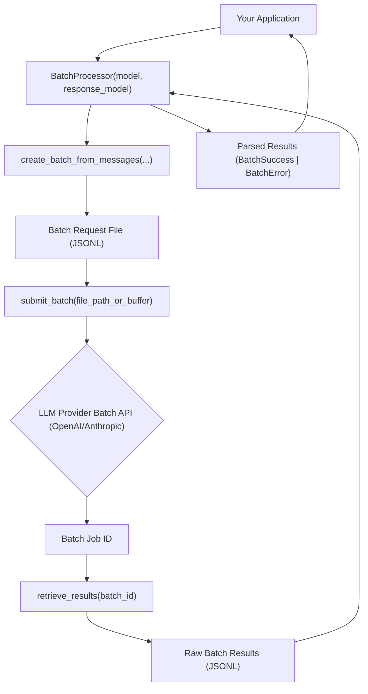

# Cross-Provider Batch Processing

## 1. Goal
In this tutorial, you will learn how to leverage the `BatchProcessor` from the `instructor` library to efficiently process multiple requests across different LLM providers (like OpenAI and Anthropic) using a unified API. By the end, you will have a working example of how to create a batch job, submit it, retrieve results, and handle both successful and erroneous responses.

This approach offers significant benefits, including potential cost savings (up to 50% on batch requests with some providers), simplified interaction with diverse LLM APIs, and robust error handling for structured outputs.

## 2. Prerequisites
- Python 3.9+
- Basic understanding of Pydantic for data modeling.
- An API key for OpenAI and/or Anthropic (depending on the provider you wish to use for batch processing).

## 3. Architecture
The `BatchProcessor` acts as an abstraction layer over different LLM provider's batch APIs. It standardizes the process of creating batch request files, submitting them, and parsing the results, regardless of the underlying provider's specific implementation.



## 4. Step 1: Setup and Data Modeling
First, we need to define the structured output we expect from our LLM using Pydantic. We'll also set up our `BatchProcessor` instance.

```python
import os
from pydantic import BaseModel, Field
from instructor.batch import BatchProcessor, filter_successful, extract_results

# 1. Define your desired data structure
class UserExtract(BaseModel):
    name: str = Field(..., description="The name of the user")
    age: int = Field(..., description="The age of the user")
    city: str | None = Field(None, description="The city where the user lives")

# 2. Instantiate the BatchProcessor
# The model string specifies the provider and the model, e.g., "openai/gpt-3.5-turbo"
# or "anthropic/claude-3-opus-20240229".
# Replace with your desired model and ensure you have the corresponding API key set as an environment variable.
# For example, for OpenAI, set OPENAI_API_KEY. For Anthropic, set ANTHROPIC_API_KEY.
processor = BatchProcessor(
    model="openai/gpt-3.5-turbo", # or "anthropic/claude-3-opus-20240229"
    response_model=UserExtract
)

print(f"BatchProcessor initialized for model: {processor.model} with response model: {processor.response_model.__name__}")
```

## 5. Step 2: Create and Submit a Batch Job
Next, we'll prepare a list of messages, create a batch file from them, and then submit this batch job to the LLM provider. The `create_batch_from_messages` function handles the formatting of requests for the specific provider.

```python
# 3. Prepare a list of message conversations
messages_to_process = [
    [{"role": "user", "content": "Extract the user: John is 30 years old and lives in New York."}],
    [{"role": "user", "content": "Extract the user: Jane is 25 years old and from London."}],
    [{"role": "user", "content": "Extract the user: Peter, 40, resides in Berlin."}],
    [{"role": "user", "content": "Extract the user: Alice, age 35."}], # Missing city for testing error handling
    [{"role": "user", "content": "This is not a user description."}], # Invalid content
]

# 4. Create the batch request file
batch_file_path = "batch_requests.jsonl"
created_file = processor.create_batch_from_messages(
    messages_to_process,
    file_path=batch_file_path,
    max_tokens=500,
    temperature=0.1
)
print(f"Batch request file created at: {created_file}")

# 5. Submit the batch job
# The submission process requires an active API key for the chosen provider.
# Ensure your environment variables (e.g., OPENAI_API_KEY, ANTHROPIC_API_KEY) are set.
try:
    batch_id = processor.submit_batch(created_file)
    print(f"Batch job submitted with ID: {batch_id}")
except Exception as e:
    print(f"Error submitting batch job: {e}")
    print("Please ensure your API key is correctly set for the chosen provider and that the model name is valid.")
    exit(1)
```

## 6. Step 3: Retrieve and Process Results
After submitting the job, we'll need to wait for it to complete. Once finished, we can retrieve the results and use the utility functions provided by `instructor.batch` to filter and extract the structured data.

```python
import time

# 6. Monitor batch job status and retrieve results
print("Waiting for batch job to complete...")
status = processor.get_batch_status(batch_id)
while status.get("status") not in ["completed", "failed", "cancelled"]:
    time.sleep(30) # Wait for 30 seconds before re-checking
    status = processor.get_batch_status(batch_id)
    print(f"Current batch status: {status.get('status')}. Remaining requests: {status.get('request_counts', {}).get('pending')}")

if status.get("status") == "completed":
    print("Batch job completed successfully!")
    all_results = processor.retrieve_results(batch_id)
    print(f"Retrieved {len(all_results)} results.")

    # 7. Filter and extract successful results
    successful_extractions = filter_successful(all_results)
    extracted_users: list[UserExtract] = extract_results(successful_extractions)

    print("\n--- Successful Extractions ---")
    for user in extracted_users:
        print(user.model_dump_json(indent=2))

    # 8. Filter and inspect errors
    failed_extractions = [res for res in all_results if res.error_type is not None]
    print("\n--- Failed Extractions ---")
    for error_res in failed_extractions:
        print(f"Custom ID: {error_res.custom_id}")
        print(f"Error Type: {error_res.error_type}")
        print(f"Error Message: {error_res.error_message}")
        print(f"Raw Data: {error_res.raw_data}\n")

else:
    print(f"Batch job finished with status: {status.get('status')}. No results to retrieve.")

# Optional: Clean up the batch job and local file
# processor.delete_batch(batch_id) # Uncomment to delete the batch job from the provider
# os.remove(batch_file_path) # Uncomment to remove the local batch request file
```

## 7. Conclusion
You've successfully used the `instructor.batch.BatchProcessor` to manage cross-provider batch processing for structured data extraction. You learned how to define a Pydantic `response_model`, prepare requests, submit a batch job, and process its results, differentiating between successful extractions and errors.

This unified interface simplifies working with different LLM batch APIs, making it easier to scale your applications and maintain consistent data processing workflows. You can extend this by integrating more sophisticated error recovery mechanisms or by dynamically choosing providers based on cost or performance. Remember to handle API keys securely and monitor your batch job statuses for optimal performance and cost management.