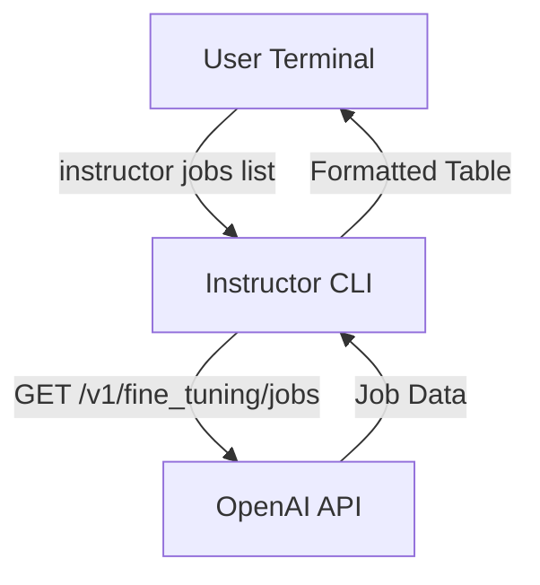

# Building a CLI with Instructor

## 1. Goal

This tutorial will guide you through using the `instructor` command-line interface (CLI) to manage fine-tuning jobs with OpenAI. We will focus on listing and monitoring existing jobs, a common task for developers working with custom models.

## 2. Prerequisites

Before you begin, ensure you have `instructor` installed:

```bash
pip install instructor
```

You also need to have your OpenAI API key set up as an environment variable:

```bash
export OPENAI_API_KEY="sk-..."
```

## 3. Architecture

The `instructor` CLI provides a convenient wrapper around the OpenAI API. When you use the `jobs` command, the CLI interacts with the fine-tuning endpoints to retrieve and display job information.



## 4. Implementation Steps

### Step 1: Listing Fine-Tuning Jobs

The most straightforward way to interact with your fine-tuning jobs is to list them. The `instructor jobs list` command provides a real-time view of your jobs.

```bash
instructor jobs list
```

This command will produce a table that automatically refreshes, showing the status of your most recent fine-tuning jobs.

*Verification*:

You will see a table in your terminal that looks like this, updated every 5 seconds:

```
 OpenAI Fine Tuning Job Monitoring
Automatically refreshes every 5 seconds, press Ctrl+C to exit

┏━━━━━━━━━━━━━━━━━━━━┳━━━━━━━━━━━━━━━━━━┳━━━━━━━━━━━━━━━━━━━━━━━━━━━━━━┳━━━━━━━━━━━━━━━━━━━━━━━━━━━━━━┳━━━━━━━━━━━━━━━━━━━━━━┳━━━━━━━━━━━━━━━━━━━━━━┳━━━━━━━━━━┳━━━━━━━━━━━━━┓
┃ Job ID             ┃ Status           ┃ Creation Time                ┃ Completion Time              ┃ Model Name           ┃ File ID              ┃ Epochs   ┃ Base Model  ┃
┡━━━━━━━━━━━━━━━━━━━━╇━━━━━━━━━━━━━━━━━━╇━━━━━━━━━━━━━━━━━━━━━━━━━━━━━━╇━━━━━━━━━━━━━━━━━━━━━━━━━━━━━━╇━━━━━━━━━━━━━━━━━━━━━━╇━━━━━━━━━━━━━━━━━━━━━━╇━━━━━━━━━━╇━━━━━━━━━━━━━┩
│ ftjob-abcde...       │ ✅ [green]succeeded[/] │ 2023-11-01 12:00:00            │ 2023-11-01 12:30:00            │ ft:gpt-3.5-turbo...  │ file-xyz...          │ 3        │ gpt-3.5-turbo │
│ ftjob-fghij...       │ ⏳ [yellow]running[/]   │ 2023-11-01 13:00:00            │ N/A                          │                      │ file-uvw...          │ auto     │ gpt-3.5-turbo │
└────────────────────┴──────────────────┴──────────────────────────────┴──────────────────────────────┴──────────────────────┴──────────────────────┴──────────┴─────────────┘
```

### Step 2: Customizing the Output

You can control the `list` command with several options. For example, you can change the number of jobs displayed and the polling interval.

To see the latest 10 jobs and refresh every 10 seconds, use the `--limit` and `--poll` options:

```bash
instructor jobs list --limit 10 --poll 10
```

*Verification*:

The table will now show up to 10 jobs, and you will notice the refresh happens at a 10-second interval.

## 5. Common Pitfalls

- **API Key Not Set**: If you haven't configured your `OPENAI_API_KEY`, you will get an authentication error. Make sure the environment variable is correctly set.
- **No Fine-Tuning Jobs**: If you have not created any fine-tuning jobs, the list will be empty. The CLI simply reports the information available from the OpenAI API.

## 6. Challenge Yourself

Now that you know how to list jobs, try the following:

1.  Create a dummy `jsonl` file for fine-tuning.
2.  Use the `instructor jobs create-from-file` command to start a new fine-tuning job.
3.  Use `instructor jobs list` to monitor your new job from creation to completion.

This exercise will give you a complete understanding of the fine-tuning workflow using the `instructor` CLI.
