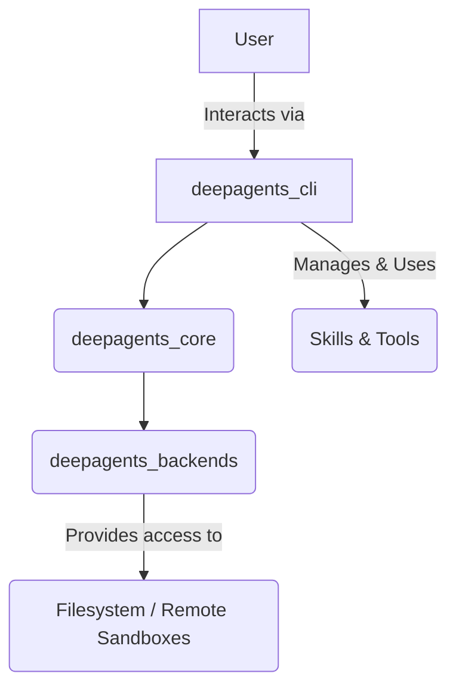

# Getting Started with DeepAgents

## 1. Goal
In this tutorial, you will learn how to get started with the DeepAgents framework. We'll cover installation, launching the command-line interface (CLI), and interacting with an agent using simple commands. By the end, you will have a basic understanding of how to use DeepAgents to interact with AI agents.

## 2. Prerequisites
- Basic familiarity with the command line.
- Python 3.9+ installed on your system.

## 3. Architecture
DeepAgents is built with a modular architecture. At its core, the `deepagents_core` handles the agent's intelligence, while `deepagents_cli` provides a user-friendly interface to interact with these agents. Backends manage how agents interact with the environment, such as the filesystem or remote execution environments.



## 4. Step 1: Install DeepAgents CLI

First, you need to install the `deepagents-cli` package. This package provides the command-line interface that you'll use to interact with your agents.

Open your terminal and run the following command:

```bash
pip install deepagents-cli
```

This command uses `pip`, Python's package installer, to download and install the DeepAgents CLI and its dependencies.

## 5. Step 2: Launch the CLI

Once installed, you can launch the DeepAgents CLI from your terminal. This will start an interactive session where you can chat with your AI agent.

Run:

```bash
deepagents-cli
```

You should see a prompt similar to this:

```
>>>
```

This `>>>` prompt indicates that the CLI is ready and waiting for your input.

## 6. Step 3: Basic Interactions - "Hello, World!"

Now, let's try a simple interaction. Type a greeting and press Enter.

```bash
Hello, DeepAgent!
```

The agent should respond to your message. This demonstrates the basic communication flow with your agent.

## 7. Step 4: Explore Basic Commands

The DeepAgents CLI comes with several useful slash commands for managing your session. These commands start with a forward slash (`/`).

### Get Help: `/help`

To see a list of available commands and a brief description of what they do, type `/help` and press Enter.

```bash
/help
```

This will display a menu of options, helping you navigate the CLI's capabilities.

### Clear Conversation: `/clear`

If your conversation with the agent becomes long or you want to start fresh, you can clear the chat history using the `/clear` command.

```bash
/clear
```

This command resets the current conversation context, allowing you to begin a new interaction without any previous messages influencing the agent's responses.

## 8. Conclusion

Congratulations! You've successfully installed the DeepAgents CLI, launched it, and had your first interactions with an AI agent. You also learned how to use basic commands like `/help` and `/clear` to manage your session.

From here, you can start exploring more advanced features of DeepAgents, such as defining custom skills and connecting to remote sandboxes for secure code execution. The world of AI agents is now at your fingertips!