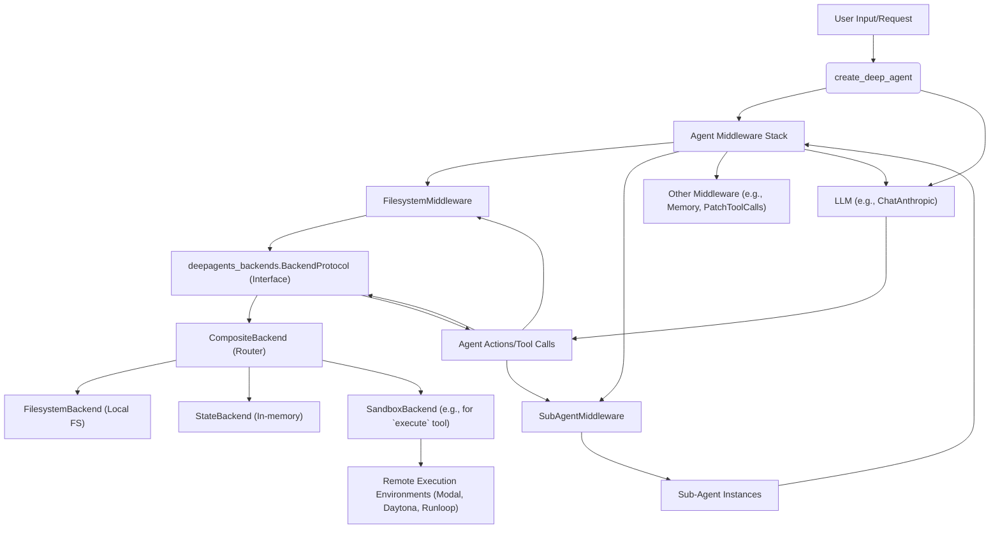

# DeepAgents - Core Concepts

## 1. Goal
In this tutorial, you will learn the core concepts of the DeepAgents framework, including how agents are created, how they interact with middleware for enhanced capabilities like filesystem access and sub-agent delegation, and how the flexible backend system allows for varied storage and execution environments. By the end, you will understand the fundamental architecture that makes DeepAgents powerful and extensible.

## 2. Prerequisites
- Basic understanding of Python programming.
- Familiarity with the concept of AI agents and large language models (LLMs).
- An environment capable of running Python 3.9+.

## 3. Architecture

The DeepAgents framework is built with modularity at its core, allowing for a flexible and extensible system. The `deepagents_core` library is responsible for agent creation and orchestrates a stack of middleware to provide specialized functionalities. The `deepagents_backends` library offers a pluggable system for abstracting filesystem operations and command execution, allowing agents to interact with various storage solutions and sandboxed environments.



## 4. Understanding `deepagents_core` and `create_deep_agent`

The `deepagents_core` library is the heart of the framework. Its primary function is `create_deep_agent`, which acts as an orchestrator to assemble an agent with specific capabilities. Instead of building agents from scratch every time, `create_deep_agent` allows you to define an agent's behavior by composing various middleware components.

Think of `create_deep_agent` as the agent's constructor. It takes parameters like the language model to use, the tools available, the system prompt, and crucially, a list of `middleware` instances. This middleware stack is what gives DeepAgents its power and flexibility.

### Why Middleware?
Middleware promotes a clean separation of concerns. Each middleware component is responsible for adding a specific capability or modifying the agent's behavior. For example, `FilesystemMiddleware` injects file interaction tools, and `SubAgentMiddleware` enables the agent to delegate tasks.

```python
# This is a conceptual example of how create_deep_agent might be used.
# The actual implementation might involve more complex configurations.
from deepagents.graph import create_deep_agent
from deepagents.middleware.filesystem import FilesystemMiddleware
from deepagents.middleware.subagents import SubAgentMiddleware
from deepagents.backends.composite import CompositeBackend
from deepagents.backends.filesystem import FilesystemBackend
from langchain_anthropic import ChatAnthropic

def build_my_agent():
    # Initialize our backend system. Here, we'll use a simple filesystem backend.
    # In a real scenario, you might configure a CompositeBackend with multiple routes.
    fs_backend = FilesystemBackend(cwd='./workspace') # './workspace' is a placeholder

    # Define the middleware stack
    middleware = [
        FilesystemMiddleware(backend=fs_backend), # Provides ls, read, write, execute tools
        SubAgentMiddleware(subagents=[], general_purpose_agent=True), # Enables sub-agent delegation
        # ... other middleware like AgentMemoryMiddleware, PatchToolCallsMiddleware
    ]

    # Create the deep agent
    my_agent = create_deep_agent(
        model=ChatAnthropic(model='claude-3-haiku-20240307'), # Example LLM
        middleware=middleware,
        system_prompt="You are a helpful assistant.",
        # ... other configurations
    )
    return my_agent

# To use the agent (conceptual):
# agent = build_my_agent()
# agent.invoke({'messages': [('user', 'List files in current directory')]})
```

## 5. Middleware Architecture: `FilesystemMiddleware` and `SubAgentMiddleware`

Middleware are key to extending DeepAgents' capabilities without altering its core logic. Let's look at two prominent examples:

### `FilesystemMiddleware`
This middleware equips your agent with tools to interact with a filesystem. It abstracts away the underlying storage mechanism, providing the agent with powerful capabilities like `ls` (list files), `read_file`, `write_file`, `edit_file`, and crucially, `execute` for running shell commands. The middleware ensures that these operations are performed securely and consistently, regardless of whether the agent is interacting with a local disk, an in-memory store, or a remote sandbox.

**How it works**: `FilesystemMiddleware` takes a `backend` instance (from `deepagents_backends`) during its initialization. This backend is responsible for the actual file operations. When the agent decides to `read_file`, for instance, the middleware translates this into a call to the `read` method of its configured backend.

### `SubAgentMiddleware`
For complex or multi-step tasks, a single agent can become overwhelmed or inefficient. `SubAgentMiddleware` introduces the concept of *sub-agents*, allowing the main agent to delegate specific tasks to specialized, ephemeral agents. These sub-agents operate with their own isolated context, enabling them to focus on a particular problem and return a concise result to the main agent.

**How it works**: This middleware injects a `task` tool into the main agent's toolkit. When the main agent determines a task is better handled by a sub-agent, it calls the `task` tool, specifying the sub-agent's purpose and input. The `SubAgentMiddleware` then dynamically creates and runs the sub-agent, captures its output, and feeds it back to the main agent.

This delegation pattern is crucial for managing complexity and preventing token bloat in long-running or intricate tasks.

## 6. Pluggable Backends with `deepagents_backends` and `CompositeBackend`

The `deepagents_backends` library provides a robust and flexible system for managing how agents interact with their environment, particularly concerning file operations and command execution. It's designed to be pluggable, meaning you can easily swap out or combine different backend implementations.

### `BackendProtocol`
At the core of `deepagents_backends` is the `BackendProtocol`. This is an abstract interface that all backend implementations must adhere to. It defines a standard set of methods for file operations (`ls_info`, `read`, `write`, `edit`, `grep_raw`, `glob_info`) and, for sandboxed environments, command execution (`execute`). This protocol ensures consistency across various backend types.

### `CompositeBackend`
The `CompositeBackend` is a powerful routing mechanism. It allows you to combine multiple backend instances and route file operations to the correct backend based on path prefixes. Imagine having a `/workspace` directory handled by a local `FilesystemBackend` and a `/memories` directory handled by a `StateBackend` (an in-memory store that benefits from LangGraph's checkpointing).

```python
from deepagents.backends.composite import CompositeBackend
from deepagents.backends.filesystem import FilesystemBackend
from deepagents.backends.state import StateBackend
from deepagents.backends.sandbox import BaseSandbox # Base class for sandboxes

# Assume a concrete Sandbox implementation exists, e.g., MySandbox(BaseSandbox)
# class MySandbox(BaseSandbox):
#    def execute(self, command: str) -> ExecuteResponse: # ... implement actual execution
#        pass
#    def upload_files(self, files: list[tuple[str, bytes]]) -> list[FileUploadResponse]:
#        pass
#    def download_files(self, files: list[str]) -> list[FileDownloadResponse]:
#        pass

def setup_multiple_backends():
    # A local filesystem backend for general workspace files
    local_fs = FilesystemBackend(cwd='./agent_workspace')

    # An in-memory backend for temporary state or agent memories
    in_memory_state = StateBackend() # Requires a ToolRuntime instance in a real agent context

    # A sandbox backend for secure code execution (e.g., a Docker container or remote VM)
    # For this example, we'll use a placeholder. In practice, this would be a concrete implementation
    # of BaseSandbox like ModalSandbox or DaytonaSandbox.
    # sandbox_backend = MySandbox() # Replace with actual sandbox backend

    # Create a CompositeBackend to route operations
    # For this tutorial, we will use a simplified CompositeBackend setup.
    # In a full agent setup, StateBackend needs to be initialized with a ToolRuntime.
    # We'll omit the sandbox here for simplicity, assuming local_fs will handle 'execute' if it can.
    
    # IMPORTANT: In a real DeepAgents setup, StateBackend is typically initialized within the agent's context
    # or requires a ToolRuntime, which isn't readily available here for a simple standalone example.
    # For demonstration purposes, we will show a CompositeBackend with FilesystemBackend only.
    # A StateBackend would be integrated within the create_deep_agent middleware stack.

    composite_backend = CompositeBackend(
        default=local_fs, # Default backend for any un-routed paths
        routes={
            "/workspace/": local_fs,
            # "/memories/": in_memory_state, # Would be enabled with proper ToolRuntime setup
            # "/sandbox/": sandbox_backend, # If a concrete sandbox backend is provided
        }
    )
    return composite_backend

# To use the composite backend (conceptual):
# backend = setup_multiple_backends()
# backend.write("/workspace/report.md", "This is my report content.")
# backend.read("/workspace/report.md")
# backend.write("/memories/note.txt", "Remember this.") # This would fail without StateBackend ToolRuntime
```

**P.S. about `execute`**: When an agent needs to run commands (like shell scripts), the `execute` tool relies on a backend that implements `SandboxBackendProtocol`. The `CompositeBackend` will delegate `execute` calls to its `default` backend, which typically would be a `SandboxBackend` or a `FilesystemBackend` configured to allow execution.

## 7. Conclusion

You've now explored the core architectural components of the DeepAgents framework. You've learned how `create_deep_agent` brings together various middleware to define an agent's capabilities, with `FilesystemMiddleware` and `SubAgentMiddleware` providing crucial functionalities like secure file interaction and task delegation. Furthermore, you understand how `deepagents_backends` and the `CompositeBackend` enable a flexible, pluggable approach to managing an agent's environment and resources. This modular design is what allows DeepAgents to build, manage, and deploy sophisticated AI agents capable of tackling complex, real-world problems. Experiment with different middleware and backend configurations to see how you can customize your agents for specific tasks!