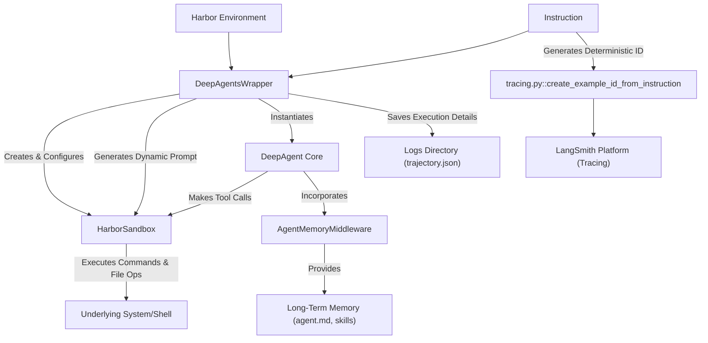

# Advanced Topics & Deployment with Harbor

## 1. Goal
In this tutorial, you will learn how to leverage the `deepagents_harbor` library to deploy and evaluate your DeepAgents within the Harbor environment. We will cover the purpose of the `HarborSandbox` backend, how to wrap your agents for deployment, the role of `AgentMemoryMiddleware` for long-term memory, and how trajectory logging aids in analysis and debugging. By the end, you will understand how to bridge the gap from agent development to robust evaluation and potential production deployment.

## 2. Prerequisites
- Basic understanding of the DeepAgents framework.
- Python 3.9+
- Familiarity with command-line interfaces.

## 3. Architecture
Deploying a DeepAgent to Harbor involves several key components working together to provide a sandboxed environment for execution, while also enabling comprehensive evaluation through tracing and trajectory logging.



## 4. Step 1: Understanding `deepagents_harbor` and `HarborSandbox`
The `deepagents_harbor` library is designed to facilitate the deployment and evaluation of DeepAgents within the Harbor ecosystem. At its core is the `HarborSandbox` backend, which implements the `SandboxBackendProtocol` for DeepAgents. This allows your agent to interact with the sandboxed environment securely.

`HarborSandbox` provides a consistent interface for your agent to perform actions like executing shell commands, reading, writing, and editing files, and listing directory contents. It handles the nuances of the Harbor environment, such as filtering out harmless bash error messages from non-interactive shells, ensuring a clean and reliable execution context for your agent.

### Why `HarborSandbox`?
When you develop an agent, it needs to interact with its environment. In a production or evaluation setting, direct access to the host system is often undesirable for security and reproducibility reasons. `HarborSandbox` acts as a secure intermediary, providing your DeepAgent with the necessary tools to operate within a controlled, isolated environment.

## 5. Step 2: Wrapping and Deploying a DeepAgent for Evaluation
To deploy your DeepAgent within Harbor, you'll typically use the `DeepAgentsWrapper`. This class acts as an adapter, taking your DeepAgent and integrating it into the Harbor's evaluation framework. The wrapper handles the setup of the `HarborSandbox`, the creation of your DeepAgent, and the logging of its execution trajectory.

Here's a simplified look at how a `DeepAgentsWrapper` might be initialized and how its `run` method orchestrates the agent's execution:

```python
# This code snippet illustrates the concepts, actual implementation resides in deepagents_harbor/deepagents_wrapper.py

import os
from datetime import datetime, timezone
from pathlib import Path
from typing import Any, Dict

from deepagents.agents import create_deep_agent
from deepagents.backends.protocol import SandboxBackendProtocol
from deepagents.middleware.agent_memory import AgentMemoryMiddleware
from harbor.environments.base import BaseEnvironment, AgentContext # Assuming these exist

# Placeholder for HarborSandbox, which would be imported from deepagents_harbor.backend
class HarborSandbox(SandboxBackendProtocol):
    def __init__(self, environment: BaseEnvironment):
        self.environment = environment

    async def aexecute(self, command: str) -> Dict[str, Any]:
        # Simulate command execution in a sandboxed environment
        print(f"Executing: {command}")
        # In a real scenario, this would call self.environment.exec()
        return {"output": f"Simulated output for: {command}", "exit_code": 0}

    async def aread(self, file_path: str, offset: int = 0, limit: int = 2000) -> str:
        print(f"Reading file: {file_path}")
        return f"Simulated content of {file_path}"

    async def awrite(self, file_path: str, content: str) -> Dict[str, Any]:
        print(f"Writing to {file_path} with content: {content[:50]}...")
        return {"status": "success"}

    async def als_info(self, path: str) -> list:
        print(f"Listing directory: {path}")
        return [] # Simplified

class DeepAgentsWrapper:
    def __init__(self, logs_dir: Path, model_name: str = "gpt-4", temperature: float = 0.0):
        self.logs_dir = logs_dir
        self._model_name = model_name
        self._temperature = temperature

    def _get_formatted_system_prompt(self, backend: HarborSandbox) -> str:
        # Dynamically generate system prompt based on environment context
        return f"You are an AI assistant in a Harbor environment. Current dir: /workspace. Files: [list of files from backend.als_info()]"

    async def run(self, instruction: str, environment: BaseEnvironment, context: AgentContext):
        # 1. Setup HarborSandbox backend
        harbor_backend = HarborSandbox(environment=environment)

        # 2. Prepare middleware for the DeepAgent
        # AgentMemoryMiddleware is crucial for providing long-term memory
        agent_memory_path = Path("/memories/agent.md") # Example path
        agent_memory_middleware = AgentMemoryMiddleware(agent_memory_path=agent_memory_path)

        # 3. Create the DeepAgent (simplified, actual creation uses deepagents.agents.create_deep_agent)
        # This would typically involve FilesystemMiddleware and other components
        # For this example, we
# Advanced Topics & Deployment with Harbor

## 1. Goal
In this tutorial, you will learn how to leverage the `deepagents_harbor` library to deploy and evaluate your DeepAgents within the Harbor environment. We will cover the purpose of the `HarborSandbox` backend, how to wrap your agents for deployment, the role of `AgentMemoryMiddleware` for long-term memory, and how trajectory logging aids in analysis and debugging. By the end, you will understand how to bridge the gap from agent development to robust evaluation and potential production deployment.

## 2. Prerequisites
- Basic understanding of the DeepAgents framework.
- Python 3.9+
- Familiarity with command-line interfaces.

## 3. Architecture
Deploying a DeepAgent to Harbor involves several key components working together to provide a sandboxed environment for execution, while also enabling comprehensive evaluation through tracing and trajectory logging.


## 4. Step 1: Understanding `deepagents_harbor` and `HarborSandbox`
The `deepagents_harbor` library is designed to facilitate the deployment and evaluation of DeepAgents within the Harbor ecosystem. At its core is the `HarborSandbox` backend, which implements the `SandboxBackendProtocol` for DeepAgents. This allows your agent to interact with the sandboxed environment securely.

`HarborSandbox` provides a consistent interface for your agent to perform actions like executing shell commands, reading, writing, and editing files, and listing directory contents. It handles the nuances of the Harbor environment, such as filtering out harmless bash error messages from non-interactive shells, ensuring a clean and reliable execution context for your agent.

### Why `HarborSandbox`?
When you develop an agent, it needs to interact with its environment. In a production or evaluation setting, direct access to the host system is often undesirable for security and reproducibility reasons. `HarborSandbox` acts as a secure intermediary, providing your DeepAgent with the necessary tools to operate within a controlled, isolated environment.

## 5. Step 2: Wrapping and Deploying a DeepAgent for Evaluation
To deploy your DeepAgent within Harbor, you'll typically use the `DeepAgentsWrapper`. This class acts as an adapter, taking your DeepAgent and integrating it into the Harbor's evaluation framework. The wrapper handles the setup of the `HarborSandbox`, the creation of your DeepAgent, and the logging of its execution trajectory.

Here's a simplified look at how a `DeepAgentsWrapper` might be initialized and how its `run` method orchestrates the agent's execution:

```python
# This code snippet illustrates the concepts, actual implementation resides in deepagents_harbor/deepagents_wrapper.py

import os
from datetime import datetime, timezone
from pathlib import Path
from typing import Any, Dict

from deepagents.agents import create_deep_agent
from deepagents.backends.protocol import SandboxBackendProtocol
from deepagents.middleware.agent_memory import AgentMemoryMiddleware
from harbor.environments.base import BaseEnvironment, AgentContext # Assuming these exist

# Placeholder for HarborSandbox, which would be imported from deepagents_harbor.backend
class HarborSandbox(SandboxBackendProtocol):
    def __init__(self, environment: BaseEnvironment):
        self.environment = environment

    async def aexecute(self, command: str) -> Dict[str, Any]:
        # Simulate command execution in a sandboxed environment
        print(f"Executing: {command}")
        # In a real scenario, this would call self.environment.exec()
        return {"output": f"Simulated output for: {command}", "exit_code": 0}

    async def aread(self, file_path: str, offset: int = 0, limit: int = 2000) -> str:
        print(f"Reading file: {file_path}")
        return f"Simulated content of {file_path}"

    async def awrite(self, file_path: str, content: str) -> Dict[str, Any]:
        print(f"Writing to {file_path} with content: {content[:50]}...")
        return {"status": "success"}

    async def als_info(self, path: str) -> list:
        print(f"Listing directory: {path}")
        return [] # Simplified

class DeepAgentsWrapper:
    def __init__(self, logs_dir: Path, model_name: str = "gpt-4", temperature: float = 0.0):
        self.logs_dir = logs_dir
        self._model_name = model_name
        self._temperature = temperature

    def _get_formatted_system_prompt(self, backend: HarborSandbox) -> str:
        # Dynamically generate system prompt based on environment context
        return f"You are an AI assistant in a Harbor environment. Current dir: /workspace. Files: [list of files from backend.als_info()]"

    async def run(self, instruction: str, environment: BaseEnvironment, context: AgentContext):
        # 1. Setup HarborSandbox backend
        harbor_backend = HarborSandbox(environment=environment)

        # 2. Prepare middleware for the DeepAgent
        # AgentMemoryMiddleware is crucial for providing long-term memory
        agent_memory_path = Path("/memories/agent.md") # Example path
        agent_memory_middleware = AgentMemoryMiddleware(agent_memory_path=agent_memory_path)

        # 3. Create the DeepAgent (simplified, actual creation uses deepagents.agents.create_deep_agent)
        # This would typically involve FilesystemMiddleware and other components
        # For this example, we'll mock a basic agent.
        # In a real scenario, you'd pass middleware to create_deep_agent
        # agent = create_deep_agent(backend=harbor_backend, middleware=[agent_memory_middleware], ...)
        class MockDeepAgent:
            async def arun(self, instruction: str):
                print(f"DeepAgent received instruction: {instruction}")
                # Simulate some tool calls and responses
                await harbor_backend.aexecute("echo Hello from agent")
                await harbor_backend.awrite("output.txt", "Agent finished its task.")
                return {"messages": [], "result": "Agent completed the task."}

        agent = MockDeepAgent()

        print(f"Running DeepAgent with instruction: {instruction}")
        result = await agent.arun(instruction)

        # 4. Save the execution trajectory for analysis
        self._save_trajectory(environment, instruction, {"messages": [], "result": "Agent completed the task."}) # Simplified result
        print(f"Trajectory saved to {self.logs_dir / "trajectory.json"}")


    def _save_trajectory(self, environment: BaseEnvironment, instruction: str, result: dict) -> None:
        # Simplified version of trajectory saving for demonstration
        trajectory_path = self.logs_dir / "trajectory.json"
        with open(trajectory_path, "w") as f:
            f.write(f"{{\"instruction\": \"{instruction}\", \"result\": \"{result}\", \"timestamp\": \"{datetime.now(timezone.utc).isoformat()}\"}}")

# Example usage (would be called by the Harbor environment)
async def main():
    logs_directory = Path("./harbor_logs")
    logs_directory.mkdir(exist_ok=True)

    # Mock BaseEnvironment and AgentContext
    class MockEnvironment:
        session_id = "test-session-123"
        async def exec(self, command: str) -> Dict[str, Any]:
            return {"stdout": f"Mock output for {command}", "stderr": "", "return_code": 0}

    class MockAgentContext:
        pass

    wrapper = DeepAgentsWrapper(logs_directory)
    await wrapper.run(
        instruction="Analyze the codebase and suggest improvements.",
        environment=MockEnvironment(),
        context=MockAgentContext()
    )

# To run this example:
# import asyncio
# asyncio.run(main())

```

### Explanation:
- **`HarborSandbox` Initialization**: The `DeepAgentsWrapper` creates an instance of `HarborSandbox`, passing the `Harbor` environment to it. This links your agent's actions to the sandboxed execution context.
- **Middleware Preparation**: Crucially, `AgentMemoryMiddleware` is prepared here. This middleware is vital for providing your agent with long-term memory, allowing it to retain context across interactions and sessions (more on this in the next step).
- **DeepAgent Creation**: The wrapper then creates your `DeepAgent` instance, injecting the `HarborSandbox` as its backend and including any necessary middleware.
- **Execution and Trajectory Saving**: The `run` method invokes your DeepAgent with the given instruction. After execution, it calls `_save_trajectory` to log all the steps, tool calls, and observations, creating a detailed `trajectory.json` file. This file is invaluable for understanding your agent's behavior and for debugging.

## 6. Step 3: `AgentMemoryMiddleware` for Long-Term Memory
One of the advanced features of DeepAgents is its ability to have long-term memory, facilitated by the `AgentMemoryMiddleware`. This middleware provides agents with persistent context by loading information from `agent.md` and skill files.

### How it Works:
When `AgentMemoryMiddleware` is part of your agent's middleware stack, it ensures that the agent can access predefined information. This can include:
- **`agent.md`**: A file containing the agent's core instructions, personality, and general knowledge. This allows the agent to maintain its role and purpose consistently.
- **Skill Files**: Markdown files (`.md`) defining specific capabilities or knowledge domains for the agent. These skills can include structured instructions or custom tools that the agent can utilize.

By providing this memory, the agent can avoid redundant information gathering and operate more efficiently and effectively, especially in complex, multi-step tasks. For example, an agent tasked with code refactoring can remember coding standards defined in its `agent.md` or recall how to use a specific refactoring tool from a skill file.

## 7. Step 4: Trajectory Logging for Analysis and Debugging
The `DeepAgentsWrapper` automatically logs the entire execution trajectory of your DeepAgent. This trajectory is saved as a `trajectory.json` file in a structured format (ATIF-v1.2). This log is not just a simple record; it's a comprehensive breakdown of your agent's decision-making process.

### What's in a Trajectory Log?
- **Steps**: Each significant action taken by the agent, including its thoughts, messages, and tool calls.
- **Tool Calls**: Details of every tool (e.g., `execute`, `read`, `write`) invoked by the agent, including the arguments passed to them.
- **Observations**: The results or output received by the agent after executing a tool call.
- **Metrics**: Token usage, number of steps, and other performance indicators.

```json
// Example of a simplified trajectory.json structure
{
  "schema_version": "ATIF-v1.2",
  "session_id": "test-session-123",
  "agent": {
    "name": "MyDeepAgent",
    "version": "1.0",
    "model_name": "gpt-4"
  },
  "steps": [
    {
      "step_id": 1,
      "source": "user",
      "message": "Analyze the codebase and suggest improvements."
    },
    {
      "step_id": 2,
      "source": "agent",
      "message": "Okay, I will start by listing the files.",
      "tool_calls": [
        {
          "tool_call_id": "tool_0",
          "function_name": "als_info",
          "arguments": {
            "path": "./"
          }
        }
      ],
      "observation": {
        "results": [
          {
            "source_call_id": "tool_0",
            "content": "['main.py', 'utils.py']" // Simulated output
          }
        ]
      }
    }
    // ... more steps
  ],
  "final_metrics": {
    "total_prompt_tokens": 150,
    "total_completion_tokens": 80,
    "total_steps": 2
  }
}
```

### Why is Trajectory Logging Important?
- **Debugging**: Pinpoint exactly where an agent went wrong. You can see the agent's reasoning, the tools it called, and the observations it received at each step.
- **Evaluation**: Understand how efficiently and effectively your agent is performing its tasks. Analyze token usage, number of steps, and the overall flow to identify areas for improvement.
- **Reproducibility**: With a detailed log, you can reconstruct the agent's execution path, which is crucial for replicating issues or verifying improvements.
- **Human-in-the-Loop Analysis**: For complex tasks, humans can review trajectories to provide feedback and guide agent development.

## 8. Conclusion
By integrating DeepAgents with the `deepagents_harbor` library, you gain access to a powerful framework for evaluating and deploying your AI agents in a controlled and observable environment. The `HarborSandbox` provides a secure execution context, `AgentMemoryMiddleware` enables long-term memory for more sophisticated behaviors, and comprehensive trajectory logging offers unparalleled insights into your agent's performance. This advanced integration allows you to move beyond basic development and build agents that are robust, intelligent, and ready for real-world application and rigorous evaluation. Try deploying your own DeepAgent to Harbor and leverage these advanced features to build better AI systems!