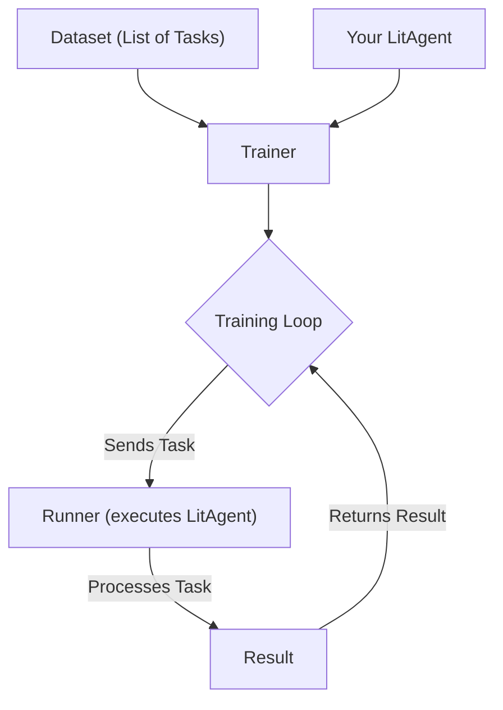

# Getting Started with agentlightning

This tutorial guides you through the process of setting up your first `agentlightning` project. You will learn how to define a basic `LitAgent`, configure a `Trainer`, and execute a simple training loop.

## 1. Synopsis: The "Why"

In the world of AI agents, moving from a simple proof-of-concept to a robust, trainable system is a significant challenge. `agentlightning` provides the scaffolding to structure your agent's logic (`LitAgent`) and manage its training (`Trainer`). It handles the complex parts like parallel data processing, task orchestration, and results tracking, letting you focus on the core agent intelligence.

This tutorial will create a very basic "Echo Agent". It doesn't learn, but it demonstrates the fundamental wiring of the `agentlightning` framework. We will feed it a list of tasks, and it will "process" them, showing that the `Trainer` and `LitAgent` are communicating correctly.

## 2. Prerequisites

Before you begin, ensure you have Python 3.10+ installed. 

First, install `agentlightning` along with `torch`, which is a common dependency for agent-based models:

```bash
pip install agentlightning "torch>=2.0.0"
```

This will install the core `agentlightning` package and its dependencies.

## 3. Architecture: The Core Components

The `agentlightning` training process involves three main components:

*   **`LitAgent`**: Your agent. This is a Python class where you define the logic for how to handle a single piece of data or "task."
*   **`Trainer`**: The orchestrator. It takes your agent, your data, and settings (like how many parallel processes to run), and manages the entire training loop.
*   **Dataset**: A simple iterable (like a list) containing the tasks you want your agent to process.

Here is how they interact:



## 4. Implementation Steps

Let's build our Echo Agent. Create a Python file named `run_echo.py`.

### Step 1: Define Your `LitAgent`

The `LitAgent` is the heart of your application. It must implement the `rollout` method, which receives a single `task` from your dataset.

```python
# run_echo.py

from agentlightning import LitAgent, Trainer
from agentlightning.types import Rollout, NamedResources

# Define the data type for our tasks (simple strings)
TaskType = str

class EchoAgent(LitAgent[TaskType]):
    """
    A simple agent that prints the task it receives and returns it.
    """
    def rollout(self, task: TaskType, resources: NamedResources, rollout: Rollout) -> float:
        """
        This is the core logic of the agent.
        It receives one 'task' from the dataset at a time.
        """
        print(f"Agent received task: {task}")
        # In a real scenario, you would process the task and return a reward score.
        # For this example, we just return a dummy reward of 1.0
        return 1.0

```

*   **`EchoAgent(LitAgent[TaskType])`**: We subclass `LitAgent` and use generics (`[str]`) to specify that our agent expects tasks of type `str`.
*   **`rollout(...)`**: This method is the entry point for your agent's logic. The `Trainer` will call this method for each item in your dataset. It receives the `task` itself, a `resources` dictionary (for things like API keys or prompt templates, which we ignore for now), and `rollout` metadata.

### Step 2: Configure the `Trainer` and Dataset

Now, in the same file, we will add the code to set up the `Trainer` and run the training process.

```python
# run_echo.py (continued)

if __name__ == "__main__":
    # 1. Instantiate your agent
    agent = EchoAgent()

    # 2. Create your dataset
    # This is a simple list of strings. Each string is a "task".
    train_dataset = ["hello world", "this is a test", "agentlightning is running"]

    # 3. Configure the Trainer
    # n_runners specifies how many parallel processes to use for running the agent.
    trainer = Trainer(n_runners=1)

    # 4. Start the training loop
    print("Starting trainer...")
    trainer.fit(agent, train_dataset=train_dataset)
    print("Trainer finished.")

```

*   **`agent = EchoAgent()`**: We create an instance of our agent.
*   **`train_dataset = [...]`**: We define a simple list of strings that will be our data source.
*   **`trainer = Trainer(n_runners=1)`**: We instantiate the `Trainer`. `n_runners=1` means it will run in a single process, which is good for simple scripts and debugging.
*   **`trainer.fit(...)`**: This is the command that starts the entire process. The `Trainer` will iterate through `train_dataset` and pass each item to an `EchoAgent` instance via its `rollout` method.

### Step 3: Run the Code and Verify

Execute the script from your terminal:

```bash
python run_echo.py
```

*Verification*: You should see output showing that the agent received each task, demonstrating that the `Trainer` is successfully orchestrating the work:

```
Starting trainer...
Agent received task: hello world
Agent received task: this is a test
Agent received task: agentlightning is running
Trainer finished.
```

This confirms that your basic `agentlightning` application is set up correctly.

## 5. Common Pitfalls

*   **`NotImplementedError`**: If you create a `LitAgent` class but forget to implement the `rollout` method, you will get a `NotImplementedError` when you run `trainer.fit()`.
*   **Forgetting the Dataset**: The `trainer.fit()` call requires a dataset. If `train_dataset` is `None` or empty, the trainer will start but will have no work to do and will finish immediately.
*   **Async vs. Sync**: `LitAgent` supports both synchronous (`rollout`) and asynchronous (`rollout_async`) methods. Make sure you implement the correct one for your use case. For simple, blocking tasks, `rollout` is sufficient.

## 6. Challenge Yourself

To solidify your understanding, try modifying the `EchoAgent`.

1.  Create a `ReverseAgent` that takes the string task and returns the reversed string.
2.  Modify the `rollout` method to print both the original task and the reversed string.
3.  Think about what the "reward" could represent. For example, you could return the length of the string as a reward.

This simple exercise will prepare you for more complex agents that perform meaningful work and require more sophisticated reward calculation.