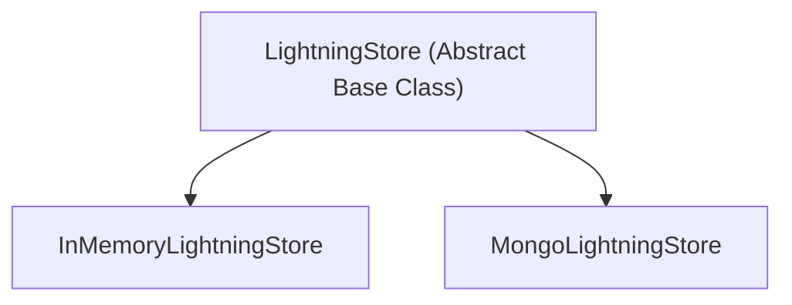

# Data Persistence with LightningStore

## 1. Goal

In this tutorial, you'll learn how to configure and use `LightningStore` to save and load training data, including rollouts and traces. We will cover both in-memory and persistent storage options.

## 2. Prerequisites

- `agentlightning` package installed.
- For persistent storage, a running MongoDB instance.

## 3. Architecture

`LightningStore` is an abstract base class that defines the interface for data storage. `agentlightning` provides two concrete implementations:

- `InMemoryLightningStore`: Stores data in memory. It's fast and easy to use for single-process applications and testing.
- `MongoLightningStore`: Stores data in a MongoDB database, providing persistence and scalability for distributed applications.



## 4. Implementation

### Step 1: Using `InMemoryLightningStore`

`InMemoryLightningStore` is the simplest way to get started. It requires no external dependencies and is great for local development and testing.

```python
import asyncio
from agentlightning.store.memory import InMemoryLightningStore
from agentlightning.types import TaskInput

async def main():
    # Instantiate the in-memory store
    store = InMemoryLightningStore()

    # Enqueue a new rollout
    rollout_request = TaskInput(content="run my agent")
    rollout = await store.enqueue_rollout(input=rollout_request)
    print(f"Enqueued rollout with ID: {rollout.rollout_id}")

    # Query the rollout
    retrieved_rollouts = await store.query_rollouts(rollout_id_in=[rollout.rollout_id])
    print(f"Retrieved rollout: {retrieved_rollouts[0]}")

if __name__ == "__main__":
    asyncio.run(main())

```

***Verification***

Running this script will output:

```
Enqueued rollout with ID: <rollout_id>
Retrieved rollout: Rollout(rollout_id='<rollout_id>', ...)
```

### Step 2: Using `MongoLightningStore`

For persistent storage and multi-process applications, `MongoLightningStore` is the recommended choice. It uses a MongoDB backend to store all the data.

```python
import asyncio
from agentlightning.store.mongo import MongoLightningStore
from agentlightning.types import TaskInput

async def main():
    # Instantiate the mongo store
    # Make sure you have a running MongoDB instance
    store = MongoLightningStore(mongo_uri="mongodb://localhost:27017")

    # Enqueue a new rollout
    rollout_request = TaskInput(content="run my agent with mongo")
    rollout = await store.enqueue_rollout(input=rollout_request)
    print(f"Enqueued rollout with ID: {rollout.rollout_id}")

    # Query the rollout
    retrieved_rollouts = await store.query_rollouts(rollout_id_in=[rollout.rollout_id])
    print(f"Retrieved rollout: {retrieved_rollouts[0]}")

if __name__ == "__main__":
    asyncio.run(main())
```

***Verification***

Running this script will produce a similar output to the in-memory example. However, the data will be persisted in your MongoDB database.

## 5. Common Pitfalls

- **`InMemoryLightningStore` is not persistent**: Data will be lost when the process terminates.
- **`MongoLightningStore` requires a running MongoDB instance**: Ensure your MongoDB server is running and accessible at the specified URI.
- **Firewall rules**: If your MongoDB is on a different machine, ensure firewall rules allow connections on port 27017.

## 6. Challenge Yourself

Write a Python script that:
1. Initializes both an `InMemoryLightningStore` and a `MongoLightningStore`.
2. Adds several rollouts to the `InMemoryLightningStore`.
3. Queries all rollouts from the `InMemoryLightningStore`.
4. For each rollout, creates a corresponding rollout in the `MongoLightningStore`.
5. Verify that the rollouts have been successfully migrated by querying the `MongoLightningStore`.