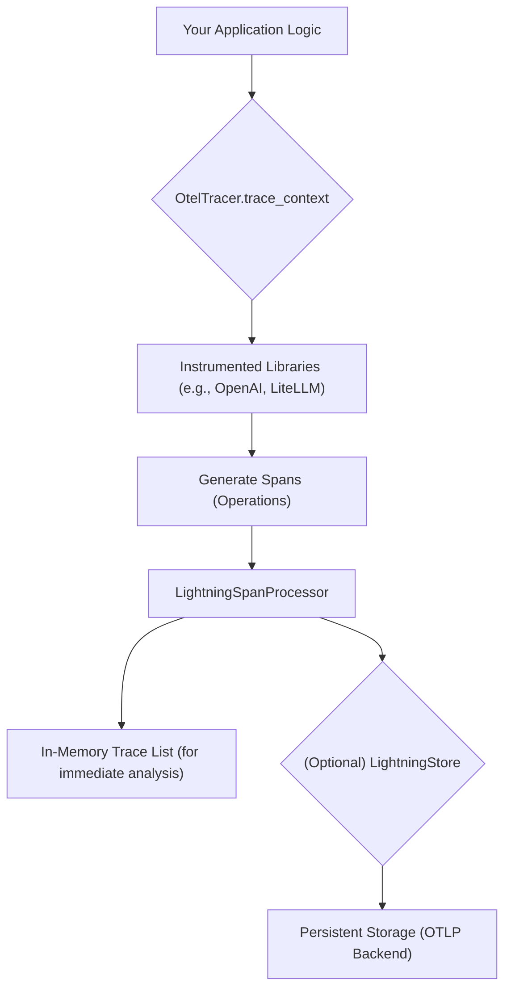

# Technical Tutorial: Observability and Tracing with OtelTracer

## 1. Synopsis: The "Why"

Modern AI applications, especially those built on Large Language Models (LLMs), can often feel like "black boxes." When an agent produces an unexpected output or an error occurs, it can be challenging to pinpoint the cause. Was the problem in the prompt? The model's response? Or a bug in the business logic that processed the response? Without detailed visibility, debugging becomes a frustrating process of trial and error.

This is where observability comes in. By "observing" the internal state of your application through traces, you can reconstruct the exact sequence of events that led to a particular outcome. This tutorial provides a deep dive into the `agentlightning` tracing system, focusing on its primary implementation, `OtelTracer`. You will learn how to instrument your code to capture detailed execution flows, enabling you to debug with precision and gain a deeper understanding of your agent's behavior.

## 2. Prerequisites

Before you begin, ensure you have the `agentlightning` package installed. If not, you can install it via pip:

```bash
pip install agentlightning
```

This tutorial assumes you have a basic understanding of asynchronous programming in Python (`asyncio`).

## 3. Architecture: How Tracing Works

The tracing system in `agentlightning` is built on top of OpenTelemetry (OTel), a widely adopted open-source observability framework. The `OtelTracer` provides a high-level API to manage the tracing lifecycle.

Here's a visual representation of the data flow:



- **`trace_context`**: This is the main entry point. You wrap your code in this asynchronous context manager to start capturing a trace.
- **Spans**: Each operation within the context (like an LLM call or a database query) is recorded as a "span." A trace is simply a collection of these spans, organized in a tree-like structure.
- **`LightningSpanProcessor`**: This component runs in the background, collecting all the spans that are generated. It keeps a list of the most recent trace in memory and can optionally forward the spans to a persistent `LightningStore` for long-term storage and analysis.

## 4. Implementation Steps

Let's walk through a practical example of how to use `OtelTracer`.

### Step 1: Basic Tracing with `OtelTracer`

The core of the tracing workflow is the `trace_context`. The following code shows how to set up a tracer and capture a simple trace.

```python
import asyncio
from agentlightning.tracer.otel import OtelTracer
from agentlightning.instrumentation.agentops import instrument_agentops

# It's crucial to instrument libraries BEFORE you import them
# to ensure their behavior is correctly patched for tracing.
instrument_agentops()

import openai

async def main():
    """
    A simple demonstration of capturing a trace with OtelTracer.
    """
    print("Initializing OtelTracer...")
    tracer = OtelTracer()
    # Each tracer instance needs to be initialized for a worker context.
    tracer.init_worker(worker_id=0)

    print("Entering traced context...")
    # The `trace_context` is an async context manager.
    async with tracer.trace_context(name="my_first_trace"):
        print("This code block is now being traced.")
        
        # In a real application, you would perform traced operations here,
        # such as making an LLM call.
        # For this example, we'll simulate a simple operation.
        tracer.create_span(name="simulated_work")
        await asyncio.sleep(0.1) # Simulate async work

    print("Exited traced context.")

    # After the context closes, you can retrieve the captured trace.
    captured_trace = tracer.get_last_trace()

    print("\n--- Captured Trace Data ---")
    if not captured_trace:
        print("No trace data was captured.")
    else:
        for span in captured_trace:
            print(f"- Span: '{span.name}'")
            print(f"  Status: {span.status.status_code}")
            print(f"  Start Time: {span.start_time}")
            print(f"  End Time: {span.end_time}")
            if span.attributes:
                print("  Attributes:")
                for key, value in span.attributes.items():
                    print(f"    - {key}: {value}")
    print("--------------------------")

if __name__ == "__main__":
    asyncio.run(main())

```

### *Verification*

When you run the script above, you should see output similar to the following:

```
Initializing OtelTracer...
Entering traced context...
This code block is now being traced.
Exited traced context.

--- Captured Trace Data ---
- Span: 'simulated_work'
  Status: UNSET
  Start Time: ...
  End Time: ...
- Span: 'my_first_trace'
  Status: UNSET
  Start Time: ...
  End Time: ...
--------------------------
```

This output confirms that:
1.  The `trace_context` successfully captured the root span named `my_first_trace`.
2.  The manually created `simulated_work` span was also captured and is part of the same trace.

## 5. Common Pitfalls

- **Forgetting `init_worker()`**: The tracer must be initialized with `tracer.init_worker(worker_id=...)` before it can be used. Forgetting this will result in a `RuntimeError`.
- **Missing `async with`**: The `trace_context` is an *asynchronous* context manager and must be used with `async with`. Using a regular `with` will cause a `TypeError`.
- **Instrumentation Order**: You must call instrumentation functions like `instrument_agentops()` *before* importing the libraries they patch (e.g., `import openai`). If you import first, the patches won't be applied, and you won't get detailed traces from those libraries.
- **No Active Trace**: Calling `tracer.get_last_trace()` before any `trace_context` has been run will return an empty list.

## 6. Challenge Yourself

Now that you understand the basics, try extending the example:

1.  **Integrate a Real LLM Call**: Replace the `simulated_work` span with an actual call to an LLM using a library like `openai` or `litellm`. Make sure `agentops` is instrumented. Inspect the resulting trace. What new attributes do you see on the LLM span? (Hint: look for things like `llm.model_name`, `llm.prompt`, `llm.usage.total_tokens`).
2.  **Use `operation_context`**: The `tracer.create_span()` method is for simple, fire-and-forget spans. For more complex operations where you might want to record an exception, use the `tracer.operation_context()` context manager. Try wrapping a piece of code that might fail in an `operation_context` and see how the exception is recorded in the span's status.

```python
# Challenge hint
async with tracer.trace_context(name="challenge_trace"):
    with tracer.operation_context(name="failable_operation") as op_span:
        try:
            # Code that might raise an exception
            raise ValueError("Something went wrong!")
        except Exception as e:
            # The exception is automatically recorded on the span!
            pass
```

By mastering the `OtelTracer`, you gain a powerful tool for building more robust, reliable, and transparent AI applications.