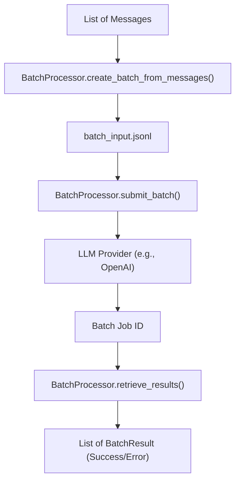

# Asynchronous Batch Processing with Instructor

## 1. Goal

This tutorial demonstrates how to use the `instructor.batch.processor` for large-scale asynchronous jobs. We will walk through creating a `BatchProcessor`, enqueuing tasks from a list of files, running the processing, and handling the results. This is ideal for non-real-time tasks like document processing, data extraction, or batch classification.

## 2. Prerequisites

- The `instructor` library installed.
- An API key for your chosen LLM provider (e.g., OpenAI, Anthropic).

## 3. Architecture



## 4. Implementation

### Step 1: Define Your Data Model

First, define the Pydantic model for the structured data you want to extract.

```python
from pydantic import BaseModel

class User(BaseModel):
    name: str
    age: int
```

### Step 2: Prepare Your Data

For this example, we'll use a list of messages. In a real-world scenario, this could be a list of documents, articles, or any text data.

```python
messages_list = [
    [{"role": "user", "content": "Extract Jason is 25"}],
    [{"role": "user", "content": "Extract Sarah is 30"}],
]
```

### Step 3: Create and Run the Batch Job

Now, we'll use the `BatchProcessor` to create a batch job, submit it, and retrieve the results.

```python
import instructor
from instructor.batch import BatchProcessor

# 1. Initialize the BatchProcessor
# The model string is in the format "provider/model-name"
processor = BatchProcessor(model="openai/gpt-4", response_model=User)

# 2. Create the batch input file
# This creates a JSONL file in the format required by the provider
batch_file = processor.create_batch_from_messages(
    messages_list=messages_list,
    file_path="batch_input.jsonl"
)

# 3. Submit the batch job
job_id = processor.submit_batch(file_path_or_buffer=batch_file)
print(f"Batch job submitted with ID: {job_id}")

# 4. Wait for the job to complete
# In a real application, you would poll the job status using `processor.get_batch_status(job_id)`
# For this example, we'll assume the job completes successfully.

# 5. Retrieve the results
# This will download the results and parse them into BatchSuccess or BatchError objects
results = processor.retrieve_results(job_id)

# 6. Process the results
for result in results:
    if result.is_success():
        print(f"Success ({result.custom_id}): {result.result}")
    else:
        print(f"Error ({result.custom_id}): {result.error_message}")

```

### *Verification*

After running the script, you should see output similar to this:

```
Batch job submitted with ID: <your_job_id>
Success (request-0): name='Jason' age=25
Success (request-1): name='Sarah' age=30
```

## 5. Common Pitfalls

- **Incorrect Model String**: The `model` parameter for `BatchProcessor` must be in the format `"provider/model-name"`. For example, `"openai/gpt-4"` or `"anthropic/claude-3-sonnet"`.
- **Not Waiting for Completion**: Batch processing is asynchronous. You must wait for the job to complete before attempting to retrieve the results. You can check the job status using `processor.get_batch_status(job_id)`.

## 6. Challenge Yourself

Modify the example to read a directory of text files. For each file, create a message and add it to the `messages_list`. Then, run the batch job and print the extracted data for each file.