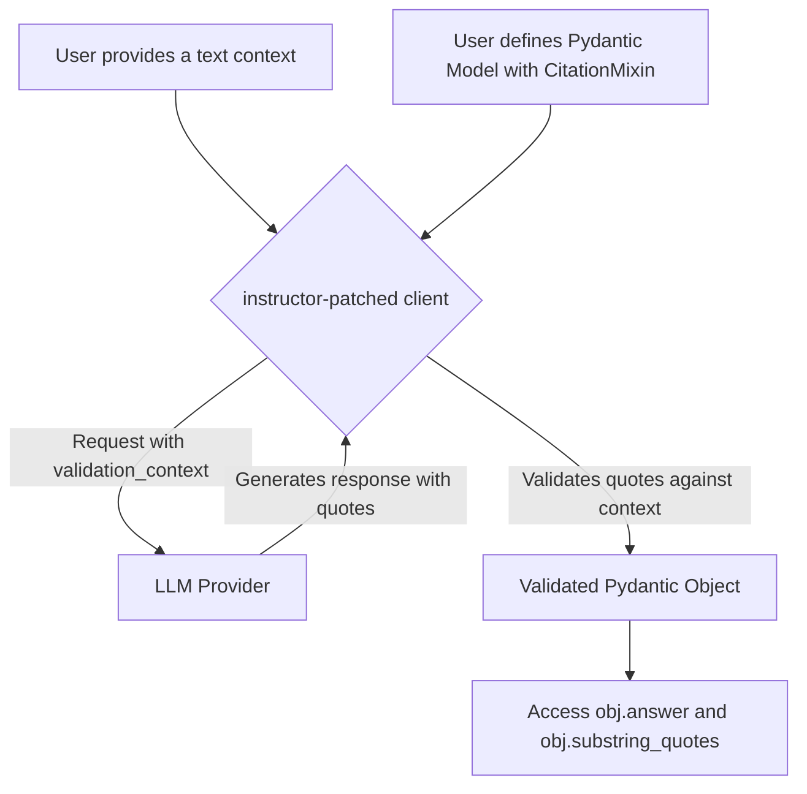

# Practical Applications of Instructor: Batch Processing and RAG

Instructor is a powerful tool for getting structured data from language models. While single requests are useful, real-world applications often require processing data at scale or ensuring the model's responses are grounded in facts. This tutorial dives into two advanced, practical applications of `instructor`:

1.  **Batch Processing**: How to efficiently process thousands of documents for large-scale data extraction.
2.  **Retrieval-Augmented Generation (RAG)**: How to build a system that answers questions based on a provided text and cites its sources, ensuring verifiability.

## 1. Synopsis

**The Real-World Problem:**

Imagine you have a database of 10,000 customer support tickets. Your goal is to classify each ticket by topic, extract key entities like product names and user IDs, and summarize the issue. Doing this one-by-one would be slow and expensive. This is a classic batch processing problem.

Now, consider you want to build a chatbot that answers questions based on your company's internal documentation. You don't want the bot to make things up; you need its answers to be directly traceable to the source material. This is a RAG problem that requires verifiable citations.

This tutorial will show you how to solve both problems using `instructor`.

## 2. Prerequisites

Before you begin, ensure you have the necessary libraries installed:

```bash
pip install instructor pydantic openai
```

You will also need an API key from a provider like OpenAI, configured in your environment:

```bash
export OPENAI_API_KEY="sk-..."
```

## 3. Architecture

We will explore two distinct but complementary architectures.

### Batch Processing Architecture

The `BatchProcessor` abstracts the entire batch workflow, from file creation to result retrieval.

```mermaid
graph TD
    A["User defines Pydantic Model (e.g., UserInfo)"] --> B["User prepares list of messages"];
    B --> C{BatchProcessor};
    C -->|1. create_batch_from_messages()| D["batch_requests.jsonl"];
    C -->|2. submit_batch(file)| E["LLM Provider (e.g., OpenAI)"];
    E -->|Processes Asynchronously| F["Batch Job"];
    C -->|3. get_results(job_id)| G["Raw Results"];
    C -->|4. parse_results()| H["List of BatchSuccess/BatchError"];
    A -- "Used for parsing" --> H;
```

### RAG with Citations Architecture

The `CitationMixin` adds a validation layer to your Pydantic models, ensuring responses are grounded in a provided context.



## 4. Implementation: Batch Processing for Data Extraction

Let's tackle the first problem: extracting user information from a large number of unstructured text snippets.

### Step 1: Define the Data Model

First, define the structure of the data you want to extract using Pydantic. This model will be the target for the LLM.

```python
from pydantic import BaseModel, Field

class UserInfo(BaseModel):
    name: str = Field(description="The user's full name.")
    email: str = Field(description="The user's email address.")
    ticket_summary: str = Field(description="A concise, one-sentence summary of the user's issue.")
```

### Step 2: Prepare Messages and Run the Batch Job

Next, we'll create an instance of `BatchProcessor`, prepare our list of messages, and kick off the batch job. The `BatchProcessor` handles creating the correctly formatted file, uploading it, and starting the job.

```python
import instructor
from instructor.batch import BatchProcessor
import openai

# Sample raw data (in a real scenario, this would come from a database or file system)
support_tickets = [
    "User John Doe (john.d@email.com) is reporting that his account is locked.",
    "User Jane Smith (jane.s@email.com) says she cannot reset her password.",
    "Michael Roe (m.roe@email.com) is asking for a refund for order #12345.",
]

# Convert raw text into the message format expected by the API
messages_list = [
    [
        {
            "role": "user",
            "content": f"Extract the user info and summarize the issue from this support ticket: {ticket}",
        }
    ]
    for ticket in support_tickets
]

# 1. Initialize the BatchProcessor
# The model string "provider/model-name" is crucial.
processor = BatchProcessor(model="openai/gpt-4-turbo", response_model=UserInfo)

# 2. Create the batch file in memory (or optionally on disk by passing a file_path)
batch_buffer = processor.create_batch_from_messages(messages_list=messages_list)

# 3. Submit the batch job
# This returns a job ID immediately.
batch_job = processor.submit_batch(batch_buffer)

print(f"Batch job submitted successfully! Job ID: {batch_job.id}")
```

### *Verification*

After submitting the job, you can monitor its status and retrieve the results. The provider will process the requests asynchronously. This might take several minutes.

```python
# (Wait for a few minutes for the job to complete...)

# 4. Check the status
job_status = processor.get_batch_status(batch_job.id)
print(f"Job Status: {job_status.status}")

# 5. Retrieve the results once the job is 'completed'
if job_status.status == "completed":
    results = processor.get_results(batch_job.id)
    
    # Use utilities to filter results
    from instructor.batch.utils import filter_successful, extract_results

    successes = filter_successful(results)
    users = extract_results(successes)

    for user in users:
        print(user.model_dump_json(indent=2))
```

**Expected Output Log:**

```
Batch job submitted successfully! Job ID: batch_abc123
---
(after some time)
---
Job Status: completed
{
  "name": "John Doe",
  "email": "john.d@email.com",
  "ticket_summary": "The user is reporting that their account is locked."
}
{
  "name": "Jane Smith",
  "email": "jane.s@email.com",
  "ticket_summary": "The user is unable to reset her password."
}
{
  "name": "Michael Roe",
  "email": "m.roe@email.com",
  "ticket_summary": "The user is requesting a refund for order #12345."
}
```

## 5. Implementation: RAG with Verifiable Citations

Now, let's build a simple RAG system that forces the LLM to cite its sources. We'll use `CitationMixin` to ensure the model's response is directly backed by the provided text.

### Step 1: Define a Pydantic Model with `CitationMixin`

This mixin automatically adds a `substring_quotes` field and a validator that checks if each quote exists in the context you provide.

```python
from pydantic import BaseModel, Field
from instructor import CitationMixin

class Fact(CitationMixin):
    fact: str = Field(..., description="A specific, verifiable fact from the text.")
```

### Step 2: Prepare Context and Make the Request

Here's the key part: when you make the API call, you must pass the source text into the `validation_context`. `instructor` will automatically use this context to verify the `substring_quotes` the LLM returns.

```python
import instructor
import openai

# Patch the OpenAI client
client = instructor.patch(openai.OpenAI())

# The source material for our RAG system
source_context = """
Photosynthesis is a process used by plants, algae, and certain bacteria to convert light energy into chemical energy, 
through a process that converts carbon dioxide and water into glucose (a sugar) and oxygen. 
This process is crucial for life on Earth as it produces most of the oxygen in the atmosphere.
"""

# Ask a question and request a response in the shape of our `Fact` model
response = client.chat.completions.create(
    model="gpt-4-turbo",
    response_model=Fact,
    messages=[
        {
            "role": "user",
            "content": f"Based on the following text, what is the primary role of photosynthesis?\n\n{source_context}",
        }
    ],
    # This is the magic ingredient for citation verification
    validation_context={"context": source_context},
)

print(f"Fact: {response.fact}")
print(f"Citations: {response.substring_quotes}")
```

### *Verification*

The `CitationMixin` does the verification for you. If the LLM were to hallucinate a quote that isn't in `source_context`, the validator would automatically remove it from the final `substring_quotes` list. You can add an assertion to confirm this.

```python
# Verify that each returned quote is actually in the source text
for quote in response.substring_quotes:
    assert quote in source_context

print("\nVerification successful: All quotes are from the source context.")
```

**Expected Output Log:**

```
Fact: The primary role of photosynthesis is to produce most of the oxygen in the atmosphere, which is crucial for life on Earth.
Citations: ['produces most of the oxygen in the atmosphere', 'crucial for life on Earth']

Verification successful: All quotes are from the source context.
```

## 6. Common Pitfalls

-   **Batch Processing**: 
    -   **Provider-Specific Models**: Ensure the model string is correct (e.g., `"openai/gpt-4-turbo"` not just `"gpt-4-turbo"`). `BatchProcessor` needs the provider prefix.
    -   **API Limits**: Batch jobs are powerful but subject to your account's rate limits and quotas. Check your provider's documentation.
-   **CitationMixin**:
    -   **Missing Context**: The most common error is forgetting to pass `validation_context={"context": ...}`. Without it, the citation validator cannot run, and your quotes will not be verified.
    -   **Fuzzy Matching**: The mixin uses fuzzy matching to find quotes. This is powerful but can sometimes match a slightly incorrect phrase. Always review critical citations.

## 7. Challenge Yourself

Ready to combine these concepts? Here's a challenge:

**Task**: You have a folder of 100 product reviews as `.txt` files. For each review, extract the product name, the user's sentiment (Positive, Negative, Neutral), and a one-sentence summary of their opinion. This summary **must** be grounded with a citation from the review text.

1.  Create a Pydantic model `ReviewAnalysis` that includes fields for `product_name`, `sentiment`, and `summary`.
2.  Incorporate the `CitationMixin` into your `ReviewAnalysis` model to apply to the `summary` field.
3.  Read all 100 text files.
4.  This is the tricky part: `BatchProcessor` doesn't natively support `validation_context`. How can you work around this? 
    *Hint: You could run the batch job to get the raw extracted data and then run the validation step *after* you retrieve the results, by manually calling `model_validate()` on each result with the appropriate context.*

This challenge mirrors a real-world ETL (Extract, Transform, Load) pipeline where you extract data at scale and then run a separate validation or enrichment step.