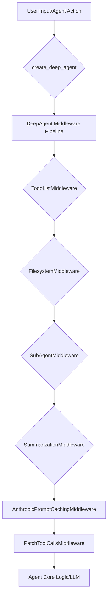

# DeepAgents Core Concepts

The `deepagents` library offers a powerful framework for building intelligent AI agents capable of complex tasks. This tutorial explores the fundamental concepts behind DeepAgents, focusing on how agents are orchestrated, how they plan, and their flexible interaction with various filesystems.

## 1. The DeepAgent: Orchestration and Planning

At the heart of the `deepagents` library is the `create_deep_agent` function, which serves as the primary entry point for assembling a sophisticated AI agent. This function orchestrates a layered stack of LangChain middleware, each contributing to the agent's overall capabilities, including task planning, context management, and subagent delegation.

### Agent Middleware Pipeline

The agent's "planning" capabilities are largely derived from this middleware pipeline. When a user provides input or the agent needs to take an action, the request traverses this stack. For instance:

*   **`TodoListMiddleware`**: Helps the agent keep track of tasks, subtasks, and their completion status, forming a basic planning mechanism.
*   **`FilesystemMiddleware`**: Intercepts file-related operations, delegating them to an appropriate backend (discussed in the next section).
*   **`SubAgentMiddleware`**: Allows the main agent to dynamically invoke specialized subagents, enabling modular problem-solving and delegation of complex tasks.
*   **`SummarizationMiddleware`**: Manages the agent's context window by summarizing past interactions, crucial for long-running tasks.

This modular approach ensures that the agent can adapt to diverse requirements and execute multi-step plans effectively.

Here's a simplified representation of the agent's middleware flow:



### Code Example: Creating a DeepAgent

The `create_deep_agent` function demonstrates how these middleware components are integrated. Notice how `FilesystemMiddleware` and `SubAgentMiddleware` are central to enabling core functionalities.

```python
from typing import Any, Callable, Sequence
from langchain_core.caches import BaseCache
from langchain_core.language_models import BaseChatModel
from langchain_core.runnables import RunnableConfig
from langchain_core.tools import BaseTool
from langgraph.checkpoint import Checkpointer
from langgraph.graph import CompiledStateGraph
from langgraph.prebuilt import create_agent
from libs.deepagents.deepagents.graph import AgentMiddleware, ResponseFormat, BASE_AGENT_PROMPT # Assuming these are available
from libs.deepagents.deepagents.middleware import (
    TodoListMiddleware,
    FilesystemMiddleware,
    SubAgentMiddleware,
    SummarizationMiddleware,
    AnthropicPromptCachingMiddleware,
    PatchToolCallsMiddleware,
    HumanInTheLoopMiddleware,
)
from libs.deepagents.deepagents.backends.protocol import BackendProtocol, BackendFactory
from libs.deepagents.deepagents.subagents import SubAgent, CompiledSubAgent

# Simplified example of create_deep_agent function signature and core middleware setup
def create_deep_agent_simplified(
    model: str | BaseChatModel | None = None,
    tools: Sequence[BaseTool | Callable | dict[str, Any]] | None = None,
    *,
    system_prompt: str | None = None,
    middleware: Sequence[AgentMiddleware] = (),
    subagents: list[SubAgent | CompiledSubAgent] | None = None,
    backend: BackendProtocol | BackendFactory | None = None,
    # ... other parameters trimmed for brevity
) -> CompiledStateGraph:

    # In a real scenario, 'trigger' and 'keep' would be determined by summarization logic
    trigger = lambda x: True # Placeholder
    keep = lambda x: True    # Placeholder

    deepagent_middleware = [
        TodoListMiddleware(),
        FilesystemMiddleware(backend=backend), # Integrates filesystem interaction
        SubAgentMiddleware(
            default_model=model,
            default_tools=tools,
            subagents=subagents if subagents is not None else [],
            default_middleware=[
                TodoListMiddleware(),
                FilesystemMiddleware(backend=backend),
                SummarizationMiddleware(
                    model=model,
                    trigger=trigger,
                    keep=keep,
                    trim_tokens_to_summarize=None,
                ),
                AnthropicPromptCachingMiddleware(unsupported_model_behavior="ignore"),
                PatchToolCallsMiddleware(),
            ],
            general_purpose_agent=True,
        ),
        SummarizationMiddleware(
            model=model,
            trigger=trigger,
            keep=keep,
            trim_tokens_to_summarize=None,
        ),
        AnthropicPromptCachingMiddleware(unsupported_model_behavior="ignore"),
        PatchToolCallsMiddleware(),
    ]
    if middleware:
        deepagent_middleware.extend(middleware)

    # The actual create_agent call would use the full set of parameters
    return create_agent(
        model,
        system_prompt=system_prompt + "\n\n" + BASE_AGENT_PROMPT if system_prompt else BASE_AGENT_PROMPT,
        tools=tools,
        middleware=deepagent_middleware,
        # ... other parameters
    ).with_config({"recursion_limit": 1000})
```

## 2. Filesystem Interaction: The Backend Abstraction

A critical aspect of DeepAgents is its ability to interact with various filesystems in a standardized manner. This is achieved through a pluggable backend system, abstracting file operations and command execution. This allows agents to operate consistently whether dealing with ephemeral in-memory states or persistent, external environments.

### The `BackendProtocol` Interface

The `deepagents.backends.protocol.py` module defines the `BackendProtocol`, an abstract interface that all filesystem backends must implement. This protocol standardizes a comprehensive set of file operations.

```python
import abc
import asyncio
from typing import List, Optional

# Assuming FileInfo is defined elsewhere, e.g., in the same protocol.py
class FileInfo:
    name: str
    is_dir: bool
    size: int
    last_modified: Optional[float] # Unix timestamp

class WriteResult:
    path: str
    error: Optional[str]
    files_update: Optional[dict]

class BackendProtocol(abc.ABC):
    """Protocol for pluggable memory backends (single, unified)."""

    def ls_info(self, path: str) -> List["FileInfo"]:
        """List all files in a directory with metadata."""
        raise NotImplementedError

    async def als_info(self, path: str) -> List["FileInfo"]:
        """Async version of ls_info."""
        return await asyncio.to_thread(self.ls_info, path)

    def read(
        self,
        file_path: str,
        offset: int = 0,
        limit: int = 2000,
    ) -> str:
        """Read file content with line numbers."""
        raise NotImplementedError

    def write(
        self,
        file_path: str,
        content: str,
    ) -> WriteResult:
        """Create a new file. Returns WriteResult; error populated on failure."""
        raise NotImplementedError

    # ... other methods like grep_raw, glob_info, edit, upload_files, download_files
```

This abstraction is crucial for promoting modularity; different backend implementations can be swapped without altering the agent's core logic.

### Backend Implementations: `StateBackend` vs. `BaseSandbox`

DeepAgents provides concrete implementations of these protocols, each suited for different use cases:

*   **`StateBackend` (In-memory)**: This backend stores all file data directly within the LangGraph agent's state. File operations are ephemeral within a conversation thread and are checkpointed as part of the agent's state. This is ideal for quick, isolated tasks where persistence beyond the session isn't required.

*   **`BaseSandbox` (Shell-based)**: An abstract implementation of `SandboxBackendProtocol` (an extension of `BackendProtocol` that adds command execution). It translates file operations into shell commands and executes them in an isolated environment. This allows for interaction with a persistent, external filesystem, mimicking real-world development environments.

#### Code Example: `BaseSandbox` File Write

The `write` method from `BaseSandbox` illustrates how a high-level file operation is translated into a low-level shell command, ensuring robust handling of content:

```python
import base64
from abc import ABC

# Assuming SandboxBackendProtocol, WriteResult, and ExecuteResponse are defined elsewhere
class ExecuteResponse:
    exit_code: int
    output: str

class SandboxBackendProtocol(BackendProtocol, ABC):
    def execute(self, command: str) -> ExecuteResponse:
        raise NotImplementedError

_WRITE_COMMAND_TEMPLATE = '''
import base64
import sys

file_path = "{file_path}"
content_b64 = "{content_b64}"

try:
    with open(file_path, "wb") as f:
        f.write(base64.b64decode(content_b64))
    print(f"File '{file_path}' written successfully.")
except Exception as e:
    print(f"Error: Could not write file '{file_path}'. Reason: {{e}}", file=sys.stderr)
    sys.exit(1)
'''

class BaseSandbox(SandboxBackendProtocol, ABC):
    def execute(self, command: str) -> ExecuteResponse:
        # This would be implemented by a concrete sandbox to run actual shell commands
        # For demonstration, we simulate an execution.
        print(f"Executing command (simulated): {command[:100]}...")
        if "Error:" in command: # Simple error simulation
            return ExecuteResponse(exit_code=1, output="Error: Simulated write failure.")
        return ExecuteResponse(exit_code=0, output=f"Simulated write success for {command.split('file_path = "')[1].split('"')[0]}.")

    def write(
        self,
        file_path: str,
        content: str,
    ) -> WriteResult:
        """Create a new file. Returns WriteResult; error populated on failure."""
        # Encode content as base64 to avoid any escaping issues within the shell command
        content_b64 = base64.b64encode(content.encode("utf-8")).decode("ascii")

        # Construct a Python script command to be executed in the sandbox
        cmd = _WRITE_COMMAND_TEMPLATE.format(file_path=file_path, content_b64=content_b64)
        result = self.execute(f"python3 -c \'''{cmd}\'''") # Execute the Python script

        # Check for errors based on the execution result
        if result.exit_code != 0 or "Error:" in result.output:
            error_msg = result.output.strip() or f"Failed to write file '{file_path}'"
            return WriteResult(path=file_path, error=error_msg, files_update=None)

        # For external storage, files_update is typically None as changes are external
        return WriteResult(path=file_path, files_update=None)

# Example usage (conceptual, requires a concrete SandboxBackendProtocol implementation)
# from deepagents.backends.sandbox import DockerSandbox # or similar concrete implementation
# my_backend = DockerSandbox()
# write_result = my_backend.write("test_file.txt", "Hello, DeepAgents!")
# print(write_result.path, write_result.error)
```

This robust backend system ensures that DeepAgents can seamlessly interact with various storage and execution contexts, making them incredibly versatile for development and deployment.

## Conclusion

DeepAgents provides a sophisticated architecture built around a flexible middleware pipeline for agent orchestration and planning, coupled with an abstract backend system for versatile filesystem interaction. These core concepts allow developers to build highly capable and adaptable AI agents ready to tackle complex challenges in diverse environments.