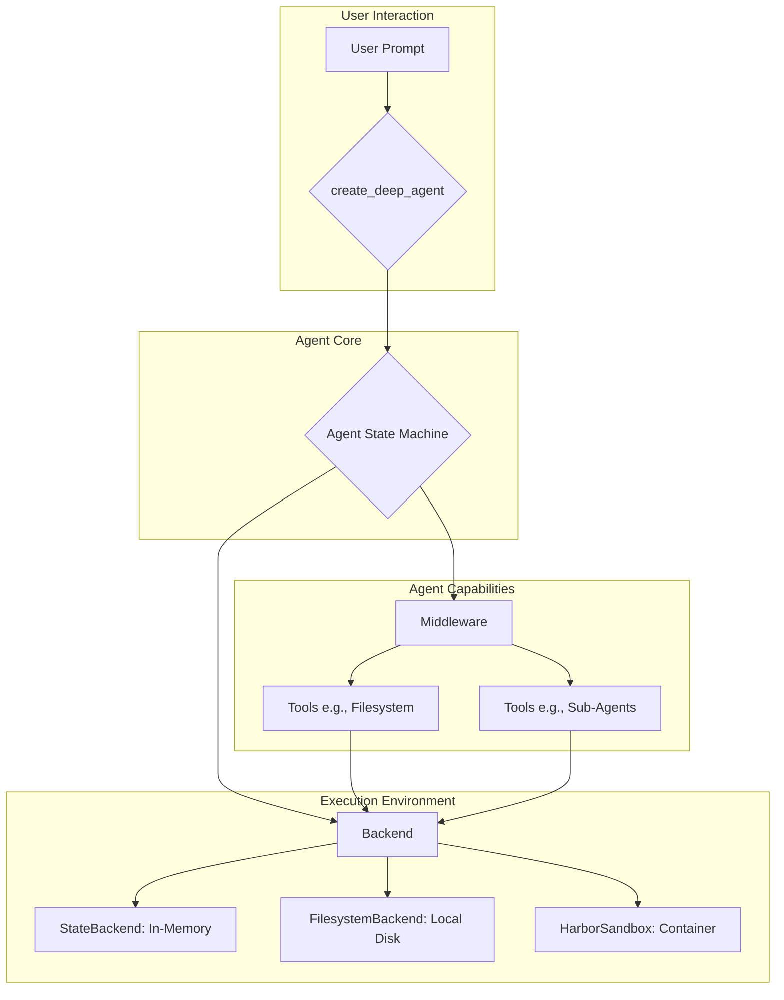

'''
# Core Concepts: Backends and Middleware

Welcome to a deep dive into the core architectural concepts of the DeepAgents framework: Backends and Middleware. Understanding these two components is key to unlocking the full potential of your AI agents, allowing you to customize their capabilities and execution environments.

## The Big Picture: A Modular Architecture

At its heart, the DeepAgents framework is designed for modularity. This is achieved through a clear separation of concerns, where the agent's core logic is decoupled from its access to the outside world (Backends) and its extended capabilities (Middleware). This design allows you to mix and match components to create the perfect agent for your needs.

Here’s a conceptual overview of how these pieces fit together:



- **Agent Core**: This is the LangGraph state machine created by `create_deep_agent`, which orchestrates the agent's behavior.
- **Middleware**: These are components that plug into the agent to provide it with tools and capabilities. For example, `FilesystemMiddleware` provides tools for reading and writing files.
- **Backends**: These components define the environment in which the agent operates. They handle the actual I/O and execution of the agent's actions.

Let's explore each of these in more detail.

## Backends: Defining the Agent's World

A Backend is a swappable component that dictates how an agent interacts with its environment. It's the "where" of agent execution. DeepAgents provides three main types of backends:

### 1. `StateBackend`: Ephemeral, In-Memory Storage

The `StateBackend` is the simplest backend. It stores all data, including files, directly in the agent's state. This is useful for short-lived, self-contained tasks where you don't need to interact with the local filesystem.

- **Use Case**: Quick, one-off tasks that don't require file persistence.
- **Characteristics**: Fast, ephemeral, and requires no external setup.

Here's how you might configure an agent to use the `StateBackend`:

```python
from deepagents import create_deep_agent
from deepagents.backends import StateBackend
from deepagents.middleware import FilesystemMiddleware

# The agent will use the StateBackend for all file operations
agent = create_deep_agent(
    model="anthropic/claude-3-opus-20240229",
    middleware=[
        FilesystemMiddleware(backend=StateBackend),
    ],
)
```

### 2. `FilesystemBackend`: Interacting with the Local Disk

The `FilesystemBackend` allows your agent to read from and write to your local filesystem. This is essential for tasks that involve code generation, data analysis, or any interaction with local files.

- **Use Case**: Code refactoring, generating reports, analyzing local data.
- **Security**: It includes a `virtual_mode` to restrict file access to a specific root directory, providing a sandboxed environment.

Here's how to set it up:

```python
from deepagents import create_deep_agent
from deepagents.backends import FilesystemBackend
from deepagents.middleware import FilesystemMiddleware

# The agent can read/write files in the current working directory
agent = create_deep_agent(
    model="anthropic/claude-3-opus-20240229",
    middleware=[
        FilesystemMiddleware(
            backend=FilesystemBackend(root_dir="./workspace", virtual_mode=True)
        ),
    ],
)
```

### 3. `HarborSandbox`: Secure Execution in a Container

The `HarborSandbox` is a specialized backend designed for running agents in a secure, containerized environment like Harbor. It translates agent actions (like reading a file) into secure shell commands (`cat`, `grep`, `perl`) that are executed inside the container.

- **Use Case**: Running automated tasks in a production environment where security and isolation are critical.
- **How it Works**: Instead of direct filesystem access, it uses shell commands to interact with the environment, providing a robust security layer.

Here is a conceptual example of how it is used within the `deepagents_harbor` library:

```python
# From deepagents_harbor.deepagents_wrapper
from deepagents import create_deep_agent
from deepagents_harbor.backend import HarborSandbox

# This wrapper would be used to create an agent that runs in Harbor
class DeepAgentsWrapper:
    def __init__(self, environment):
        self.agent = create_deep_agent(
            model="anthropic/claude-3-opus-20240229",
            middleware=[
                FilesystemMiddleware(backend=HarborSandbox(environment)),
            ],
        )
```

## Middleware: Extending Agent Capabilities

Middleware components are like plugins that give your agent new tools and abilities. They intercept the agent's execution flow to add new capabilities.

### 1. `FilesystemMiddleware`: The Gift of File I/O

This is one of the most common middleware. It provides the agent with a suite of tools for interacting with a filesystem, such as `ls`, `read_file`, `write_file`, and `edit_file`.

The `FilesystemMiddleware` is backend-agnostic. You can pair it with any backend (`StateBackend`, `FilesystemBackend`, or `HarborSandbox`) to control where the file operations are executed.

```python
from deepagents import create_deep_agent
from deepagents.backends import FilesystemBackend
from deepagents.middleware import FilesystemMiddleware

# This agent gets filesystem tools that operate on the local disk
agent = create_deep_agent(
    model="anthropic/claude-3-opus-20240229",
    middleware=[
        FilesystemMiddleware(backend=FilesystemBackend(root_dir="./project"))
    ],
)
```

### 2. `SubAgentMiddleware`: Delegating Tasks to Other Agents

The `SubAgentMiddleware` is a powerful component that allows an agent to spawn and delegate tasks to other, specialized sub-agents. This is useful for breaking down complex problems into smaller, manageable parts.

- **Use Case**: A primary "orchestrator" agent could delegate a coding task to a "developer" sub-agent and a documentation task to a "writer" sub-agent.
- **How it Works**: It provides a `task` tool that can be used to invoke other agents with specific instructions.

Here’s a simplified example of how you might configure it:

```python
from deepagents import create_deep_agent
from deepagents.middleware import SubAgentMiddleware

# Define a specialized sub-agent for research
research_agent_spec = {
    "name": "researcher",
    "description": "A specialized agent for conducting research.",
    "system_prompt": "You are a research assistant. Your goal is to find and synthesize information.",
    "tools": [], # Typically would have search tools
}

# The main agent can now delegate research tasks
main_agent = create_deep_agent(
    model="anthropic/claude-3-opus-20240229",
    middleware=[
        SubAgentMiddleware(subagents=[research_agent_spec]),
    ],
)
```

## Tying It All Together with `create_deep_agent`

The `create_deep_agent` function is the central factory for assembling your agent. You provide it with a model, and a list of middleware, and it constructs the agent state machine with all the specified capabilities.

By combining different Backends and Middleware, you can create a wide variety of agents tailored to specific tasks. Whether you need a simple, in-memory agent or a powerful, sandboxed agent with a full suite of tools, the Backend and Middleware architecture provides the flexibility to build it.
'''