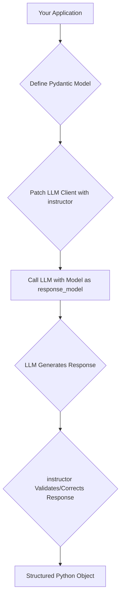

# Getting Started with instructor

## Goal
This tutorial aims to introduce you to the `instructor` library, a powerful tool for structuring and validating LLM (Large Language Model) outputs. By the end of this guide, you will understand what `instructor` is, how to install it, and how to get started with a basic example.

`instructor` simplifies the process of working with LLMs by enabling you to define structured outputs using Pydantic models. This ensures that the responses from your LLM calls conform to a predictable schema, making integration with downstream systems much more robust.

## Prerequisites
To follow this tutorial, you will need:

*   Python 3.8 or higher installed on your system.
*   `pip` (Python package installer) for installing libraries.
*   An API key for an LLM provider (e.g., OpenAI, Anthropic, Google Gemini). For this tutorial, we will primarily use OpenAI examples, but the concepts apply broadly.

## Step 1: Installation
Installing `instructor` is straightforward using pip. Open your terminal or command prompt and run the following command:

```bash
pip install instructor
```

This command will install the `instructor` library and its necessary dependencies. If you are using a specific LLM provider, you might need to install their SDK as well. For example, for OpenAI:

```bash
pip install openai
```

## Step 2: Understanding the Core Concept
At its heart, `instructor` works by "patching" your LLM client. This patching process allows you to pass a Pydantic model directly to your chat completion call, and `instructor` will handle the underlying mechanisms to ensure the LLM returns data conforming to that model. If the LLM output doesn't match the Pydantic model, `instructor` can even attempt to re-prompt the LLM to correct the output.

Here's a conceptual flow of how `instructor` operates:



## Step 3: A Simple Example
Let's write a basic Python script to demonstrate `instructor` with OpenAI. First, ensure you have your OpenAI API key set as an environment variable (e.g., `OPENAI_API_KEY`).

Create a file named `simple_extraction.py` and add the following content:

```python
import openai
import instructor
from pydantic import BaseModel, Field

# Apply the patch to the OpenAI client
# This modifies the client to accept response_model
client = instructor.patch(openai.OpenAI())

# 1. Define your desired output structure using Pydantic
class User(BaseModel):
    name: str = Field(description="The user's full name")
    age: int = Field(description="The user's age in years")
    email: str = Field(description="The user's email address")

# 2. Use the patched client to get structured output
def extract_user_info(text: str) -> User:
    return client.chat.completions.create(
        model="gpt-3.5-turbo",
        response_model=User,
        messages=[
            {"role": "system", "content": "You are a helpful assistant that extracts user information."},
            {"role": "user", "content": f"Extract the user's name, age, and email from the following text: {text}"}
        ]
    )

# 3. Call the function and observe the structured output
if __name__ == "__main__":
    user_text = "My name is John Doe, I am 30 years old, and my email is john.doe@example.com."
    user_info = extract_user_info(user_text)
    print(f"Name: {user_info.name}")
    print(f"Age: {user_info.age}")
    print(f"Email: {user_info.email}")

    # Example with a slightly trickier input
    user_text_2 = "Sarah Connor is 45 and can be reached at sarah.c@skynet.com."
    user_info_2 = extract_user_info(user_text_2)
    print("\n--- Second User ---")
    print(f"Name: {user_info_2.name}")
    print(f"Age: {user_info_2.age}")
    print(f"Email: {user_info_2.email}")
```

## Step 4: Running the Example
Save the file as `simple_extraction.py` and run it from your terminal:

```bash
python simple_extraction.py
```

You should see output similar to this (the exact order might vary slightly but the content should be structured):

```
Name: John Doe
Age: 30
Email: john.doe@example.com

--- Second User ---
Name: Sarah Connor
Age: 45
Email: sarah.c@skynet.com
```

This demonstrates how `instructor` successfully parsed the natural language text into a `User` Pydantic object, validating the types and ensuring the structure.

## Conclusion
You've now taken your first steps with `instructor`! You've learned about its purpose, installed it, and seen a practical example of how it can bring structure and reliability to your LLM interactions. From here, you can explore more advanced features like custom validation, error handling, and integrating with other LLM providers. Happy building!