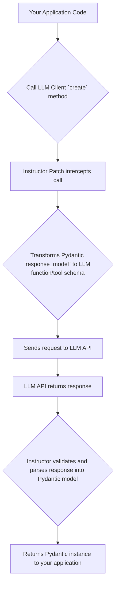

# Getting Started with `instructor`

## Goal
This tutorial will guide you through the basics of the `instructor` library, demonstrating how to use it to coerce Large Language Models (LLMs) into returning structured, Pydantic-validated output. By the end, you'll be able to integrate `instructor` into your Python projects to build more reliable and predictable LLM-powered applications.

## 1. Introduction to `instructor`
The `instructor` library is a powerful tool designed to bring structure and reliability to your interactions with Large Language Models (LLMs). It acts as a middleware, allowing you to define the exact format of the LLM's output using Pydantic models. This ensures that the responses you receive are always validated, type-safe, and ready for programmatic use, eliminating the need for manual parsing and error handling.

`instructor` supports a wide range of LLM providers, including OpenAI, Anthropic, Google Gemini, and more, offering a unified interface to streamline multi-LLM development. Its core idea revolves around "patching" existing LLM client libraries to inject its structured output capabilities seamlessly.

## 2. Core Concepts

### Structured Output with Pydantic
At its core, `instructor` leverages Pydantic models to define the desired structure of LLM responses. Instead of receiving free-form text, you instruct the LLM to return data that conforms to a specific schema. This is achieved by using the LLM's function calling or JSON mode capabilities under the hood, ensuring predictable output.

### Provider Agnostic Interface (`from_provider`)
`instructor` offers a convenient `from_provider` function to initialize clients for various LLM providers. You simply specify the model, and `instructor` intelligently configures the client to enable structured output, abstracting away provider-specific API nuances.

```python
import instructor

# Example with OpenAI
client = instructor.from_provider("openai/gpt-4")

# Example with Google Gemini (requires google-generativeai installed)
# client = instructor.from_provider("google/gemini-pro")
```

### Seamless Patching
One of `instructor`'s most elegant features is its ability to "patch" existing LLM client libraries. When you initialize an `Instructor` client, it modifies the `create` method of the underlying LLM client (e.g., `openai.chat.completions.create`). This allows you to continue using the familiar API calls while `instructor` transparently handles the transformation of your Pydantic `response_model` into the LLM's function call schema and validates the incoming response.

Here's a simplified visual representation of how `instructor` patches the LLM client:



## 3. Step-by-Step Tutorial: Basic Structured Output

Let's walk through a simple example to extract information about a person from a piece of text using `instructor` and Pydantic.

### Prerequisites

Before you begin, ensure you have the necessary libraries installed and an OpenAI API key configured.

1.  **Install `instructor` and `openai`**:
    ```bash
    pip install "instructor[openai]" "pydantic>=2"
    ```

2.  **Set your OpenAI API Key**:
    Make sure your `OPENAI_API_KEY` environment variable is set.

### Defining Your Pydantic Model

First, we'll define a Pydantic model that represents the structured data we want to extract.

```python
from pydantic import BaseModel, Field
from typing import Literal

class UserDetail(BaseModel):
    """
    Represents detailed information about a user.
    """
    name: str = Field(description="The name of the user.")
    age: int = Field(description="The age of the user in years.")
    occupation: str = Field(description="The primary occupation or job title of the user.")
    marital_status: Literal["single", "married", "divorced", "widowed"] = Field(
        description="The marital status of the user."
    )
```

### Using `instructor` to Extract Structured Data

Now, let's use `instructor` to call an LLM and have it return an instance of our `UserDetail` model.

```python
import instructor
import openai
from pydantic import BaseModel, Field
from typing import Literal

# 1. Define your Pydantic model (as shown above)
class UserDetail(BaseModel):
    """
    Represents detailed information about a user.
    """
    name: str = Field(description="The name of the user.")
    age: int = Field(description="The age of the user in years.")
    occupation: str = Field(description="The primary occupation or job title of the user.")
    marital_status: Literal["single", "married", "divorced", "widowed"] = Field(
        description="The marital status of the user."
    )

# 2. Initialize the OpenAI client and patch it with instructor
# We use instructor.patch to enable structured output on the OpenAI client.
# instructor.from_provider("openai/gpt-4") is an alternative for broader provider support.
client = instructor.patch(openai.OpenAI())

# 3. Make an LLM call with response_model
# The 'response_model' argument tells instructor to coerce the output into UserDetail.
user_info = client.chat.completions.create(
    model="gpt-3.5-turbo",
    response_model=UserDetail,
    messages=[
        {"role": "user", "content": "Extract information about the person: John Doe, 30 years old, a software engineer, and is married."}
    ]
)

# 4. Print the extracted structured data
print("Extracted User Information:")
print(f"Name: {user_info.name}")
print(f"Age: {user_info.age}")
print(f"Occupation: {user_info.occupation}")
print(f"Marital Status: {user_info.marital_status}")
print(f"Type of object: {type(user_info)}")

# You can also verify the data type
assert isinstance(user_info, UserDetail)
print("\nSuccessfully extracted data as a UserDetail Pydantic object!")
```

### Expected Output

```
Extracted User Information:
Name: John Doe
Age: 30
Occupation: software engineer
Marital Status: married
Type of object: <class '__main__.UserDetail'>

Successfully extracted data as a UserDetail Pydantic object!
```

## Conclusion

You've successfully taken your first steps with `instructor`! By combining the power of Pydantic models with `instructor`'s intelligent patching, you can transform unstructured LLM responses into reliable, type-safe Python objects. This approach significantly reduces boilerplate, enhances data quality, and accelerates the development of robust AI applications. Explore further to leverage `instructor`'s advanced features like iterable models, parallel tool calls, and distillation for even more complex use cases.