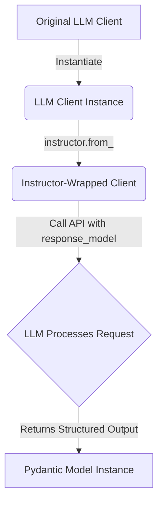

# Working with LLM Providers

## Goal
This tutorial will guide you through integrating various Large Language Model (LLM) providers with the `instructor` library to enable structured data extraction. You will learn how to use `instructor`'s `from_<provider_name>` functions to wrap existing LLM clients and leverage their capabilities for structured outputs.

## Prerequisites
To follow along, you'll need to install the `instructor` library and the client libraries for the LLM providers you wish to use. For this tutorial, we will focus on OpenAI and Anthropic.

```bash
pip install instructor openai anthropic pydantic
```

## Introduction
`instructor` extends the functionality of popular LLM client libraries, allowing you to reliably get structured data (e.g., Pydantic models) directly from LLM responses. This is achieved by "patching" or "wrapping" the client instances, injecting `instructor`'s logic into their API calls.

## Core Concept: Wrapping LLM Clients
`instructor` provides specific functions like `instructor.from_openai()`, `instructor.from_anthropic()`, `instructor.from_gemini()`, etc., to wrap the corresponding LLM client instances. These functions return an `Instructor` client that behaves like the original client but with enhanced capabilities for structured output.

### How it Works (Mermaid Diagram)



## Step 1: Integrating with OpenAI

Integrating `instructor` with OpenAI's client is straightforward. You instantiate the `OpenAI` client, then wrap it with `instructor.from_openai()`.

```python
import openai
import instructor
from pydantic import BaseModel, Field

# 1. Define your desired output structure using Pydantic
class User(BaseModel):
    name: str = Field(description="The name of the user")
    age: int = Field(description="The age of the user")
    occupation: str = Field(description="The occupation of the user")

# 2. Instantiate the original OpenAI client
# Make sure your OPENAI_API_KEY environment variable is set
client = openai.OpenAI()

# 3. Wrap the OpenAI client with instructor
# This gives you an instructor-enhanced client
patch_client = instructor.from_openai(client)

# 4. Use the patched client to create chat completions with a response_model
def extract_user_info(text: str) -> User:
    response = patch_client.chat.completions.create(
        model="gpt-3.5-turbo",
        response_model=User, # Specify your Pydantic model here
        messages=[
            {"role": "user", "content": f"Extract user information from the following text: {text}"}
        ]
    )
    return response

# Example usage
user_data = "My name is John Doe, I am 30 years old and work as a software engineer."
extracted_user = extract_user_info(user_data)

print(f"Extracted User: {extracted_user.name}, Age: {extracted_user.age}, Occupation: {extracted_user.occupation}")
# Expected Output (values may vary slightly based on model response):
# Extracted User: John Doe, Age: 30, Occupation: Software Engineer
```

## Step 2: Integrating with Anthropic

Similarly, you can integrate `instructor` with Anthropic's client. The process involves instantiating the `Anthropic` client and then wrapping it with `instructor.from_anthropic()`.

```python
import anthropic
import instructor
from pydantic import BaseModel, Field

# 1. Define your desired output structure using Pydantic
class ProductReview(BaseModel):
    product_name: str = Field(description="The name of the product being reviewed")
    rating: int = Field(description="The star rating given to the product (1-5)")
    sentiment: str = Field(description="The overall sentiment of the review (positive, negative, neutral)")
    summary: str = Field(description="A brief summary of the review")

# 2. Instantiate the original Anthropic client
# Make sure your ANTHROPIC_API_KEY environment variable is set
client = anthropic.Anthropic()

# 3. Wrap the Anthropic client with instructor
# This gives you an instructor-enhanced client
patch_client = instructor.from_anthropic(client)

# 4. Use the patched client to create messages with a response_model
def analyze_product_review(review_text: str) -> ProductReview:
    response = patch_client.messages.create(
        model="claude-3-opus-20240229", # Or other suitable Claude model
        response_model=ProductReview, # Specify your Pydantic model here
        max_tokens=1000,
        messages=[
            {
                "role": "user",
                "content": f"Analyze the following product review and extract structured information: {review_text}"
            }
        ]
    )
    return response

# Example usage
review = "I absolutely love this new smartphone! The camera is incredible, and the battery life is surprisingly good. Definitely a 5-star product."
extracted_review = analyze_product_review(review)

print(f"Product Name: {extracted_review.product_name}")
print(f"Rating: {extracted_review.rating} stars")
print(f"Sentiment: {extracted_review.sentiment}")
print(f"Summary: {extracted_review.summary}")
# Expected Output (values may vary slightly based on model response):
# Product Name: new smartphone
# Rating: 5 stars
# Sentiment: positive
# Summary: A new smartphone with an incredible camera and good battery life receives a 5-star rating.
```

## Conclusion

You've successfully learned how to integrate `instructor` with different LLM providers like OpenAI and Anthropic. By wrapping their respective clients, you can leverage `instructor`'s powerful structured extraction capabilities, making your interactions with LLMs more reliable and efficient for data processing tasks. This pattern extends to many other providers supported by `instructor`, allowing for a consistent approach across different models. Enjoy building more robust LLM applications!