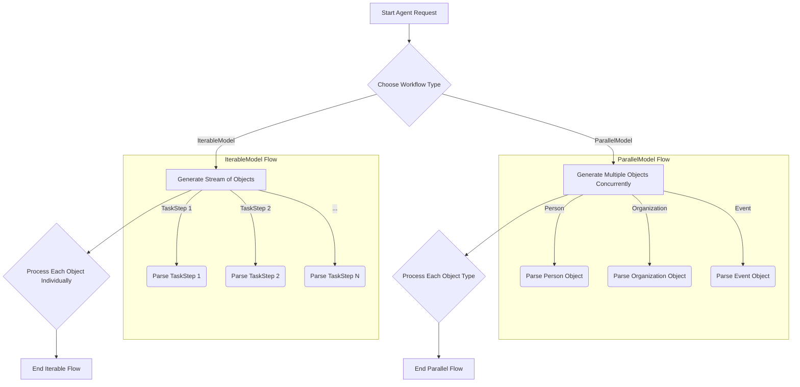

# Authoring DSLs for complex workflows

## Goal
This tutorial explains how to leverage `instructor/dsl` to construct and manage sophisticated agentic workflows. We will cover defining and executing multi-step processes, focusing on `IterableModel` for streaming results and `ParallelModel` for concurrent function calls.

## Pre-requisites
- Python 3.9+
- `instructor` library installed (`pip install instructor pydantic openai`)

## Step 1: Understanding `instructor/dsl` Core Concepts
`instructor/dsl` provides tools to define domain-specific languages (DSLs) for agent interactions. Key components include:

-   **`IterableModel`**: Designed for scenarios where an agent needs to produce a sequence of structured outputs. This is particularly useful for streaming data or generating lists of items.
-   **`ParallelModel`**: Enables an agent to make multiple, distinct function calls concurrently within a single turn, processing various types of information simultaneously.

## Step 2: Defining an `IterableModel` Workflow
An `IterableModel` is ideal when you expect a series of structured outputs. Let's imagine we want an agent to break down a complex task into several smaller, actionable steps.

```python
from pydantic import BaseModel, Field
from typing import Iterable
import instructor
from openai import OpenAI

# 1. Define the schema for a single task step
class TaskStep(BaseModel):
    step_number: int = Field(..., description="The sequential number of the step.")
    description: str = Field(..., description="A clear description of the task step.")
    estimated_duration_minutes: int = Field(default=5, description="Estimated time to complete the step in minutes.")

# 2. Create an IterableModel for a sequence of TaskSteps
class TaskBreakdown(Iterable[TaskStep]):
    # No additional fields needed here, just inherit from Iterable[TaskStep]
    pass

# 3. Initialize the OpenAI client with instructor patch
client = instructor.patch(OpenAI())

# 4. Define the prompt for the agent
prompt = "Break down the process of baking a chocolate cake into detailed, actionable steps."

# 5. Execute the agent call to get a stream of TaskStep objects
print("Baking a Chocolate Cake - Step-by-step Breakdown:")
for step in client.chat.completions.create(
    model="gpt-4o",
    response_model=TaskBreakdown,
    messages=[
        {"role": "system", "content": "You are a helpful assistant that breaks down complex tasks into simple steps."},
        {"role": "user", "content": prompt},
    ],
    stream=True,
):
    print(f"Step {step.step_number}: {step.description} (Est. {step.estimated_duration_minutes} min)")

```

In this example, the `TaskBreakdown` model, inheriting from `Iterable[TaskStep]`, tells `instructor` to expect a stream of `TaskStep` objects. The agent generates these steps one by one, allowing for real-time processing of the workflow.

## Step 3: Defining a `ParallelModel` Workflow
A `ParallelModel` is useful when your agent needs to extract multiple, distinct pieces of information or execute several tools in a single response. Let's consider extracting different entities from a piece of text.

```python
from pydantic import BaseModel, Field
from typing import Union, Iterable
import instructor
from openai import OpenAI

# 1. Define individual schemas for different entities
class Person(BaseModel):
    name: str = Field(..., description="The full name of the person.")
    role: str = Field(..., description="The role or title of the person.")

class Organization(BaseModel):
    name: str = Field(..., description="The name of the organization.")
    industry: str = Field(..., description="The industry the organization operates in.")

class Event(BaseModel):
    name: str = Field(..., description="The name of the event.")
    date: str = Field(..., description="The date of the event.")
    location: str = Field(..., description="The location where the event took place.")

# 2. Create a ParallelModel to extract any of these entities
class ExtractedEntities(Iterable[Union[Person, Organization, Event]]):
    # This model will allow parallel extraction of Person, Organization, or Event objects
    pass

# 3. Initialize the OpenAI client with instructor patch
client = instructor.patch(OpenAI())

# 4. Define the text to analyze
text_to_analyze = """
Google announced its new AI model at their annual I/O conference on May 14, 2024. 
Sundar Pichai, the CEO of Google, presented the new capabilities. 
Attendees from various tech companies and media outlets were present.
"""

# 5. Execute the agent call to get a stream of different entity objects
print("Extracted Entities:")
for entity in client.chat.completions.create(
    model="gpt-4o",
    response_model=ExtractedEntities,
    messages=[
        {"role": "system", "content": "You are an entity extraction assistant."},
        {"role": "user", "content": f"Extract all people, organizations, and events from the following text: {text_to_analyze}"},
    ],
    stream=True,
):
    if isinstance(entity, Person):
        print(f"  Person: {entity.name} (Role: {entity.role})")
    elif isinstance(entity, Organization):
        print(f"  Organization: {entity.name} (Industry: {entity.industry})")
    elif isinstance(entity, Event):
        print(f"  Event: {entity.name} (Date: {entity.date}, Location: {entity.location})")

```

Here, `ExtractedEntities` is defined as `Iterable[Union[Person, Organization, Event]]`. This instructs the agent to return a stream of objects, each conforming to either the `Person`, `Organization`, or `Event` schema. `instructor` handles the routing and parsing of these distinct models from the model's response.

## Step 4: Visualizing the Workflow
Mermaid diagrams can help illustrate the flow of data and control within these DSL-driven workflows.



## Conclusion
By using `instructor/dsl` with `IterableModel` and `ParallelModel`, you can design agents that handle complex, multi-step, and multi-entity workflows with structured outputs. This approach enhances the reliability and clarity of agentic systems, making them more robust and easier to integrate into larger applications. These DSL constructs empower you to define clear contracts between your language models and your application logic, fostering more predictable and manageable AI interactions.))
