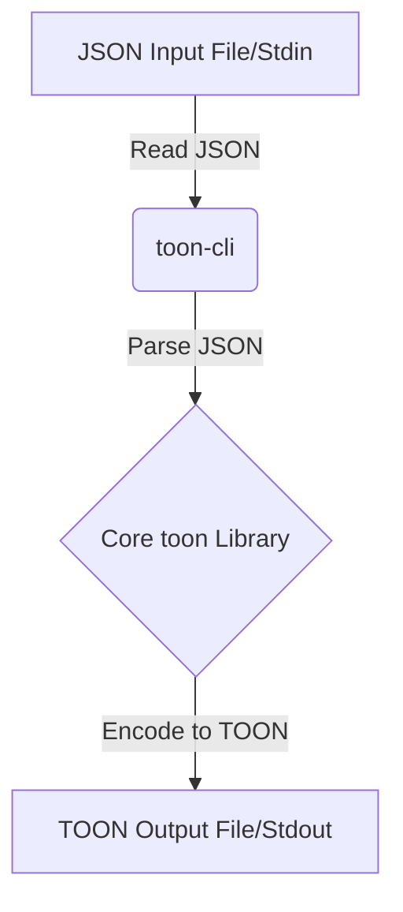

# Getting Started with TOON

Welcome to this tutorial on getting started with TOON (Typed Object Notation)! TOON is a human-readable, structured data format designed for configuration and data interchange, offering features like array headers, tabular data, and key folding for efficient representation.

In this tutorial, you will learn what TOON is, how to install the `toon` CLI tool, and how to use it for basic JSON to TOON conversion.

## 1. What is TOON?

TOON stands for Typed Object Notation. It's a data serialization format that aims to be highly readable and efficient, especially when working with nested data structures. It provides an alternative to formats like JSON, YAML, and XML, with a focus on human readability and conciseness.

Key features of TOON include:

*   **Human-Readable Syntax**: Designed to be easily understood and written by humans.
*   **Array Headers**: Supports defining arrays with explicit headers, which can be useful for tabular data.
*   **Key Folding**: An optimization that compactly represents nested single-key objects using dot-separated keys, e.g., `{ a: { b: "value" } }` can become `a.b: value`.
*   **Streaming Support**: Efficiently handles large datasets through streaming encoding and decoding.

For a more in-depth overview of the project's architecture and goals, you can refer to the `executive_summary.md` file in the knowledge base.

### TOON vs. JSON

While JSON is widely used, TOON offers some advantages in specific scenarios, particularly for configuration files or data where readability and compactness are paramount. Consider the following JSON:

```json
{
  "database": {
    "server": "localhost",
    "ports": [8001, 8002, 8003],
    "connectionMax": 5000,
    "enabled": true
  },
  "owners": [
    {
      "name": "John Doe",
      "email": "john.doe@example.com"
    },
    {
      "name": "Jane Smith",
      "email": "jane.smith@example.com"
    }
  ]
}
```

And its equivalent in TOON, potentially with key folding:

```toon
database.server: localhost
database.ports: [8001, 8002, 8003]
database.connectionMax: 5000
database.enabled: true

[[owners]]
name: John Doe
email: john.doe@example.com

[[owners]]
name: Jane Smith
email: jane.smith@example.com
```

Notice how `database.server` folds the nested `server` key. Also, arrays of objects can be represented with `[[owners]]` headers, making tabular data more visually organized.

## 2. Installing the `toon` CLI Tool

The `toon` CLI tool allows you to easily convert between JSON and TOON formats. It's built on the core `toon` library and provides a convenient command-line interface. For more details on the CLI's internal workings and advanced options, refer to `packages_cli.md`.

To install the `toon` CLI, you'll typically use a package manager like `npm` or `yarn` (assuming you have Node.js installed):

```bash
npm install -g @your-org/toon-cli # Replace @your-org with the actual package scope if applicable
# OR
yarn global add @your-org/toon-cli # Replace @your-org with the actual package scope if applicable
```

Once installed, you can verify the installation by checking the version:

```bash
toon-cli --version
```

## 3. Basic JSON to TOON Conversion

The most common use case for the `toon` CLI is converting existing JSON data into the TOON format. Let's create a sample JSON file first.

Create a file named `input.json` with the following content:

```json
{
  "application": {
    "name": "My Awesome App",
    "version": "1.0.0",
    "settings": {
      "theme": "dark",
      "notifications_enabled": true
    }
  },
  "users": [
    {
      "id": 1,
      "username": "alice"
    },
    {
      "id": 2,
      "username": "bob"
    }
  ]
}
```

Now, let's convert this JSON file to TOON using the `toon-cli`.

### Converting a File

To convert `input.json` to `output.toon`:

```bash
toon-cli input.json -o output.toon --encode --indent 2
```

*   `input.json`: Specifies the input file.
*   `-o output.toon`: Specifies the output file where the TOON content will be written.
*   `--encode`: Tells the CLI to encode JSON to TOON.
*   `--indent 2`: Formats the output TOON with 2 spaces for indentation.

The `output.toon` file will contain:

```toon
application.name: My Awesome App
application.version: 1.0.0
application.settings.theme: dark
application.settings.notifications_enabled: true

[[users]]
id: 1
username: alice

[[users]]
id: 2
username: bob
```

Notice how the nested `application` settings are folded, and the `users` array is represented with `[[users]]` headers.

### Converting from Standard Input to Standard Output

You can also pipe JSON data directly to the `toon-cli` and get the TOON output on your console. This is useful for quick conversions or integrating into scripts.

```bash
cat input.json | toon-cli --encode --indent 2
```

This command will print the same TOON output directly to your terminal.

## 4. Understanding the Conversion Process (Mermaid Diagram)

The `toon` CLI acts as an orchestrator, taking your input, calling the core `toon` library for the actual conversion, and then writing the output. Here's a simplified flow for JSON to TOON conversion:



*   **A (JSON Input)**: Your source JSON data.
*   **B (toon-cli)**: The command-line interface tool, responsible for reading input and handling arguments.
*   **C (Core toon Library)**: The underlying library that performs the actual data transformation from JSON structures into the TOON format.
*   **D (TOON Output)**: The resulting TOON formatted data, written to a file or displayed in the console.

This diagram illustrates the separation of concerns: the CLI handles I/O and user interaction, while the core library focuses on the conversion logic.

## Conclusion

You've successfully learned the basics of TOON and how to use the `toon` CLI tool to convert JSON data into the TOON format. This is just the beginning! The `toon` CLI offers many more options for controlling output formatting, handling strictness, and managing key folding. Explore the `--help` option (`toon-cli --help`) for a full list of features and arguments, and delve into the knowledge base documents (`executive_summary.md`, `packages_cli.md`) for deeper insights. Happy TOONing!