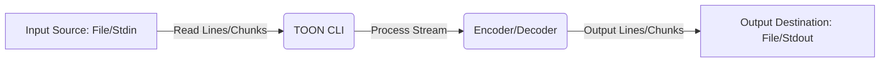

# Advanced TOON CLI Features

This tutorial explores advanced functionalities of the TOON CLI, building upon the basic concepts of converting between JSON and TOON formats. We will cover key folding for more concise TOON output, customizing indentation, and leveraging streaming for efficient data processing. This guide references `packages_cli.md` for a comprehensive overview of all CLI options.

## 1. Key Folding

Key folding is a powerful feature that allows you to represent nested JSON objects with a flattened, dot-separated key notation in TOON. This can significantly reduce verbosity for deeply nested data.

### 1.1. `keyFolding=off` (Default)

By default, key folding is `off`, meaning nested JSON objects are represented with standard TOON sections.

**Example JSON (`input.json`):**
```json
{
  "user": {
    "profile": {
      "name": "Alice",
      "age": 30
    }
  }
}
```

**Command:**
```bash
toon-cli input.json --encode -o output_off.toon
```

**Output TOON (`output_off.toon`):**
```toon
[user]
  [profile]
    name = "Alice"
    age = 30
```

### 1.2. `keyFolding=safe`

When `keyFolding` is set to `safe`, the CLI will attempt to fold keys where possible, using a dot (`.`) as the separator. This is particularly useful for configuration files or data structures with predictable nesting.

**Example JSON (same `input.json`):**
```json
{
  "user": {
    "profile": {
      "name": "Alice",
      "age": 30
    }
  }
}
```

**Command:**
```bash
toon-cli input.json --encode -o output_safe.toon --keyFolding safe
```

**Output TOON (`output_safe.toon`):**
```toon
user.profile.name = "Alice"
user.profile.age = 30
```

### 1.3. `flattenDepth` with Key Folding

The `flattenDepth` option allows you to control how many levels of nesting are flattened when `keyFolding` is enabled. This can be useful for partial flattening.

**Example JSON (`nested.json`):**
```json
{
  "config": {
    "database": {
      "host": "localhost",
      "port": 5432,
      "credentials": {
        "user": "admin",
        "pass": "secret"
      }
    },
    "api": {
      "version": "v1"
    }
  }
}
```

**Command (flattenDepth=1):**
```bash
toon-cli nested.json --encode -o output_flat1.toon --keyFolding safe --flattenDepth 1
```

**Output TOON (`output_flat1.toon`):**
```toon
[config.database]
  host = "localhost"
  port = 5432
  [credentials]
    user = "admin"
    pass = "secret"
[config.api]
  version = "v1"
```

## 2. Indentation

The `--indent` option controls the number of spaces or the character used for indentation in the output. You can specify a number for spaces or `\t` for tabs.

### 2.1. Spaces Indentation

To use 4 spaces for indentation:

**Command:**
```bash
toon-cli input.json --encode -o output_indent4.toon --indent 4
```

**Output TOON (excerpt):
```toon
[user]
    [profile]
        name = "Alice"
        age = 30
```

### 2.2. Tab Indentation

To use tabs for indentation:

**Command:**
```bash
toon-cli input.json --encode -o output_tab.toon --indent "\t"
```

**Output TOON (excerpt):
```toon
[user]
	[profile]
		name = "Alice"
		age = 30
```

## 3. Streaming for Efficiency

The TOON CLI supports streaming for both encoding and decoding, which is crucial for handling large files efficiently without loading the entire content into memory. This is achieved by processing data line by line or in chunks.

### 3.1. Encoding with Streaming

You can pipe JSON data directly to the `toon-cli` for encoding. The CLI will read from standard input and write the TOON output to standard output.

**Command:**
```bash
cat large_data.json | toon-cli --encode > large_data.toon
```

### 3.2. Decoding with Streaming

Similarly, you can pipe TOON data to the `toon-cli` for decoding into JSON.

**Command:**
```bash
cat large_data.toon | toon-cli --decode > large_data_decoded.json
```

### 3.3. Streaming Workflow

Here's a conceptual diagram of how streaming works within the TOON CLI:



## 4. Expand Paths for Decoding

When decoding TOON that uses key folding (e.g., `user.profile.name = "Alice"`), the `--expandPaths` option reconstructs the nested JSON structure.

### 4.1. `expandPaths=safe`

Using `expandPaths=safe` will convert folded TOON keys back into their nested JSON object structure.

**Example TOON (`folded.toon`):
```toon
user.profile.name = "Alice"
user.profile.age = 30
```

**Command:**
```bash
toon-cli folded.toon --decode -o decoded_expanded.json --expandPaths safe
```

**Output JSON (`decoded_expanded.json`):
```json
{
  "user": {
    "profile": {
      "name": "Alice",
      "age": 30
    }
  }
}
```

## 5. Strict Mode for Decoding

The `--strict` flag (defaulting to `true`) enforces strict parsing of TOON. If your TOON input has minor syntax deviations, decoding might fail. You can disable strict mode for more lenient parsing.

**Command (disable strict mode):
```bash
toon-cli potentially_malformed.toon --decode --strict false -o lenient_decoded.json
```

**Note**: While `--strict false` can be helpful for parsing slightly malformed TOON, it is generally recommended to ensure your TOON is valid for predictable results.

## Conclusion

These advanced features of the TOON CLI provide greater control over your data transformations, allowing for more concise representations with key folding, tailored output formatting through indentation, and efficient handling of large datasets via streaming. By understanding and utilizing these options, you can optimize your workflow for converting between JSON and TOON formats.