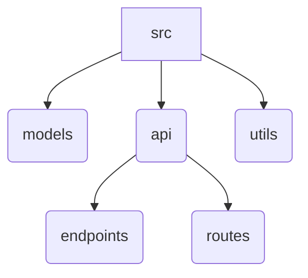

# Extending Functionality: Adding New Features

This tutorial will guide you on how to extend the existing codebase by adding new features or modifying existing ones. This involves understanding the codebase's architecture and following best practices for contributions.

## 1. Understanding the Codebase Architecture

Before extending the codebase, it's essential to understand its structure and key components. The TaskFlow API is organized into several modules:

*   **`src/models`**: Defines the data structures for core entities like Users, Projects, and Tasks. It includes attributes, methods for data manipulation, and serialization (e.g., `to_dict()` for API responses).
*   **`src/api`**: Handles incoming HTTP requests, routing, validation, and responses. It uses Flask Blueprints to organize endpoints for different resources (tasks, users, projects).
*   **`src/utils`**: Contains helper functions for validation and other common utilities.

### Codebase Tree

Here's a simplified view of the codebase structure:



## 2. Adding a New Feature: Example - Task Prioritization

Let's illustrate how to add a new feature: task prioritization. This involves modifying both the data model and the API endpoints.

### Step 1: Modify the Task Model

We need to add a `priority` field to the `Task` model. 

**File**: `src/models/task.py` (Illustrative - actual file may differ)

```python
# src/models/task.py
class Task:
    def __init__(self, id, title, description, status, project_id, assigned_to, priority, created_at, updated_at=None):
        self.id = id
        self.title = title
        self.description = description
        self.status = status
        self.project_id = project_id
        self.assigned_to = assigned_to
        self.priority = priority # New field
        self.created_at = created_at
        self.updated_at = updated_at

    def to_dict(self):
        return {
            'id': self.id,
            'title': self.title,
            'description': self.description,
            'status': self.status,
            'project_id': self.project_id,
            'assigned_to': self.assigned_to,
            'priority': self.priority, # Include in to_dict
            'created_at': self.created_at,
            'updated_at': self.updated_at
        }

# Add any necessary database/storage updates here if not using in-memory
```

### Step 2: Update the API Endpoint for Task Creation/Update

Modify the relevant API endpoint to accept and handle the new `priority` field.

**File**: `src/api/endpoints/tasks.py` (Illustrative)

```python
# src/api/endpoints/tasks.py
from flask import request, jsonify
from src.models.task import Task
from src.utils.validators import validate_task # Assuming a validator exists or will be created
from src.utils.helpers import get_timestamp

# ... (existing imports and task_store)

@tasks_bp.route('', methods=['POST'])
def create_task():
    data = request.get_json()
    # Add validation for priority
    is_valid, error = validate_task(data)
    if not is_valid:
        return jsonify({'error': error, 'code': 'VALIDATION_ERROR'}), 400

    global next_task_id
    new_task = Task(
        id=next_task_id,
        title=data['title'],
        description=data.get('description', ''),
        status=data.get('status', 'pending'),
        project_id=data['project_id'],
        assigned_to=data.get('assigned_to'),
        priority=data.get('priority', 'medium'), # Handle new priority field
        created_at=get_timestamp()
    )

    tasks_store[next_task_id] = new_task.to_dict() # Store using to_dict
    next_task_id += 1

    return jsonify({'message': 'Task created successfully', 'task': new_task.to_dict()}), 201

# Similar modifications would be needed for the update endpoint.
```

### Step 3: Add a New Endpoint (Optional) - Get Tasks by Priority

This demonstrates creating a new feature endpoint.

**File**: `src/api/endpoints/tasks.py` (Illustrative)

```python
# Add this to src/api/endpoints/tasks.py

@tasks_bp.route('/priority/<string:priority_level>', methods=['GET'])
def get_tasks_by_priority(priority_level):
    # In a real app, this would query the database
    # For this demo, we filter the in-memory store
    priority_tasks = [task for task in tasks_store.values()
                      if task.get('priority') == priority_level]
    return jsonify(priority_tasks), 200
```

## 3. Best Practices for Contributions

*   **Follow Project Structure**: Adhere to the existing directory (`src/models`, `src/api`, `src/utils`) and file naming conventions.
*   **Write Tests**: Add unit tests for any new models, functions, or API endpoints. Tests are crucial for ensuring code quality and preventing regressions.
*   **Documentation**: Update or add documentation (like this tutorial!) for new features. Ensure docstrings are present for new functions and classes.
*   **Code Style**: Maintain a consistent coding style, preferably following PEP 8 guidelines. Linters (like Flake8) and formatters (like Black) can help automate this.
*   **Pull Requests**: Submit changes via pull requests, clearly describing the changes and linking to any relevant issues or tasks.

## 4. Modifying Existing Functionality

If you need to modify existing functionality, follow these guidelines:

1.  **Locate the Code**: Identify the relevant files in `src/models` or `src/api` that implement the functionality you need to change.
2.  **Understand the Impact**: Analyze how your proposed change might affect other parts of the codebase, especially other API endpoints or data integrity.
3.  **Implement Changes**: Make the necessary modifications, ensuring you follow the best practices mentioned above (tests, documentation, code style).
4.  **Test Thoroughly**: Test the modified functionality and any areas that might be indirectly affected.

By understanding the architecture and adhering to these practices, you can effectively extend and improve the TaskFlow codebase.
