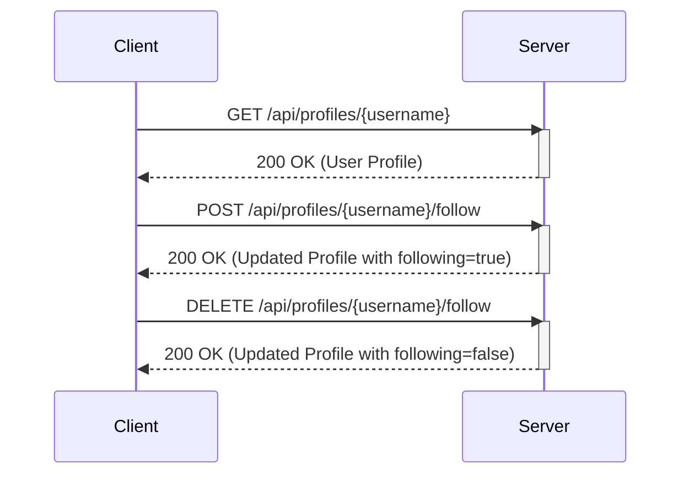

# User Profiles and Following System

This tutorial covers fetching user profiles, following other users, and unfollowing them, demonstrating social interaction features within the app.

## 1. Fetching a User Profile

To get a user's profile, you can make a GET request to the `/api/profiles/{username}` endpoint. This will return the user's information, including their articles and whether the logged-in user follows them.

### Example Request

```bash
curl -X GET "http://localhost:8000/api/profiles/janedoe" \
     -H "Authorization: Bearer YOUR_AUTH_TOKEN"
```

### Example Response

```json
{
  "profile": {
    "username": "janedoe",
    "bio": "Jane Doe's bio",
    "image": "http://example.com/janedoe.jpg",
    "following": false,
    "articles": [
      {
        "slug": "jane-does-first-article",
        "title": "Jane Doe's First Article",
        "description": "This is a description.",
        "body": "This is the body of the article...",
        "tagList": ["jane", "first"],
        "createdAt": "2023-01-01T12:00:00Z",
        "updatedAt": "2023-01-01T12:00:00Z",
        "author": {
          "username": "janedoe",
          "bio": "Jane Doe's bio",
          "image": "http://example.com/janedoe.jpg"
        }
      }
    ]
  }
}
```

## 2. Following a User

To follow another user, send a POST request to the `/api/profiles/{username}/follow` endpoint. The username in the URL is the user you want to follow.

```bash
curl -X POST "http://localhost:8000/api/profiles/janedoe/follow" \
     -H "Authorization: Bearer YOUR_AUTH_TOKEN"
```

This will return the profile of the followed user, with the `following` field set to `true`.

## 3. Unfollowing a User

To unfollow a user, send a DELETE request to the `/api/profiles/{username}/follow` endpoint. The username in the URL is the user you want to unfollow.

```bash
curl -X DELETE "http://localhost:8000/api/profiles/janedoe/follow" \
     -H "Authorization: Bearer YOUR_AUTH_TOKEN"
```

This will return the profile of the unfollowed user, with the `following` field set to `false`.

## Architecture Diagram



This tutorial provides a basic understanding of how to manage user profiles and implement a following system. You can expand upon this by adding features like listing followers/following or personalized feeds.
