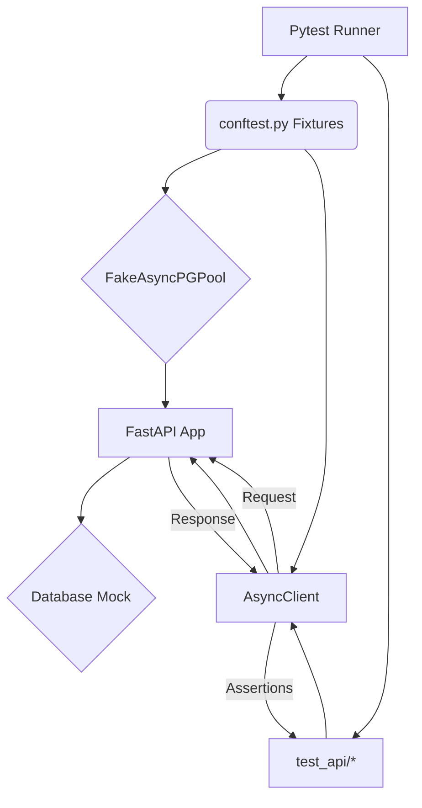

# Testing Your API Endpoints

This tutorial covers best practices for testing your API using the provided testing framework, ensuring the reliability and correctness of your application's functionality. We will explore how to write and run tests for various endpoints.

## Understanding the Testing Framework

The project utilizes `pytest` as its testing framework. The core components of the testing setup can be found in the `tests/` directory.

### Key Components:

*   **Fixtures (`tests/conftest.py`)**: These are essential for setting up the test environment. They provide reusable instances of the FastAPI application, an asynchronous HTTP client (`httpx.AsyncClient`), a fake database pool (`FakeAsyncPGPool`), authentication tokens, and pre-configured test data like users and articles. 
*   **Fake Database (`tests/fake_asyncpg_pool.py`)**: To enable fast and isolated testing without a live database, a `FakeAsyncPGPool` class mocks the `asyncpg.pool.Pool`. This allows tests to run as if they are interacting with a real database, but all operations are simulated.
*   **API Tests (`tests/test_api/`)**: This directory contains the actual test cases for your API endpoints.
    *   `test_routes.py`: Covers the business logic for articles, profiles, and following features. It verifies CRUD operations and the expected outcomes of these actions.
    *   `test_errors.py`: Focuses on testing how your API handles errors, such as 404 Not Found, 405 Method Not Allowed, and 422 Unprocessable Entity responses.

## Writing API Tests

Tests are typically written in `tests/test_api/test_routes.py` for regular endpoint testing and `tests/test_api/test_errors.py` for error scenarios.

### Example: Testing Article Creation

Let's look at how to test the article creation endpoint. This example, adapted from `tests/test_api/test_routes.py`, demonstrates using fixtures for authentication and making a POST request:

```python
async def test_create_article(client: AsyncClient, token: str, authorization_prefix: str) -> None:
    response = await client.post(
        "/articles",
        json={
            "title": "New Article Title",
            "slug": "new-article-title",
            "description": "A short description.",
            "body": "This is the full body of the new article.",
            "tagList": ["testing", "api"],
        },
        headers={\"Authorization\": f\"{authorization_prefix} {token}\"},
    )
    assert response.status_code == 200
    assert response.json()["article"]["title"] == "New Article Title"
```

**Explanation:**

*   The `authorized_client` fixture (which uses `client`, `token`, and `authorization_prefix`) is implicitly used here, providing an authenticated client.
*   A POST request is made to the `/articles` endpoint with a JSON payload representing the new article.
*   The `Authorization` header is correctly set using the provided token.
*   Assertions check if the response status code is 200 (OK) and if the returned article data matches the input.

### Example: Testing Error Handling (404 Not Found)

This example, inspired by `tests/test_api/test_errors.py`, shows how to test for a 404 response when trying to access a non-existent resource:

```python
async def test_get_nonexistent_article(client: AsyncClient) -> None:
    response = await client.get("/articles/nonexistent-slug")
    assert response.status_code == 404
```

**Explanation:**

*   An unauthenticated `client` is used to make a GET request to an invalid article slug.
*   The assertion verifies that the API returns a 404 status code, indicating the resource was not found.

## Running Tests

To run all the tests, navigate to your project's root directory in the terminal and execute the following command:

```bash
pytest
```

This command will discover and run all the test files in the `tests/` directory. Pytest will report the results, indicating which tests passed and which failed.

## Best Practices Summary:

*   **Use Fixtures**: Leverage fixtures for setting up test data and environments to keep tests clean and DRY (Don't Repeat Yourself).
*   **Isolate Tests**: Use the fake database to ensure tests do not depend on external systems or interfere with each other.
*   **Test Both Success and Failure Cases**: Write tests for both successful API calls and expected error conditions.
*   **Clear Assertions**: Make your assertions specific to verify the exact expected outcomes.
*   **Organize Tests**: Group tests logically within the `tests/test_api/` directory (e.g., by endpoint or feature).

By following these practices, you can build a robust test suite that ensures the quality and stability of your API.

## Architecture

Here is a simplified view of the testing architecture:



This diagram illustrates how Pytest orchestrates the execution, with fixtures providing the necessary components like the fake database and HTTP client to interact with the FastAPI application. The results are then asserted within the test files.
