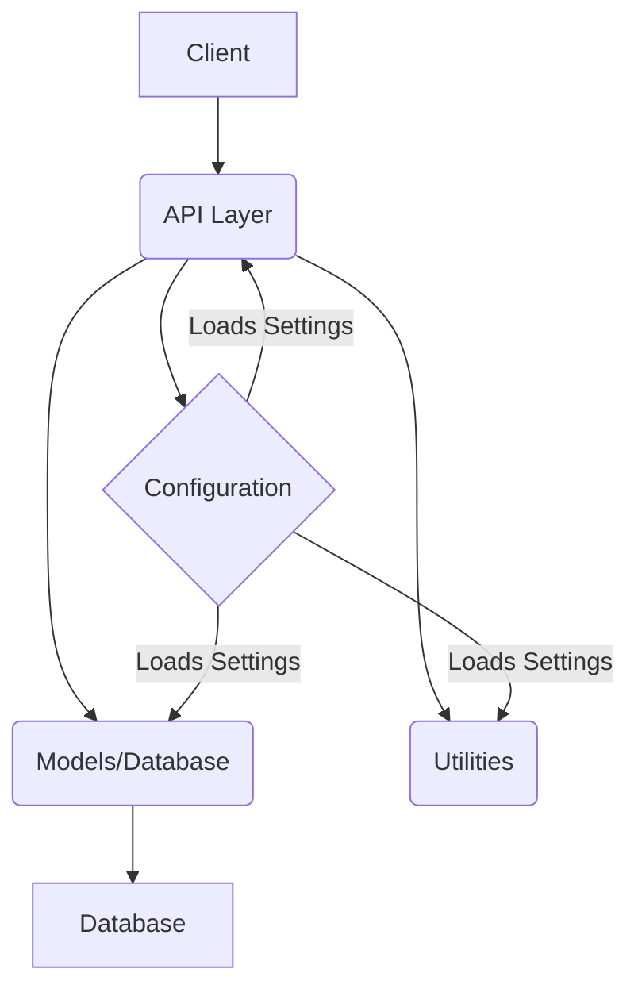

# Architecture Overview

## 1. Introduction

This document provides an overview of the TaskFlow system's architecture, outlining its major components, their responsibilities, and the data flow between them.

## 2. Core Components

The TaskFlow system is designed with a modular approach, separating concerns into distinct components:

*   **API Layer (`src/api`)**: Handles incoming HTTP requests, validates input, and orchestrates responses. It acts as the entry point for all client interactions.
*   **Configuration (`src/config`)**: Manages application settings, loading them from environment variables or `.env` files. This ensures flexibility across different deployment environments.
*   **Models (`src/models`)**: Defines the data structures (e.g., `Task`, `User`, `Project`) and handles all database interactions. This layer is responsible for data persistence and retrieval.
*   **Utilities (`src/utils`)**: Contains helper functions and common utilities used across different parts of the application.

## 3. System Architecture Diagram

Below is a diagram illustrating the high-level architecture of the TaskFlow system:

**Diagram Explanation:**

*   **Client**: Represents any external entity interacting with the TaskFlow API (e.g., a web browser, a mobile app).
*   **API Layer**: Receives requests from the client and processes them. It uses configuration settings and interacts with the Models layer.
*   **Configuration**: Provides settings to all other layers as needed.
*   **Models/Database**: Handles the business logic related to data, including validation and persistence. It interacts directly with the database.
*   **Database**: The persistent storage for all application data.
*   **Utilities**: Provides common functions used by other layers.

## 4. Data Flow

1.  **Request Ingress**: A client sends an HTTP request (e.g., GET, POST) to one of the API endpoints.
2.  **API Processing**: The API layer receives the request. It may use the `Configuration` to understand settings like database URLs or debug modes. It then calls the appropriate function in the `Models` layer to perform the requested operation (e.g., fetch a task, create a user).
3.  **Data Persistence/Retrieval**: The `Models` layer interacts with the `Database` to execute the data operation. This might involve saving new data, updating existing records, or querying for specific information.
4.  **Response Egress**: The `Models` layer returns the result (or status) back to the API layer. The API layer formats this result into an HTTP response and sends it back to the client.

*Refer to the [README.md](README.md.md) for a general project overview.*
*The [src_api.md](src_api.md) file provides details on the API layer.*
*The [src_models.md](src_models.md) file explains the data models and database interactions.*
*The [src_config.md](src_config.md) file details the configuration management.*
*The [src_utils.md](src_utils.md) file covers utility functions.*

## Next Steps

*   Dive deeper into the [Working with the API](03_working_with_api.md) tutorial.
*   Learn about [Extending the System](04_extending_the_system.md).