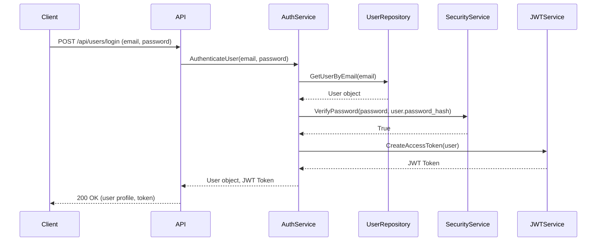

# Core API Workflows: User Authentication and Profile Management

This tutorial explores the fundamental API endpoints for user registration, login, and managing user profiles. It details how the API layer interacts with core services and data models to handle these crucial workflows.

## Table of Contents

*   [User Registration and Login](#user-registration-and-login)
*   [Profile Management](#profile-management)
*   [Authentication Flow Deep Dive](#authentication-flow-deep-dive)
*   [API Layer Interaction](#api-layer-interaction)

## User Registration and Login

The API provides endpoints for users to register new accounts and log in to existing ones. These operations are typically handled by the authentication routes.

### Registration

**Endpoint**: `POST /api/users` (or similar, often under `/users` tag)

**Workflow**:

1.  A POST request is sent to the registration endpoint with user credentials (e.g., username, email, password).
2.  The request hits the `app/api/routes/users.py` (or a dedicated authentication router).
3.  Input data is validated against a schema (e.g., `UserCreate` from `app/models/schemas/users.py`).
4.  The `authentication` service (`app/services/authentication.py`) is called to handle the business logic:
    *   Check if the username or email already exists using repository queries.
    *   Hash the password using `security.get_password_hash()`.
    *   Create a new user in the database via the `UsersRepository` (`app/db/repositories/users.py`).
    *   Generate a JWT access token for the new user using `jwt.create_access_token_for_user()`.
5.  The API returns the newly created user's profile and the JWT.

### Login

**Endpoint**: `POST /api/users/login` (or similar)

**Workflow**:

1.  A POST request is sent to the login endpoint with user credentials (email/username and password).
2.  Input data is validated against a login schema (e.g., `UserLogin` from `app/models/schemas/users.py`).
3.  The `authentication` service checks the credentials:
    *   Retrieve the user from the database by email/username using `UsersRepository`.
    *   Verify the provided password against the stored hash using `security.verify_password()`.
    *   If credentials are valid, generate a JWT access token.
4.  The API returns the logged-in user's profile and the JWT.

## Profile Management

Users can view and update their profiles. These endpoints often reside under `/api/user` or `/api/profiles`.

### Get Current User Profile

**Endpoint**: `GET /api/user` (or `GET /api/profiles/username`)

**Workflow**:

1.  A GET request is made, typically requiring authentication.
2.  The `get_current_user` dependency (`app/api/dependencies/authentication.py`) authenticates the user via JWT and fetches their data.
3.  The user's profile information (username, bio, image, following status) is returned.

### Update Current User Profile

**Endpoint**: `PUT /api/user` (or `PUT /api/profiles/username`)

**Workflow**:

1.  A PUT request is sent with updated profile data (e.g., email, password, username, bio, image).
2.  The request is authenticated using the `get_current_user` dependency.
3.  Input data is validated against a profile update schema (e.g., `ProfileUpdate` from `app/models/schemas/users.py`).
4.  The `UsersRepository` is used to update the user's information in the database.
5.  The updated user profile is returned.

## Authentication Flow Deep Dive

Authentication is primarily handled using JWTs passed in the `Authorization` header.

The core components involved are:

*   **`app/services/jwt.py`**: Contains logic for creating and decoding JWTs.
*   **`app/services/security.py`**: Handles password hashing and verification.
*   **`app/api/dependencies/authentication.py`**: Provides dependencies like `_get_authorization_header` to extract and validate the token, and `_get_current_user` to fetch the user model from the token.

**Sequence Diagram: User Login**



## API Layer Interaction

The API layer acts as the interface between the client and the backend logic. It uses FastAPI's dependency injection system extensively.

*   **Routers (`app/api/routes/`)**: Define endpoints and group related routes. For user and authentication workflows, `app/api/routes/users.py` and `app/api/routes/authentication.py` are key.
*   **Dependencies (`app/api/dependencies/`)**: Handle cross-cutting concerns like authentication (`authentication.py`) and database connections (`database.py`). The `get_current_user_authorizer` dependency is crucial for protecting endpoints.
*   **Services (`app/services/`)**: Encapsulate business logic. API route handlers call service functions (e.g., `authentication.authenticate_user`, `users.create_user`).
*   **Repositories (`app/db/repositories/`)**: Abstract database operations. Services use repositories to interact with the database.
*   **Models (`app/models/`)**: Define data structures for request validation (schemas) and internal data representation (domain models).

### Example: Getting Current User

````python
# app/api/routes/users.py (simplified)
from fastapi import APIRouter, Depends
from app.api.dependencies.authentication import get_current_user_authorizer
from app.models.domain.users import User

router = APIRouter()

@router.get("/user", response_model=UserSchema)
async def get_current_user_profile(
    user: User = Depends(get_current_user_authorizer()),
) -> User:
    return user
````

In this example, `Depends(get_current_user_authorizer())` ensures that a valid, authenticated `User` object is provided to the route handler. If authentication fails, the dependency raises an `HTTPException`.
