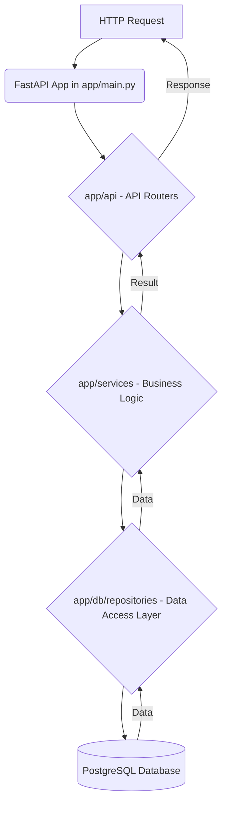

# User Authentication and Profile Management

This tutorial aims to guide you through the complete user authentication and profile management flow in the FastAPI RealWorld application. You will learn how to register a new user, log in, understand how JWT tokens are handled, fetch your own user profile, and update your user information using secure API endpoints.

## Architecture Overview

The user authentication and profile management features are implemented following a clear separation of concerns, as described in the project's executive summary. The `app/api` module defines the API endpoints, `app/services` handles the business logic (including JWT token management), and `app/db/repositories` interacts with the PostgreSQL database.

Here's a high-level architectural map showing the flow for API requests:



Specifically for user authentication and profile management, the following files are key:
- `app/api/routes/authentication.py`: Handles user registration and login.
- `app/api/routes/users.py`: Handles fetching and updating the current user's profile.
- `app/models/schemas/users.py`: Defines the data structures for user input and output.
- `app/services/jwt.py`: Manages the creation and decoding of JSON Web Tokens (JWT).

## 1. User Registration

To register a new user, you will use the `POST /users` endpoint. This endpoint expects a `UserInCreate` schema in the request body, which includes a username, email, and password.

**Endpoint:** `POST /api/users`

**Schema (`app/models/schemas/users.py`):**
```python
class UserInCreate(UserInLogin):
    username: str

class UserInLogin(RWSchema):
    email: EmailStr
    password: str
```

**`app/api/routes/authentication.py` snippet for registration:**
```python
@router.post(
    "",
    status_code=HTTP_201_CREATED,
    response_model=UserInResponse,
    name="auth:register",
)
async def register(
    user_create: UserInCreate = Body(..., embed=True, alias="user"),
    users_repo: UsersRepository = Depends(get_repository(UsersRepository)),
    settings: AppSettings = Depends(get_app_settings),
) -> UserInResponse:
    if await check_username_is_taken(users_repo, user_create.username):
        raise HTTPException(
            status_code=HTTP_400_BAD_REQUEST,
            detail=strings.USERNAME_TAKEN,
        )

    if await check_email_is_taken(users_repo, user_create.email):
        raise HTTPException(
            status_code=HTTP_400_BAD_REQUEST,
            detail=strings.EMAIL_TAKEN,
        )

    user = await users_repo.create_user(**user_create.dict())

    token = jwt.create_access_token_for_user(
        user,
        str(settings.secret_key.get_secret_value()),
    )
    return UserInResponse(
        user=UserWithToken(
            username=user.username,
            email=user.email,
            bio=user.bio,
            image=user.image,
            token=token,
        ),
    )
```

**Example Request (Bash using `curl`):**
```bash
curl -X POST "http://localhost:8000/api/users" \
  -H "Content-Type: application/json" \
  -d '{ 
    "user": {
      "username": "testuser",
      "email": "test@example.com",
      "password": "password123"
    }
  }'
```

Upon successful registration, the API will return a `201 Created` status and a `UserInResponse` object, which includes the newly created user's details along with a JWT `token`.

## 2. User Login

Existing users can log in using the `POST /users/login` endpoint. This endpoint expects a `UserInLogin` schema with the user's email and password.

**Endpoint:** `POST /api/users/login`

**Schema (`app/models/schemas/users.py`):**
```python
class UserInLogin(RWSchema):
    email: EmailStr
    password: str
```

**`app/api/routes/authentication.py` snippet for login:**
```python
@router.post("/login", response_model=UserInResponse, name="auth:login")
async def login(
    user_login: UserInLogin = Body(..., embed=True, alias="user"),
    users_repo: UsersRepository = Depends(get_repository(UsersRepository)),
    settings: AppSettings = Depends(get_app_settings),
) -> UserInResponse:
    wrong_login_error = HTTPException(
        status_code=HTTP_400_BAD_REQUEST,
        detail=strings.INCORRECT_LOGIN_INPUT,
    )

    try:
        user = await users_repo.get_user_by_email(email=user_login.email)
    except EntityDoesNotExist as existence_error:
        raise wrong_login_error from existence_error

    if not user.check_password(user_login.password):
        raise wrong_login_error

    token = jwt.create_access_token_for_user(
        user,
        str(settings.secret_key.get_secret_value()),
    )
    return UserInResponse(
        user=UserWithToken(
            username=user.username,
            email=user.email,
            bio=user.bio,
            image=user.image,
            token=token,
        ),
    )
```

**Example Request (Bash using `curl`):**
```bash
curl -X POST "http://localhost:8000/api/users/login" \
  -H "Content-Type: application/json" \
  -d '{ 
    "user": {
      "email": "test@example.com",
      "password": "password123"
    }
  }'
```

Successful login will return a `200 OK` status with a `UserInResponse` object containing the user's data and a new JWT `token`.

## 3. Handling JWT Tokens

The application uses JSON Web Tokens (JWT) for stateless authentication. After successful registration or login, the API returns a JWT token. This token must be included in the `Authorization` header of subsequent requests to authenticated endpoints.

**`app/services/jwt.py` snippet for token creation:**
```python
# ... (imports and constants)

def create_jwt_token(
    *,
    jwt_content: Dict[str, str],
    secret_key: str,
    expires_delta: timedelta,
) -> str:
    to_encode = jwt_content.copy()
    expire = datetime.utcnow() + expires_delta
    to_encode.update(JWTMeta(exp=expire, sub=JWT_SUBJECT).dict())
    return jwt.encode(to_encode, secret_key, algorithm=ALGORITHM)

def create_access_token_for_user(user: User, secret_key: str) -> str:
    return create_jwt_token(
        jwt_content=JWTUser(username=user.username).dict(),
        secret_key=secret_key,
        expires_delta=timedelta(minutes=ACCESS_TOKEN_EXPIRE_MINUTES),
    )
```

To make authenticated requests, set the `Authorization` header with the value `Token <your_jwt_token>`.

## 4. Fetching Your User Profile

Once authenticated, you can retrieve your own user profile using the `GET /user` endpoint. This endpoint requires a valid JWT token in the `Authorization` header.

**Endpoint:** `GET /api/user`

**`app/api/routes/users.py` snippet for fetching current user:**
```python
@router.get("", response_model=UserInResponse, name="users:get-current-user")
async def retrieve_current_user(
    user: User = Depends(get_current_user_authorizer()),
    settings: AppSettings = Depends(get_app_settings),
) -> UserInResponse:
    token = jwt.create_access_token_for_user(
        user,
        str(settings.secret_key.get_secret_value()),
    )
    return UserInResponse(
        user=UserWithToken(
            username=user.username,
            email=user.email,
            bio=user.bio,
            image=user.image,
            token=token,
        ),
    )
```

**Example Request (Bash using `curl`):**
```bash
# Replace <YOUR_JWT_TOKEN> with the token obtained from login or registration
JWT_TOKEN="eyJhbGciOiJIUzI1NiIsInR5cCI6IkpXVCJ9.eyJleHAiOjE2Nz..." # Example token

curl -X GET "http://localhost:8000/api/user" \
  -H "Authorization: Token ${JWT_TOKEN}"
```

This will return a `200 OK` status with your `UserInResponse` object.

## 5. Updating User Information

You can update your user profile using the `PUT /user` endpoint. This also requires a valid JWT token and accepts a `UserInUpdate` schema in the request body.

**Endpoint:** `PUT /api/user`

**Schema (`app/models/schemas/users.py`):**
```python
from typing import Optional
from pydantic import BaseModel, EmailStr, HttpUrl

class UserInUpdate(BaseModel):
    username: Optional[str] = None
    email: Optional[EmailStr] = None
    password: Optional[str] = None
    bio: Optional[str] = None
    image: Optional[HttpUrl] = None
```

**`app/api/routes/users.py` snippet for updating current user:**
```python
@router.put("", response_model=UserInResponse, name="users:update-current-user")
async def update_current_user(
    user_update: UserInUpdate = Body(..., embed=True, alias="user"),
    current_user: User = Depends(get_current_user_authorizer()),
    users_repo: UsersRepository = Depends(get_repository(UsersRepository)),
    settings: AppSettings = Depends(get_app_settings),
) -> UserInResponse:
    if user_update.username and user_update.username != current_user.username:
        if await check_username_is_taken(users_repo, user_update.username):
            raise HTTPException(
                status_code=HTTP_400_BAD_REQUEST,
                detail=strings.USERNAME_TAKEN,
            )

    if user_update.email and user_update.email != current_user.email:
        if await check_email_is_taken(users_repo, user_update.email):
            raise HTTPException(
                status_code=HTTP_400_BAD_REQUEST,
                detail=strings.EMAIL_TAKEN,
            )

    user = await users_repo.update_user(user=current_user, **user_update.dict())

    token = jwt.create_access_token_for_user(
        user,
        str(settings.secret_key.get_secret_value()),
    )
    return UserInResponse(
        user=UserWithToken(
            username=user.username,
            email=user.email,
            bio=user.bio,
            image=user.image,
            token=token,
        ),
    )
```

**Example Request (Bash using `curl`):**
```bash
# Replace <YOUR_JWT_TOKEN> with your actual token
JWT_TOKEN="eyJhbGciOiJIUzI1NiIsInR5cCI6IkpXVCJ9.eyJleHAiOjE2Nz..." # Example token

curl -X PUT "http://localhost:8000/api/user" \
  -H "Content-Type: application/json" \
  -H "Authorization: Token ${JWT_TOKEN}" \
  -d '{ 
    "user": {
      "bio": "I am a new bio for my profile.",
      "image": "https://i.imgur.com/example.jpeg"
    }
  }'
```

This will return a `200 OK` status with the updated `UserInResponse` object.

## Conclusion

This tutorial has covered the essential aspects of user authentication and profile management in the FastAPI RealWorld application. You now understand how to register and log in users, how JWT tokens are used for authentication, and how to fetch and update user profiles using the provided API endpoints. This knowledge forms a crucial foundation for interacting with other authenticated features of the application.
