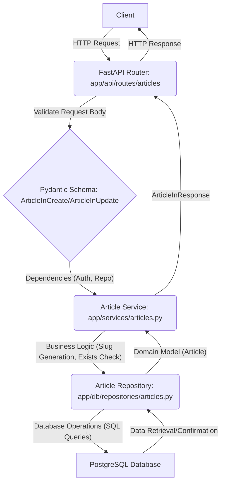

# Mastering Article Creation and Management

This tutorial dives deep into creating, reading, updating, and deleting articles within the FastAPI RealWorld application. We'll explore the authenticated API interactions required for complete article lifecycle management, from data models to repository interactions and API endpoints.

## 1. Article Data Models

Article data is primarily defined across two key modules: `app/models/domain/articles.py` for the core domain model and `app/models/schemas/articles.py` for API request and response schemas.

### Core Article Domain Model

The `Article` model in `app/models/domain/articles.py` represents the fundamental structure of an article within the application, including its unique identifier, content, author, and social metrics.

```python
# app/models/domain/articles.py
from typing import List

from app.models.common import DateTimeModelMixin, IDModelMixin
from app.models.domain.profiles import Profile
from app.models.domain.rwmodel import RWModel

class Article(IDModelMixin, DateTimeModelMixin, RWModel):
    slug: str
    title: str
    description: str
    body: str
    tags: List[str]
    author: Profile
    favorited: bool
    favorites_count: int
```

### Article Schemas for API Interactions

`app/models/schemas/articles.py` defines the Pydantic schemas used for validating incoming request data and formatting outgoing response data. These schemas leverage `RWSchema` (which inherits from `RWModel`) for consistent camelCase conversion and datetime serialization.

```python
# app/models/schemas/articles.py
from typing import List, Optional

from pydantic import BaseModel, Field

from app.models.domain.articles import Article
from app.models.schemas.rwschema import RWSchema

DEFAULT_ARTICLES_LIMIT = 20
DEFAULT_ARTICLES_OFFSET = 0

class ArticleForResponse(RWSchema, Article):
    tags: List[str] = Field(..., alias="tagList")

class ArticleInResponse(RWSchema):
    article: ArticleForResponse

class ArticleInCreate(RWSchema):
    title: str
    description: str
    body: str
    tags: List[str] = Field([], alias="tagList")

class ArticleInUpdate(RWSchema):
    title: Optional[str] = None
    description: Optional[str] = None
    body: Optional[str] = None

class ListOfArticlesInResponse(RWSchema):
    articles: List[ArticleForResponse]
    articles_count: int

class ArticlesFilters(BaseModel):
    tag: Optional[str] = None
    author: Optional[str] = None
    favorited: Optional[str] = None
    limit: int = Field(DEFAULT_ARTICLES_LIMIT, ge=1)
    offset: int = Field(DEFAULT_ARTICLES_OFFSET, ge=0)
```

## 2. API Endpoints for Article Management

All article-related API routes are defined in `app/api/routes/articles/articles_resource.py` and `app/api/routes/articles/articles_common.py`, which are then included in `app/api/routes/articles/api.py`.

```python
# app/api/routes/articles/api.py
from fastapi import APIRouter

from app.api.routes.articles import articles_common, articles_resource

router = APIRouter()

router.include_router(articles_common.router, prefix="/articles")
router.include_router(articles_resource.router, prefix="/articles")
```

### Article Creation (POST /articles)

The `create_new_article` endpoint handles the creation of new articles. It requires authentication and uses the `ArticleInCreate` schema for request body validation. A unique slug is generated from the article title, and a check is performed to ensure an article with the same slug does not already exist.

```python
# app/api/routes/articles/articles_resource.py
# ...

@router.post(
    "",
    status_code=status.HTTP_201_CREATED,
    response_model=ArticleInResponse,
    name="articles:create-article",
)
async def create_new_article(
    article_create: ArticleInCreate = Body(..., embed=True, alias="article"),
    user: User = Depends(get_current_user_authorizer()),
    articles_repo: ArticlesRepository = Depends(get_repository(ArticlesRepository)),
) -> ArticleInResponse:
    slug = get_slug_for_article(article_create.title)
    if await check_article_exists(articles_repo, slug):
        raise HTTPException(
            status_code=status.HTTP_400_BAD_REQUEST,
            detail=strings.ARTICLE_ALREADY_EXISTS,
        )

    article = await articles_repo.create_article(
        slug=slug,
        title=article_create.title,
        description=article_create.description,
        body=article_create.body,
        author=user,
        tags=article_create.tags,
    )
    return ArticleInResponse(article=ArticleForResponse.from_orm(article))
```

**Example `curl` command for creating an article:**

```bash
curl -X POST "http://localhost:8000/api/articles" \
  -H "Content-Type: application/json" \
  -H "Authorization: Token YOUR_JWT_TOKEN" \
  -d '{ 
    "article": {
      "title": "How to Train Your Dragon",
      "description": "Ever wonder how?",
      "body": "You have to believe.",
      "tagList": ["dragons", "training"]
    }
  }'
```

### Reading Articles (GET /articles and GET /articles/{slug})

The API provides endpoints for listing multiple articles and retrieving a single article by its slug.

**Listing Articles (`GET /articles`)**

The `list_articles` endpoint allows filtering, limiting, and offsetting the results. It can optionally take a user token to determine if the requesting user has favorited articles.

```python
# ...

@router.get("", response_model=ListOfArticlesInResponse, name="articles:list-articles")
async def list_articles(
    articles_filters: ArticlesFilters = Depends(get_articles_filters),
    user: Optional[User] = Depends(get_current_user_authorizer(required=False)),
    articles_repo: ArticlesRepository = Depends(get_repository(ArticlesRepository)),
) -> ListOfArticlesInResponse:
    articles = await articles_repo.filter_articles(
        tag=articles_filters.tag,
        author=articles_filters.author,
        favorited=articles_filters.favorited,
        limit=articles_filters.limit,
        offset=articles_filters.offset,
        requested_user=user,
    )
    articles_for_response = [
        ArticleForResponse.from_orm(article) for article in articles
    ]
    return ListOfArticlesInResponse(
        articles=articles_for_response,
        articles_count=len(articles),
    )
```

**Example `curl` command for listing articles:**

```bash
curl -X GET "http://localhost:8000/api/articles?limit=10&offset=0&tag=dragons" \
  -H "Content-Type: application/json"
```

**Retrieving a Single Article (`GET /articles/{slug}`)**

The `retrieve_article_by_slug` endpoint fetches a single article based on its unique slug.

```python
# ...

@router.get("/{slug}", response_model=ArticleInResponse, name="articles:get-article")
async def retrieve_article_by_slug(
    article: Article = Depends(get_article_by_slug_from_path),
) -> ArticleInResponse:
    return ArticleInResponse(article=ArticleForResponse.from_orm(article))
```

**Example `curl` command for retrieving an article:**

```bash
curl -X GET "http://localhost:8000/api/articles/how-to-train-your-dragon" \
  -H "Content-Type: application/json"
```

### Updating an Article (PUT /articles/{slug})

The `update_article_by_slug` endpoint allows authenticated users to modify their existing articles. It uses the `ArticleInUpdate` schema, which allows partial updates (fields are optional).

```python
# ...

@router.put(
    "/{slug}",
    response_model=ArticleInResponse,
    name="articles:update-article",
    dependencies=[Depends(check_article_modification_permissions)],
)
async def update_article_by_slug(
    article_update: ArticleInUpdate = Body(..., embed=True, alias="article"),
    current_article: Article = Depends(get_article_by_slug_from_path),
    articles_repo: ArticlesRepository = Depends(get_repository(ArticlesRepository)),
) -> ArticleInResponse:
    slug = get_slug_for_article(article_update.title) if article_update.title else None
    article = await articles_repo.update_article(
        article=current_article,
        slug=slug,
        **article_update.dict(),
    )
    return ArticleInResponse(article=ArticleForResponse.from_orm(article))
```

**Example `curl` command for updating an article:**

```bash
curl -X PUT "http://localhost:8000/api/articles/how-to-train-your-dragon" \
  -H "Content-Type: application/json" \
  -H "Authorization: Token YOUR_JWT_TOKEN" \
  -d '{ 
    "article": {
      "description": "A revised description.",
      "body": "It's all about belief and a good harness."
    }
  }'
```

### Deleting an Article (DELETE /articles/{slug})

The `delete_article_by_slug` endpoint permanently removes an article from the system. This action also requires authentication and proper authorization.

```python
# ...

@router.delete(
    "/{slug}",
    status_code=status.HTTP_204_NO_CONTENT,
    name="articles:delete-article",
    dependencies=[Depends(check_article_modification_permissions)],
    response_class=Response,
)
async def delete_article_by_slug(
    article: Article = Depends(get_article_by_slug_from_path),
    articles_repo: ArticlesRepository = Depends(get_repository(ArticlesRepository)),
) -> None:
    await articles_repo.delete_article(article=article)
```

**Example `curl` command for deleting an article:**

```bash
curl -X DELETE "http://localhost:8000/api/articles/how-to-train-your-dragon" \
  -H "Authorization: Token YOUR_JWT_TOKEN"
```

## 3. Article Services

The `app/services/articles.py` module contains business logic related to articles, such as slug generation and existence checks. This layer abstracts some of the complexity from the API routes.

```python
# app/services/articles.py
from slugify import slugify

from app.db.errors import EntityDoesNotExist
from app.db.repositories.articles import ArticlesRepository
from app.models.domain.articles import Article
from app.models.domain.users import User

async def check_article_exists(articles_repo: ArticlesRepository, slug: str) -> bool:
    try:
        await articles_repo.get_article_by_slug(slug=slug)
    except EntityDoesNotExist:
        return False

    return True

def get_slug_for_article(title: str) -> str:
    return slugify(title)

def check_user_can_modify_article(article: Article, user: User) -> bool:
    return article.author.username == user.username
```

-   `check_article_exists`: Verifies if an article with a given slug already exists, preventing duplicate slugs.
-   `get_slug_for_article`: Generates a URL-friendly slug from an article title.
-   `check_user_can_modify_article`: Ensures that only the article's author can modify or delete it.

## 4. Article Repository

The `app/db/repositories/articles.py` module encapsulates all database interactions for articles. It provides methods for creating, reading, updating, and deleting articles, as well as handling relationships with tags and favorites.

```python
# app/db/repositories/articles.py
from typing import List, Optional, Sequence, Union

from asyncpg import Connection, Record
from pypika import Query

from app.db.errors import EntityDoesNotExist
from app.db.queries.queries import queries
from app.db.queries.tables import (
    Parameter,
    articles,
    articles_to_tags,
    favorites,
    tags as tags_table,
    users,
)
from app.db.repositories.base import BaseRepository
from app.db.repositories.profiles import ProfilesRepository
from app.db.repositories.tags import TagsRepository
from app.models.domain.articles import Article
from app.models.domain.users import User

# ... (some constants and class definition)

class ArticlesRepository(BaseRepository):
    # ... (init method)

    async def create_article( # ... )
        # Creates a new article in the database, including linking tags.

    async def update_article( # ... )
        # Updates an existing article's title, description, or body.

    async def delete_article(self, *, article: Article) -> None:
        # Deletes an article from the database.
        async with self.connection.transaction():
            await queries.delete_article(
                self.connection,
                slug=article.slug,
                author_username=article.author.username,
            )

    async def filter_articles( # ... )
        # Filters articles based on tags, author, favorited status, with pagination.

    async def get_articles_for_user_feed( # ... )
        # Retrieves articles from followed users for a user's feed.

    async def get_article_by_slug( # ... )
        # Fetches a single article by its slug.

    # ... (other helper methods like get_tags_for_article_by_slug, is_article_favorited_by_user, etc.)
```

## 5. Article CRUD Data Flow

The following diagram illustrates the typical data flow for article CRUD operations, from the API request to the database interaction.


