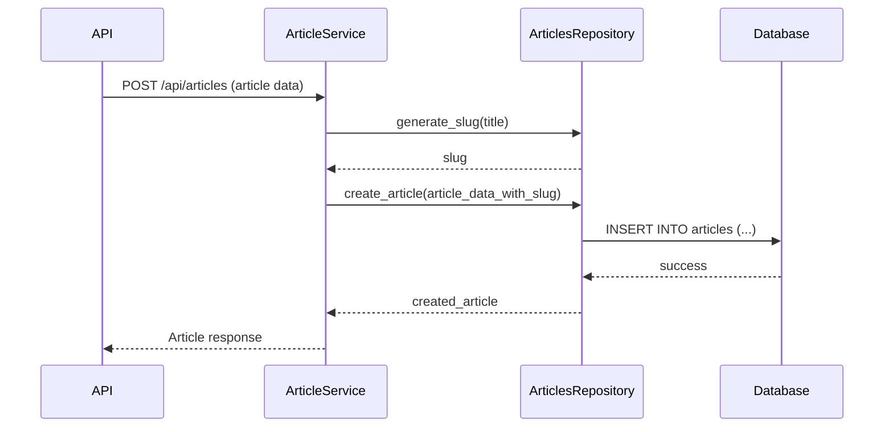

# Article Management: Creating, Reading, Updating, and Deleting Articles

This tutorial will guide you through managing articles using the API. We will cover how to perform CRUD (Create, Read, Update, Delete) operations on articles, interacting with the relevant API endpoints and understanding the underlying service logic.

## API Endpoints for Article Management

The application provides several API endpoints for managing articles. These endpoints are typically mounted under the `/api/articles` path.

### Creating an Article

To create a new article, you use the `POST /api/articles` endpoint. This requires authentication and a payload containing the article details.

**Request Example (HTTP)**:

```http
POST /api/articles HTTP/1.1
Host: your-api-host.com
Content-Type: application/json
Authorization: Token YOUR_AUTH_TOKEN

{
  "article": {
    "title": "New Article Title",
    "description": "A short description of the new article.",
    "body": "This is the full content of the new article.",
    "tagList": ["tag1", "tag2"]
  }
}
```

**Service Logic**: The `articles.py` service likely handles slug generation from the title and interacts with the `ArticlesRepository` to save the new article to the database.

### Reading Articles

There are multiple ways to read articles:

*   **Get a single article by slug**: `GET /api/articles/:slug`
    This endpoint retrieves a specific article. It requires an `ArticlesRepository` and uses the `get_article_by_slug_from_path` dependency to fetch the article, handling cases where the article does not exist.

    **Request Example (HTTP)**:

    ```http
    GET /api/articles/new-article-title HTTP/1.1
    Host: your-api-host.com
    ```

*   **Get multiple articles (feed)**: `GET /api/articles`
    This endpoint retrieves a list of articles, optionally filtered by tags, authors, or favorited status, and supports pagination. The `get_articles_filters` dependency is used to parse query parameters like `tag`, `author`, `favorited`, `limit`, and `offset`.

    **Request Example (HTTP)**:

    ```http
    GET /api/articles?tag=python&limit=10&offset=0 HTTP/1.1
    Host: your-api-host.com
    ```

### Updating an Article

To update an existing article, you use the `PUT /api/articles/:slug` endpoint. This operation is typically restricted to the author of the article.

**Service Logic**: The `check_article_modification_permissions` dependency ensures that the authenticated user is the author of the article before allowing the update. The `ArticlesRepository` is then used to persist the changes.

**Request Example (HTTP)**:

```http
PUT /api/articles/your-article-slug HTTP/1.1
Host: your-api-host.com
Content-Type: application/json
Authorization: Token YOUR_AUTH_TOKEN

{
  "article": {
    "title": "Updated Article Title",
    "description": "Updated description.",
    "body": "Updated body content."
  }
}
```

### Deleting an Article

To delete an article, you use the `DELETE /api/articles/:slug` endpoint. Similar to updating, this is typically restricted to the article's author.

**Service Logic**: The `check_article_modification_permissions` dependency also guards this endpoint. The `ArticlesRepository` would then be responsible for removing the article from the database.

**Request Example (HTTP)**:

```http
DELETE /api/articles/your-article-slug HTTP/1.1
Host: your-api-host.com
Authorization: Token YOUR_AUTH_TOKEN
```

## Underlying Service Logic

Article management heavily relies on the `app/services/articles.py` and `app/db/repositories/articles.py` modules.

*   **`app/services/articles.py`**: Contains business logic such as generating slugs (`get_slug_for_article`), checking article existence (`check_article_exists`), and verifying user permissions for modification (`check_user_can_modify_article`).
*   **`app/db/repositories/articles.py`**: This repository handles direct interactions with the database for article-related data operations (e.g., fetching, creating, updating, deleting articles).

## Architecture Diagram (Mermaid Sequence Diagram)

This diagram illustrates the flow for creating a new article:



This diagram shows how an incoming API request is processed by the service layer, which in turn uses the repository to interact with the database. The service layer is also responsible for generating slugs for new articles.

## Further Reading

*   [API Module Documentation](%s)
*   [Models Module Documentation](%s)
*   [Services Module Documentation](%s)
*   [Database Module Documentation](%s)
