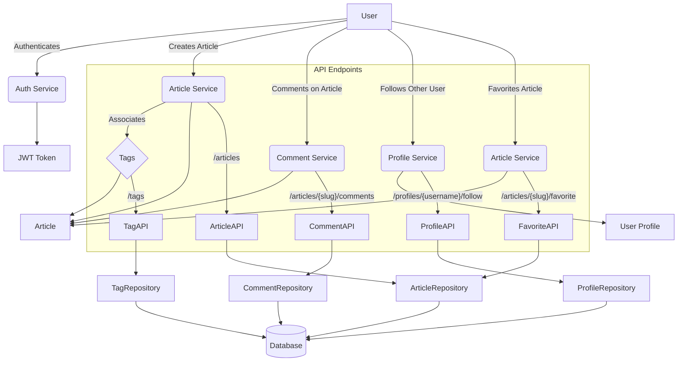

# Implementing Social Interactions: Comments, Tags, Following, and Favoriting

This tutorial extends your understanding by demonstrating how to implement and interact with advanced social features such as adding comments to articles, managing article tags, following other users, and favoriting articles to enhance user engagement within the FastAPI RealWorld application.

## 1. Comments

Comments allow users to engage in discussions about articles. This section covers how comments are created, listed, and deleted.

### API Endpoints

-   **POST `/api/articles/{slug}/comments`**: Add a comment to an article.
-   **GET `/api/articles/{slug}/comments`**: Get all comments for an article.
-   **DELETE `/api/articles/{slug}/comments/{id}`**: Delete a comment from an article.

### Implementation Details

Comments related logic resides primarily in `app/api/routes/comments.py`, `app/db/repositories/comments.py`, and the data models in `app/models/domain/comments.py` and `app/models/schemas/comments.py`.

#### `app/api/routes/comments.py`

This file defines the API routes for comments:

```python
# app/api/routes/comments.py
# Lines 19-30
@router.get(
    "",
    response_model=ListOfCommentsInResponse,
    name="comments:get-comments-for-article",
)
async def list_comments_for_article(
    article: Article = Depends(get_article_by_slug_from_path),
    user: Optional[User] = Depends(get_current_user_authorizer(required=False)),
    comments_repo: CommentsRepository = Depends(get_repository(CommentsRepository)),
) -> ListOfCommentsInResponse:
    comments = await comments_repo.get_comments_for_article(article=article, user=user)
    return ListOfCommentsInResponse(comments=comments)

# Lines 33-47
@router.post(
    "",
    status_code=status.HTTP_201_CREATED,
    response_model=CommentInResponse,
    name="comments:create-comment-for-article",
)
async def create_comment_for_article(
    comment_create: CommentInCreate = Body(..., embed=True, alias="comment"),
    article: Article = Depends(get_article_by_slug_from_path),
    user: User = Depends(get_current_user_authorizer()),
    comments_repo: CommentsRepository = Depends(get_repository(CommentsRepository)),
) -> CommentInResponse:
    comment = await comments_repo.create_comment_for_article(
        body=comment_create.body,
        article=article,
        user=user,
    )
    return CommentInResponse(comment=comment)

# Lines 50-60
@router.delete(
    "/{comment_id}",
    status_code=status.HTTP_204_NO_CONTENT,
    name="comments:delete-comment-from-article",
    dependencies=[Depends(check_comment_modification_permissions)],
    response_class=Response,
)
async def delete_comment_from_article(
    comment: Comment = Depends(get_comment_by_id_from_path),
    comments_repo: CommentsRepository = Depends(get_repository(CommentsRepository)),
) -> None:
    await comments_repo.delete_comment(comment=comment)
```

#### `app/db/repositories/comments.py`

This repository handles the database interactions for comments:

```python
# app/db/repositories/comments.py
# Lines 23-40
    async def get_comment_by_id(
        self,
        *,
        comment_id: int,
        article: Article,
        user: Optional[User] = None,
    ) -> Comment:
        comment_row = await queries.get_comment_by_id_and_slug(
            self.connection,
            comment_id=comment_id,
            article_slug=article.slug,
        )
        if comment_row:
            return await self._get_comment_from_db_record(
                comment_row=comment_row,
                author_username=comment_row["author_username"],
                requested_user=user,
            )

        raise EntityDoesNotExist(
            "comment with id {0} does not exist".format(comment_id),
        )

# Lines 42-57
    async def get_comments_for_article(
        self,
        *,
        article: Article,
        user: Optional[User] = None,
    ) -> List[Comment]:
        comments_rows = await queries.get_comments_for_article_by_slug(
            self.connection,
            slug=article.slug,
        )
        return [
            await self._get_comment_from_db_record(
                comment_row=comment_row,
                author_username=comment_row["author_username"],
                requested_user=user,
            )
            for comment_row in comments_rows
        ]

# Lines 59-73
    async def create_comment_for_article(
        self,
        *,
        body: str,
        article: Article,
        user: User,
    ) -> Comment:
        comment_row = await queries.create_new_comment(
            self.connection,
            body=body,
            article_slug=article.slug,
            author_username=user.username,
        )
        return await self._get_comment_from_db_record(
            comment_row=comment_row,
            author_username=comment_row["author_username"],
            requested_user=user,
        )

# Lines 75-81
    async def delete_comment(self, *, comment: Comment) -> None:
        await queries.delete_comment_by_id(
            self.connection,
            comment_id=comment.id_,
            author_username=comment.author.username,
        )
```

### Example API Calls

```bash
# Create a comment
curl -X POST "http://localhost:8000/api/articles/how-to-train-your-dragon/comments" \
     -H "Content-Type: application/json" \
     -H "Authorization: Token YOUR_JWT_TOKEN" \
     -d '{ "comment": { "body": "This is a great article!" } }'

# Get comments for an article
curl -X GET "http://localhost:8000/api/articles/how-to-train-your-dragon/comments"

# Delete a comment
curl -X DELETE "http://localhost:8000/api/articles/how-to-train-your-dragon/comments/123" \
     -H "Authorization: Token YOUR_JWT_TOKEN"
```

## 2. Tags

Tags are used to categorize articles, making them easier to discover. This section focuses on retrieving available tags.

-   **GET `/api/tags`**: Get all available tags.

Tag retrieval is handled by `app/api/routes/tags.py` and `app/db/repositories/tags.py`.

#### `app/api/routes/tags.py`

```python
# app/api/routes/tags.py
# Lines 9-14
@router.get("", response_model=TagsInList, name="tags:get-all")
async def get_all_tags(
    tags_repo: TagsRepository = Depends(get_repository(TagsRepository)),
) -> TagsInList:
    tags = await tags_repo.get_all_tags()
    return TagsInList(tags=tags)
```

Tags are associated with articles during article creation, as seen in `app/db/repositories/articles.py`:

```python
# app/db/repositories/articles.py
# Lines 42-56
    async def create_article(  # noqa: WPS211
        self,
        *,
        slug: str,
        title: str,
        description: str,
        body: str,
        author: User,
        tags: Optional[Sequence[str]] = None,
    ) -> Article:
        async with self.connection.transaction():
            article_row = await queries.create_new_article(
                self.connection,
                slug=slug,
                title=title,
                description=description,
                body=body,
                author_username=author.username,
            )

            if tags:
                await self._tags_repo.create_tags_that_dont_exist(tags=tags)
                await self._link_article_with_tags(slug=slug, tags=tags)

        return await self._get_article_from_db_record(
            article_row=article_row,
            slug=slug,
            author_username=article_row[AUTHOR_USERNAME_ALIAS],
            requested_user=author,
        )
```

### Example API Call

```bash
# Get all tags
curl -X GET "http://localhost:8000/api/tags"
```

## 3. Following Users

Users can follow other users to see their articles in their personalized feed.

-   **POST `/api/profiles/{username}/follow`**: Follow a user.
-   **DELETE `/api/profiles/{username}/follow`**: Unfollow a user.

User following logic is handled by `app/api/routes/profiles.py` and the `ProfilesRepository`.

#### `app/api/routes/profiles.py`

```python
# app/api/routes/profiles.py
# Lines 21-47
@router.post(
    "/{username}/follow",
    response_model=ProfileInResponse,
    name="profiles:follow-user",
)
async def follow_for_user(
    profile: Profile = Depends(get_profile_by_username_from_path),
    user: User = Depends(get_current_user_authorizer()),
    profiles_repo: ProfilesRepository = Depends(get_repository(ProfilesRepository)),
) -> ProfileInResponse:
    if user.username == profile.username:
        raise HTTPException(
            status_code=HTTP_400_BAD_REQUEST,
            detail=strings.UNABLE_TO_FOLLOW_YOURSELF,
        )

    if profile.following:
        raise HTTPException(
            status_code=HTTP_400_BAD_REQUEST,
            detail=strings.USER_IS_ALREADY_FOLLOWED,
        )

    await profiles_repo.add_user_into_followers(
        target_user=profile,
        requested_user=user,
    )

    return ProfileInResponse(profile=profile.copy(update={"following": True}))

# Lines 50-76
@router.delete(
    "/{username}/follow",
    response_model=ProfileInResponse,
    name="profiles:unsubscribe-from-user",
)
async def unsubscribe_from_user(
    profile: Profile = Depends(get_profile_by_username_from_path),
    user: User = Depends(get_current_user_authorizer()),
    profiles_repo: ProfilesRepository = Depends(get_repository(ProfilesRepository)),
) -> ProfileInResponse:
    if user.username == profile.username:
        raise HTTPException(
            status_code=HTTP_400_BAD_REQUEST,
            detail=strings.UNABLE_TO_UNSUBSCRIBE_FROM_YOURSELF,
        )

    if not profile.following:
        raise HTTPException(
            status_code=HTTP_400_BAD_REQUEST,
            detail=strings.USER_IS_NOT_FOLLOWED,
        )

    await profiles_repo.remove_user_from_followers(
        target_user=profile,
        requested_user=user,
    )

    return ProfileInResponse(profile=profile.copy(update={"following": False}))
```

```bash
# Follow a user
curl -X POST "http://localhost:8000/api/profiles/jake/follow" \
     -H "Content-Type: application/json" \
     -H "Authorization: Token YOUR_JWT_TOKEN"

# Unfollow a user
curl -X DELETE "http://localhost:8000/api/profiles/jake/follow" \
     -H "Content-Type: application/json" \
     -H "Authorization: Token YOUR_JWT_TOKEN"
```

## 4. Favoriting Articles

Users can favorite articles they like.

-   **POST `/api/articles/{slug}/favorite`**: Favorite an article.
-   **DELETE `/api/articles/{slug}/favorite`**: Unfavorite an article.

Article favoriting logic is found in `app/api/routes/articles/articles_common.py` and `app/db/repositories/articles.py`.

#### `app/api/routes/articles/articles_common.py`

```python
# app/api/routes/articles/articles_common.py
# Lines 47-73
@router.post(
    "/{slug}/favorite",
    response_model=ArticleInResponse,
    name="articles:mark-article-favorite",
)
async def mark_article_as_favorite(
    article: Article = Depends(get_article_by_slug_from_path),
    user: User = Depends(get_current_user_authorizer()),
    articles_repo: ArticlesRepository = Depends(get_repository(ArticlesRepository)),
) -> ArticleInResponse:
    if not article.favorited:
        await articles_repo.add_article_into_favorites(article=article, user=user)

        return ArticleInResponse(
            article=ArticleForResponse.from_orm(
                article.copy(
                    update={
                        "favorited": True,
                        "favorites_count": article.favorites_count + 1,
                    },
                ),
            ),
        )

    raise HTTPException(
        status_code=status.HTTP_400_BAD_REQUEST,
        detail=strings.ARTICLE_IS_ALREADY_FAVORITED,
    )

# Lines 76-102
@router.delete(
    "/{slug}/favorite",
    response_model=ArticleInResponse,
    name="articles:unmark-article-favorite",
)
async def remove_article_from_favorites(
    article: Article = Depends(get_article_by_slug_from_path),
    user: User = Depends(get_current_user_authorizer()),
    articles_repo: ArticlesRepository = Depends(get_repository(ArticlesRepository)),
) -> ArticleInResponse:
    if article.favorited:
        await articles_repo.remove_article_from_favorites(article=article, user=user)

        return ArticleInResponse(
            article=ArticleForResponse.from_orm(
                article.copy(
                    update={
                        "favorited": False,
                        "favorites_count": article.favorites_count - 1,
                    },
                ),
            ),
        )

    raise HTTPException(
        status_code=status.HTTP_400_BAD_REQUEST,
        detail=strings.ARTICLE_IS_NOT_FAVORITED,
    )
```

```bash
# Favorite an article
curl -X POST "http://localhost:8000/api/articles/how-to-train-your-dragon/favorite" \
     -H "Content-Type: application/json" \
     -H "Authorization: Token YOUR_JWT_TOKEN"

# Unfavorite an article
curl -X DELETE "http://localhost:8000/api/articles/how-to-train-your-dragon/favorite" \
     -H "Content-Type: application/json" \
     -H "Authorization: Token YOUR_JWT_TOKEN"
```

## 5. Social Feature Interaction Flow



This diagram illustrates the interconnectedness of the social features, from user authentication to interactions with articles, comments, and other user profiles, all managed through their respective API endpoints and underlying services and repositories. Attached is the tutorial.
