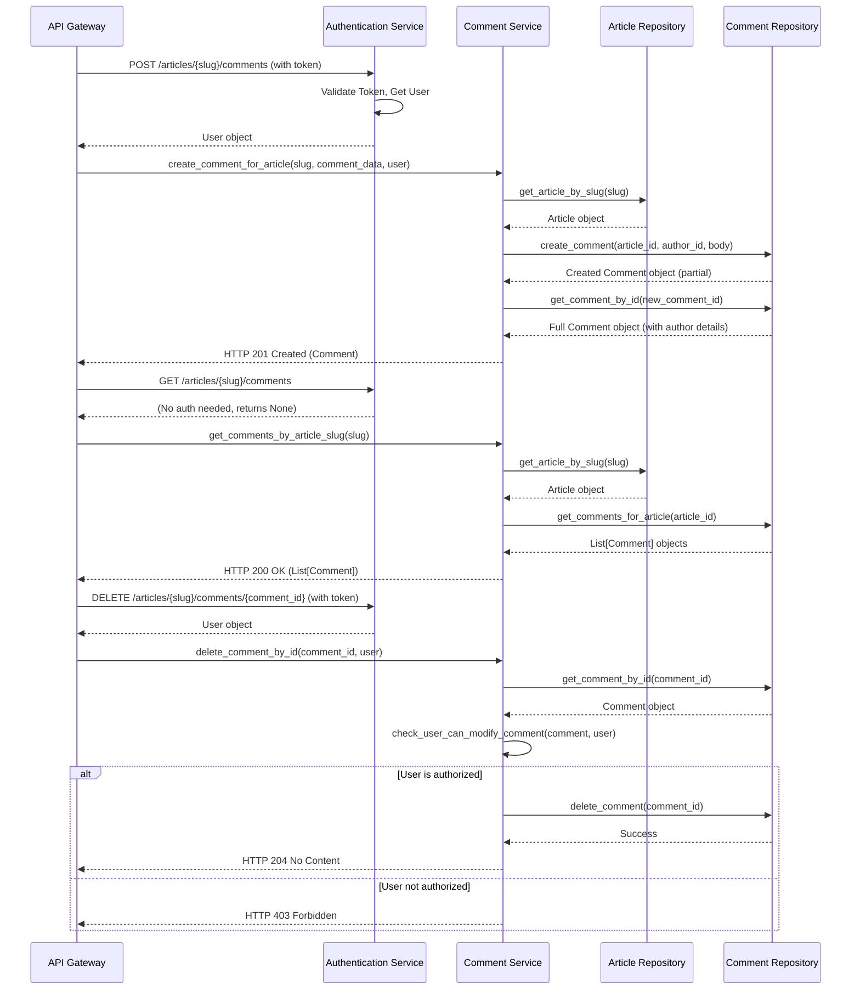

# Advanced Features: Following Users and Commenting on Articles

This tutorial explores how to implement advanced features such as following other users and managing comments on articles. These features add a social dimension to the application, enabling user interaction and engagement.

## 1. Following Users

Following other users allows users to keep track of content published by people they are interested in. This involves adding functionality to follow and unfollow users, and to retrieve a list of users that a specific user is following, as well as their followers.

### API Endpoints

-   **POST /api/profiles/{username}/follow**
    -   Allows the authenticated user to follow the specified profile.
    -   Requires authentication.
    -   Returns the profile of the followed user.

-   **DELETE /api/profiles/{username}/follow**
    -   Allows the authenticated user to unfollow the specified profile.
    -   Requires authentication.
    -   Returns the profile of the unfollowed user.

### Database Schema Changes

To support following, a new table (e.g., `user_follows`) would be needed to store the relationships between users. This table would typically have columns like `follower_id` and `following_id`, both referencing the `users` table.

### Service Layer Logic

The `services` layer would contain functions to handle the follow/unfollow actions. This would involve:

1.  Validating that the user attempting to follow/unfollow is authenticated.
2.  Checking if the target user exists.
3.  Interacting with the `UserRepository` (or a dedicated `FollowRepository`) to insert or delete records in the `user_follows` table.
4.  Updating follow/following counts for both users involved.

### Example (Conceptual)

```python
# app/services/users.py (Conceptual)
from app.db.repositories.users import UsersRepository
from app.models.domain.users import User

async def follow_user(users_repo: UsersRepository, follower_id: int, following_id: int) -> None:
    # ... validation logic ...
    await users_repo.follow_user(follower_id, following_id)
    # ... update counts if necessary ...

async def unfollow_user(users_repo: UsersRepository, follower_id: int, following_id: int) -> None:
    # ... validation logic ...
    await users_repo.unfollow_user(follower_id, following_id)
    # ... update counts if necessary ...
```

### API Route Implementation

The API routes (`app/api/routes/profiles.py`) would call these service functions. Dependencies would fetch the current user and the target user profile, then pass their IDs to the service layer.

## 2. Commenting on Articles

Adding comments to articles allows users to discuss content. This involves creating, retrieving, updating (optional), and deleting comments.

-   **POST /api/articles/{slug}/comments**
    -   Adds a comment to a specific article.
    -   Requires authentication.
    -   Request Body: `{"comment": {"body": "Your comment text"}}`
    -   Returns the created comment.

-   **GET /api/articles/{slug}/comments**
    -   Retrieves all comments for a specific article.
    -   Does not require authentication.
    -   Returns a list of comments.

-   **DELETE /api/articles/{slug}/comments/{comment_id}**
    -   Deletes a specific comment.
    -   Requires authentication (only the author of the comment or the article author might be allowed).
    -   Returns no content on successful deletion.

### Database Schema

-   **`comments` table**: Requires columns like `id`, `body`, `article_id` (foreign key to `articles`), `author_id` (foreign key to `users`), `created_at`, `updated_at`.

-   **Create Comment**: Requires article existence check, user authentication, and insertion into the `comments` table.
-   **Get Comments**: Requires fetching comments associated with a given `article_id` from the `comments` table, joining with the `users` table to get author details.
-   **Delete Comment**: Requires authentication and authorization checks (e.g., is the user the comment author?), then deletion from the `comments` table.

```python
# app/services/comments.py
from app.db.repositories.comments import CommentsRepository
from app.db.repositories.articles import ArticlesRepository
from app.models.domain.comments import Comment
from app.models.domain.users import User
from app.models.schemas.comments import CommentCreateSchema

async def create_comment_for_article(
    comments_repo: CommentsRepository,
    articles_repo: ArticlesRepository,
    article_slug: str,
    comment_data: CommentCreateSchema,
    author: User
) -> Comment:
    article = await articles_repo.get_article_by_slug(slug=article_slug, requested_user=author) # Check article exists
    if not article:
        # Raise HTTPException or similar
        pass

    comment = await comments_repo.create_comment(
        article_id=article.id,
        author_id=author.id,
        body=comment_data.body
    )
    # Fetch full comment with author details to return
    full_comment = await comments_repo.get_comment_by_id(comment.id)
    return full_comment

async def get_comments_by_article_slug(
    comments_repo: CommentsRepository,
    article_slug: str
) -> list[Comment]:
    # First, get article ID from slug (might need ArticlesRepository)
    # Then, fetch comments using comments_repo.get_comments_for_article(article_id)
    pass # Implementation details...

async def delete_comment_by_id(
    comments_repo: CommentsRepository,
    comment_id: int,
    user: User
) -> None:
    comment = await comments_repo.get_comment_by_id(comment_id)
    if not comment:
        # Raise HTTPException 404
        pass
    if not check_user_can_modify_comment(comment, user):
        # Raise HTTPException 403
        pass
    await comments_repo.delete_comment(comment_id)

```

Routes defined in `app/api/routes/comments.py` would utilize dependencies to get the current user, article slug, and comment ID. They would then call the corresponding service functions.

For example, the `POST /api/articles/{slug}/comments` endpoint would depend on:

-   `get_current_user` to authenticate the commenter.
-   `get_article_by_slug_from_path` to ensure the article exists and retrieve its ID.
-   A dependency to parse the request body (`CommentCreateSchema`).

These would then be passed to the `create_comment_for_article` service function.

## Mermaid Diagram: Commenting Feature Flow



This tutorial covered the implementation of user following and commenting features, enhancing the application with social capabilities. These features involve database schema modifications, new service layer logic, and corresponding API endpoints.
