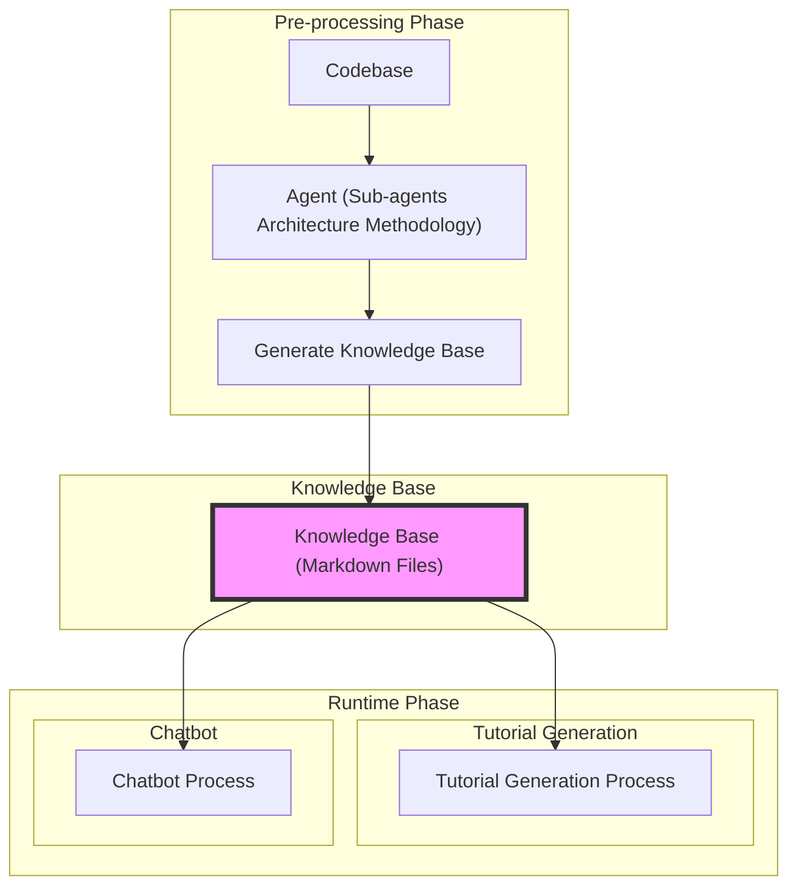
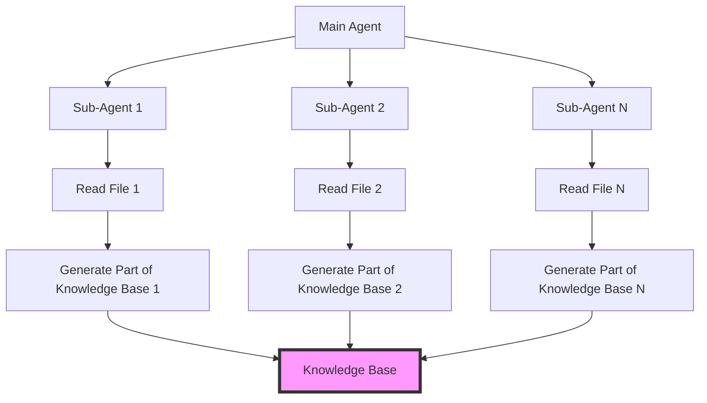
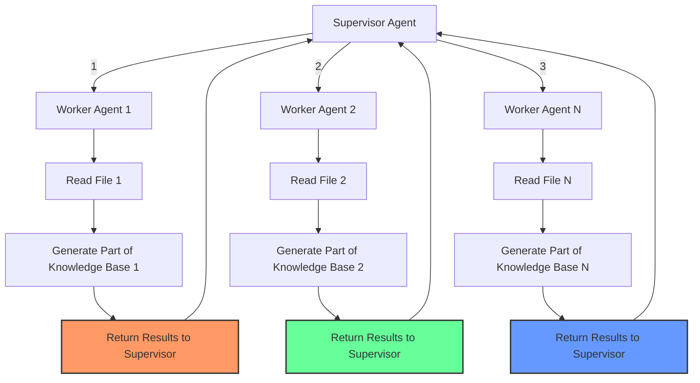

# Goal

From a high-level perspective, given a codebase in any language, we want to design and develop a system that can generate a knowledge base of that codebase. This knowledge base can then be used for various downstream tasks such as code generation, code explanation, code debugging, and more.

By **knowledge base**, we mean a set of static, pre-built markdown files that explain the codebase in a structured and detailed way, similar to what we see in [DeepWiki](https://deepwiki.org/).

### Task

Generate a tutorial in the form of multiple markdown files that explains how the codebase works and how to use it. This tutorial should be:

- **Beginner-friendly** and cover all important aspects of the codebase
- Useful for both junior developers new to the codebase and senior developers who want to get up to speed quickly
- Contains real or example code snippets, explanations, diagrams (ASCII art or preferably Mermaid), and other relevant information

**Implementation approach:**
These markdown files should be generated using the knowledge base created from the codebase and retrieving code snippets from the codebase itself using a **custom retrieval mechanism** (such as the agent opening code files dynamically **while generating the tutorial**). Optionally, RAG can also be used for this purpose.

## Expected Output

A set of markdown files that explain the codebase in a structured way without any chatbot GUI. A very simple UI that accepts the URL of a GitHub repository (or a local path to the codebase) as user input and generates and saves the markdown files on the local machine is sufficient.

**THE KNOWLEDGE BASE MUST BE GENERATED FIRST AND THEN USED FOR THE DOWNSTREAM TASK.**

- The knowledge base must **NOT** be generated on-the-fly during the downstream task
- The knowledge base is an **intermediate step** that both projects must implement and use

A mermaid diagram showing the pre-processing phase with sub-agents architecture for knowledge base generation, followed by the knowledge base as a common intermediate step, and then the runtime phase with two subgraphs for tutorial generation and chatbot:

The pre-processing phase involves the agent using a sub-agents architecture methodology to generate the knowledge base from the codebase. The knowledge base is then used as a common intermediate step for both the tutorial generation process and the chatbot process in the runtime phase.

### Option 3: Sub-agents Architecture Methodology

In this approach, we use a single main agent (manager agent) that can dynamically create and manage sub-agents at runtime. Each sub-agent can be responsible for reading a specific file, understanding the code, and generating a part of the knowledge base. Each sub-agent is created at runtime by the main agent whenever needed and is destroyed after its task is completed. Each sub-agent has its own memory, its own workspace, and its own access to only a specific part of the codebase (for example, a single directory) that is assigned to it by the main agent.

### Analogy: Comparing Multi-Agent Systems vs Sub-Agents Architecture

To better understand the difference between multi-agent systems and sub-agents architecture, let's consider an analogy:

**Multi-Agent System:**
Like a company with multiple employees (agents) who have fixed roles and responsibilities. The number of employees is fixed, and they work together to achieve the company's goals. Whenever an employee finishes their task, they report back to the manager (supervisor agent) who oversees the entire operation. The manager has to review the results of the first employee before assigning the next task to another employee.

**Sub-Agents Architecture:**
Like a freelance project where a project manager (main agent) hires freelancers (sub-agents) on demand to complete specific tasks. The project manager can hire as many freelancers as needed based on the project's requirements. Each freelancer works independently on their assigned task and delivers the results back to the project manager. Once the task is completed, the freelancer is no longer needed and can be let go.

### Wrap-Up

The sub-agents architecture methodology combines the advantages of both previous approaches while mitigating their challenges. It allows for dynamic allocation of resources based on the size and complexity of the codebase, enabling efficient processing without being constrained by fixed numbers of agents or context window limitations. The main agent can create sub-agents as needed, allowing for parallel processing of files and better management of context and coherence across the knowledge base. This methodology is well-suited for generating a comprehensive and structured knowledge base from large and complex codebases.

**Diagram:** A main agent creating multiple sub-agents at runtime to read files from a codebase and generate a knowledge base:

**Please note:** In this diagram, the main agent dynamically creates multiple sub-agents at runtime to read files from the codebase and generate parts of the knowledge base. This is different from a multi-agent system (which is already implemented in this codebase and is widely used in different frameworks) where the number of agents is fixed before the process starts.

**Key differences:**

- In **multi-agent systems**, the manager delegates a single task to a single worker agent at a time
- In **sub-agents architecture**, the main agent can create multiple sub-agents in parallel to work on different files simultaneously and write the results directly to persistent memory (in our case, the knowledge base) without needing to return the results to the main agent first

**Below is a mermaid diagram showing a multi-agent system with supervisor architecture for comparison:**

Here we show through numbers that the supervisor first delegates to worker 1, worker 1 returns results to supervisor, then supervisor delegates to worker 2, worker 2 returns results to supervisor, and so on. In contrast, in sub-agents architecture, the main agent can create multiple sub-agents in parallel to work on different files simultaneously and write the results directly to persistent memory (in our case, the knowledge base) without needing to return the results to the main agent first.

## How to implement sub-agents

Please refer to the `docs/methodology_implementation.md` file for detailed instructions on how to implement the sub-agents architecture methodology in this project.
